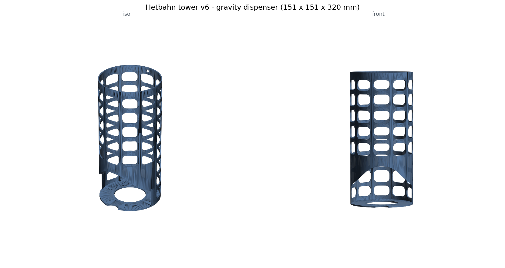
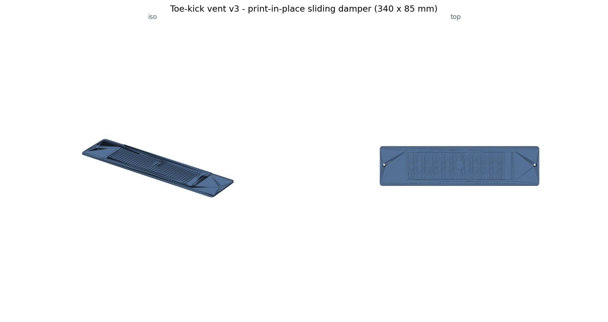
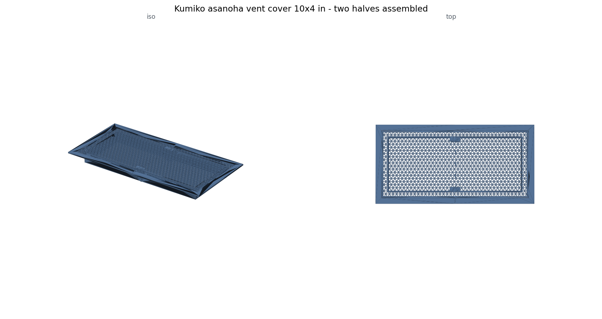
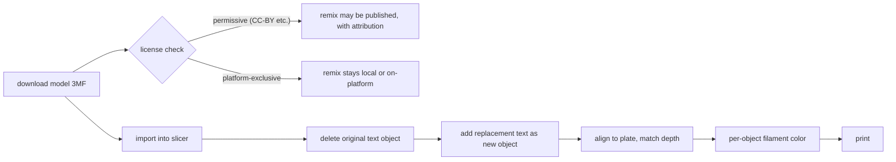

# 3D Printing as Code

Everything here is CAD-as-code: parts are Python (build123d, CadQuery, trimesh + manifold3d) or OpenSCAD, and every STL/3MF is reproducible by running a script. No GUI CAD files, no orphaned meshes. This folder is a curated slice of a private workshop that currently holds 105 Python generators and 41 OpenSCAD files across ~30 projects, all printed on a Bambu Lab H2D (350 x 320 x 325 mm).

I did not set out to build a CAD portfolio. Each part exists because something in the house was broken, missing, or unsafe, and modeling it as code turned out to compound: clearance conventions, validation patterns, and grab-feature geometry migrate between projects as copied constants and habits, not as tribal memory.

<table>
<tr>
<td align="center" width="50%"> <b>microwave-rice-tower</b> - gravity dispenser, six versions to a verified print</td>
<td align="center" width="50%"> <b>toekick-vent-slider</b> - print-in-place damper, collision-swept across its travel</td>
</tr>
<tr>
<td align="center" width="50%"> <b>kumiko-vent-covers</b> - asanoha lattice split for the bed with real joinery</td>
<td align="center" width="50%"> <b>level-lock-keypad-cover</b> - rain awning, four architectures and a mesh-forensics story</td>
</tr>
</table>

## Why code instead of GUI CAD

- **Every dimension is a named constant; everything else derives.** Scaling a 6-bowl dispenser to 8 bowls was one line. Re-fitting a caddy after caliper measurements is editing a table and re-running.
- **Constraints become asserts.** Printer bed limits, a child-safety maximum opening, and motion-envelope clearances live as `assert` statements, so a bad future edit fails at build time instead of at install time.
- **Validation is a program.** Watertight checks, point-containment truth tables (12-17 probes per part), envelope sweeps, and print-orientation renders run on every version. The nursery vent's "invisible understructure" is verified by a 1,476-point containment sweep.
- **Iteration is versioned.** `rice_tower_v1.py` through `v6.py` is a readable design history in the workshop; the repo ships v1 and the printed v6 as the endpoints, with the pivots told in prose.

## Start with the playbooks

The two documents in [playbooks/](playbooks/) are the distilled output of the whole hobby and the best writing samples here:

- **[parametric-design-gotchas.md](playbooks/parametric-design-gotchas.md)** - cross-project design rules, each traceable to a printed part: dimension sourcing (worst case across vendors, never average), motion-envelope-first design, print physics as form-giver, CAD API traps, the validation doctrine, and why containment tests cannot catch a flipped export.
- **[rice-tower-case-study.md](playbooks/rice-tower-case-study.md)** - one project told end to end: dispenser for an object with no published dimensions, researched via a hobbyist's hand measurements, six versions to a verified print at 5 mm under the printer's Z limit.

## Projects

| Project | One line |
|---|---|
| [microwave-rice-tower](projects/microwave-rice-tower/) | Rice-bowl gravity dispenser; 6 versions, gothic-arch mouth from the 45-degree rule, 23% filament cut last |
| [nursery-flush-vent](projects/nursery-flush-vent/) | Child-safe flush floor register; <= 5 mm openings by assert, asymmetric flange to fit the bed, hidden understructure with sightline math |
| [toekick-vent-slider](projects/toekick-vent-slider/) | Print-in-place sliding damper register; slider captured in rails, 3 mm travel phase-shifts slits from closed to ~43% open, collision-swept across the travel |
| [hall-bath-vent](projects/hall-bath-vent/) | The nursery vent re-parametrized for a 10 x 4 in wet-room duct; zero new CAD lines - eight variants as `-D` override sets on the shipped generator, with a thickness study in an embedded comparison viewer |
| [hallway-louver-vent](projects/hallway-louver-vent/) | 90-degree diverter for a register dead-ended under a cabinet; free-area arithmetic before printing, one-piece 20 mm plinth with zero supports and zero glue |
| [kitchen-luxe-vent](projects/kitchen-luxe-vent/) | Frameless language pushed to maximum airflow: three nested 5 mm channels and hidden magnet pockets, the pivot taken after the 9% free-area lesson |
| [honeywell-locking-nut](projects/honeywell-locking-nut/) | Multi-start thread replacement part; 8-ring overnight test matrix bracketing pitch/profile/depth/starts |
| [level-lock-keypad-cover](projects/level-lock-keypad-cover/) | Rain awning fitting a Level Lock keypad; 4 architectures to a 15-degree awning 40% lighter, a phantom-backplate bug settled by 3-tool mesh forensics |
| [eufy-doorbell-sign](projects/eufy-doorbell-sign/) | "Baby sleeping" doorbell sign; 4 mounting architectures, hand-rolled dual-color 3MF writer |
| [coffee-scale-holder](projects/coffee-scale-holder/) | Under-beam garage docks; 4 architectures in one session, designed around an undocumented port location |
| [glove-dispenser](projects/glove-dispenser/) | The original sleeve + scoop + keyhole design DNA the later holders inherit |
| [kumiko-vent-covers](projects/kumiko-vent-covers/) | Asanoha kumiko lattice vent cover split for the bed with dovetail and tab-slot joints |
| [gridfinity-tool-bins](projects/gridfinity-tool-bins/) | Tool-specific bins on the 42 mm Gridfinity standard |
| [lg-washtower-drain-cup](projects/lg-washtower-drain-cup/) | Two-part drain catch cup; 13-degree tilted socket-slot joint in pure mesh CSG |
| [shade-hanger-adapter](projects/shade-hanger-adapter/) | Caliper-to-code window-shade bracket in minimal trimesh CSG; one 2 mm fit revision after test-fitting |
| [braun-mq9-caddy](projects/braun-mq9-caddy/) | 4 caddy variants from one script, designed entirely from estimated dimensions with a test-fit plan |
| [drawer-organizers](projects/drawer-organizers/) | Custom drawer trays up to a 5-bay spoon/chopstick organizer with a rear shelf; non-manifold failure taxonomy in the docstrings, plus a 60-hole vent lattice that turned out never to punch through |

STL/3MF/video files are intentionally not in the repo; each project's script regenerates its meshes. A few small PNG/SVG renders are included so the geometry is visible without running anything. Note: the generated HTML viewers embed their STL as base64 but load three.js from a public CDN, so viewing them needs internet.

## The workflow

1. **Research dimensions** (object labels, owner photos, retailer cross-checks, Korean hand-measurement posts when manufacturers publish nothing). Size to the worst case.
2. **Map the motion envelope** before drawing material: where the object enters, exits, charges, and is grabbed.
3. **Choose print orientation while designing**, and shape topology so layer 1 grounds everything; support-free is a design outcome, not a slicer setting.
4. **Generate, then validate the output, never the intent:** watertight, containment truth table, envelope asserts, dimension probes, multi-view render, HTML viewer for human review.
5. **Print, test-fit, tighten constants, re-run.** Tolerances are tuned by cheap test prints (the fan nut's 8-ring matrix; the caddy's estimate-then-caliper loop).
6. **Bed too small?** Split with real joinery: dovetail keys with full-depth engagement, tab-slot registration, 45-degree scarfs, lap joints.

## Honest failure notes

The playbooks exist because things went wrong, repeatedly:

- A fillet silently no-opped for five versions (local vs world coordinates in a sketch context).
- A wrongly rotated export passed every containment test, because the tests derived from the same wrong transform. Only rendering "what touches the bed" caught it.
- Trusting one vendor's spec sheet produced a part 11 mm short; the corrected rule is max-across-vendors.
- Hand-built triangle meshes produced non-manifold T-junctions until the toolchain standardized on manifold3d.
- A ventilation lattice printed as blind dimples: the rotated drill cylinders grew backward from the wall's centerline, and every watertight check passed, because a dimpled solid is perfectly manifold.
- A beautiful frameless vent starved the room of airflow (9% free area) and had to be redesigned around porosity math.

## AI-assisted build notes (calibrated)

Nearly all of this code was written with Claude in the loop, and this collection doubles as a record of what that is actually like:

- **Where AI genuinely accelerated:** writing and rewriting parametric geometry (four mounting architectures in a session), porting OpenSCAD to manifold3d, generating validation harnesses and truth tables, hand-rolling a minimal 3MF zip writer, and doing the trigonometry (tilted-socket transforms, sightline cutoffs, section-modulus tradeoffs) without arithmetic slips.
- **Where it failed and a human was required:** it shipped the silent-fillet bug five times; it trusted an official spec sheet over disagreeing retailers; it placed structurally useless dovetails until a dry-fit felt flimsy; it designed an airflow-starved vent because nobody asked the free-area question; its early hand-built meshes were the non-manifold problem. None of these were caught by the AI's own tests, because the tests encoded the same wrong assumptions. They were caught by renders, printed parts, and a human asking one more question.

The stable division of labor: the AI writes geometry and checks, the human owns physical judgment, reference research disputes, and looking at the picture. Every "what went wrong" section in the project READMEs states which side of that line the mistake fell on.

## Attribution

One project adapts a community concept and says so in its README (sebtobar's Ring doorbell sign idea; the geometry here was authored independently). Third-party STLs, fonts, and vendor photos are not redistributed. Designs that would be derivative of protected commercial products or of third-party models with restrictive or unverified licenses are deliberately not published, even where a private version exists.

A concrete example of that last rule: the most-liked sign on our front door is a text remix of Ahrar Monsur's ["Peeking Cat" No Soliciting Sign](https://makerworld.com/en/models/2626138-peeking-cat-no-soliciting-sign) (text swapped in the slicer to cover flyers and surveys too). It is not in this repo, in mesh or image form, because the model's MakerWorld Exclusive License permits derivatives only on MakerWorld itself. Licenses get checked before publication, not after; the remix lives on the door, not in git.

The remix workflow itself is generic and worth having, since no protected geometry is involved in describing it:

The license check runs in parallel with the modeling work, but it decides where the result is allowed to live.
