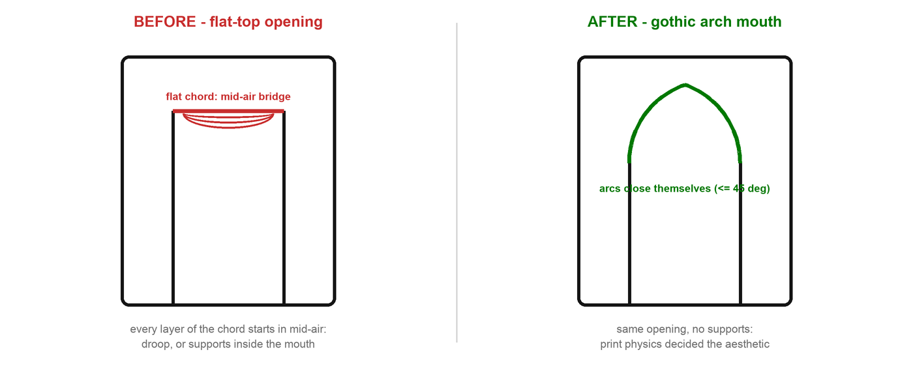
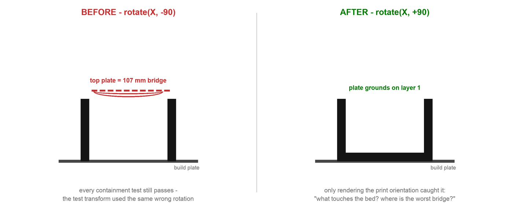
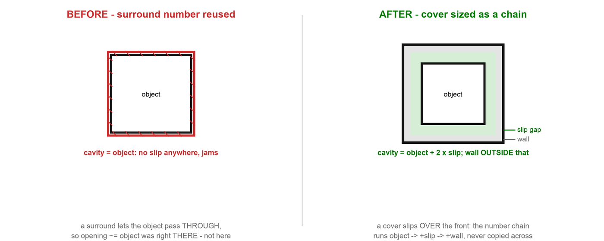

# Parametric Design Gotchas - Project-Driven Playbook

Consolidated, reusable design principles and gotchas from real printed projects. Every rule below was learned (often the hard way) on a specific project, tagged in brackets. Read this BEFORE starting the next holder/dispenser/dock design.

**Source case studies:**
- **[RiceTower]** = Microwave Rice Tower (rice-bowl dispenser, 6 versions, printed and verified; see [rice-tower-case-study.md](rice-tower-case-study.md) and [../projects/microwave-rice-tower/](../projects/microwave-rice-tower/))
- **[Scales]** = Coffee Scale Holders (under-beam garage docks for Maestri K112 + BOOKOO Themis Mini, 4 versions in one session; [../projects/coffee-scale-holder/](../projects/coffee-scale-holder/))
- **[Glove]** = Glove Box Dispenser (the original sleeve + scoop + keyhole design DNA; [../projects/glove-dispenser/](../projects/glove-dispenser/))
- **[E340]** = Eufy E340 Doorbell Sign (trapped surround -> tilted wedge -> removable clip-on cover -> inverted-U; [../projects/eufy-doorbell-sign/](../projects/eufy-doorbell-sign/))

---

## TL;DR Checklist (run top to bottom)

1. Get real dimensions: labels, owner photos, hand-measured community posts, manuals. Size to the worst case.
2. Resolve ambiguous spatial words ("lip", "center face") with screenshots and renders, not assumptions.
3. Map the motion/access envelope first: insert, remove, charge, press buttons, see display.
4. Pick the print orientation WHILE designing; shape walls so layer 1 grounds everything.
5. Place cutters by measured bounding box, never by guessed plane normals.
6. Validate the mesh: watertight + point-containment truth table + envelope asserts.
7. Render the PRINT orientation and eyeball what touches the bed. Tests do not catch flipped exports.
8. Ship STL + 3MF pre-rotated to print orientation. Version every file, never overwrite.
9. Lighten last, structural zones untouched.

---

## 1. Getting dimensions and hardware facts

- **The object's own label is a primary source.** The K112's full spec (105 x 105 x 22 mm) was on its bottom sticker, photographed by the owner. Ask for photos before searching the web. **[Scales]**
- **Korean products with no published specs: search in Korean** for `{product} 크기 지름 높이`, prefer hand-measured (실측) posts. Camping and packing communities measure everything. One hobbyist measuring 5 brands beats 5 spec sheets. **[RiceTower]**
- **Design to the worst-case variant, not the named one.** The rice tower is sized for Ottogi-bap (139 > 137 dia), so most rice bowls fit. Keep the variant table in code comments. **[RiceTower]**
- **Spec sheets and manuals document electrical specs, not physical layout.** Seven written sources (official manual, retailer pages, reviews) confirmed "USB-C charging" without ever naming the port's edge. The answer was in the manual's product RENDER: zoom on images, do not just read text. **[Scales]**
- **If a fetch 403s, use the browser.** manuals.plus blocks plain HTTP fetches but renders fine in Chrome. Product diagrams there showed the K112's Type-C flap mid-right-edge and OFF/ON switch ~28 mm from the front corner. **[Scales]**
- **When a feature location stays unknown, design around the uncertainty.** Square footprint means 4 loading rotations are equivalent: symmetric windows on both side walls cover any port edge (rotate 90 degrees while charging). Symmetry beats more research. **[Scales]**
- Record measured values verbatim in the script docstring and the design spec; the next session must not re-research. **[RiceTower] [Scales]**

## 2. Interpreting design intent (the conversation is part of the workflow)

- **Spatial language is ambiguous; geometry is not.** "Remove this lip", "the center face", "missing a top plane" each had 3+ plausible readings. The fix loop: user sends a slicer screenshot, designer answers with labeled renders. Two misreadings were caught this way; zero made it to the printer. **[Scales]**
- **The user orbiting a viewer/slicer finds what you cannot.** Open-front request, rounded windows, and the pointy arch all came from the human looking at the model, not from checks. Always deliver the HTML viewer. **[RiceTower] [Scales]**
- **Pivots are cheap when everything is parametric.** Scale holder went v1 combined drop-in, v2 split + back-wall mount, v3 flat cradle, v4 under-beam garage in one session, because each version was one script with named constants and derived values (`R_IN = DIA/2 + SLACK`). One script can emit N part files (one per scale). **[Scales] [RiceTower]**
- **Reuse local design DNA.** Clearance conventions, the elliptical grab scoop, gravity retention, and support-free orientation all transferred from the glove dispenser through 4 scale-holder redesigns. Check sibling project folders before inventing. **[Glove] [Scales]**

### Clearance conventions (house rules)

| Situation | Clearance |
|---|---|
| Rigid object, footprint/sides | +2 mm total |
| Rigid object, headroom in a pocket | +4 mm |
| Squishy/cardboard object, depth | +6 mm |
| Printer build limit | hard `assert` in the export step |

**[Glove] [Scales] [RiceTower]**

## 3. Motion envelope and lifecycle access

- **Map where material CANNOT exist before drawing where it can.** Bottom-dispense corridor (bowl radius + slack, floor to bowl height + tilt margin) dictated the whole tower; verified numerically each version (vertices inside corridor == 0). **[RiceTower]**
- **Design the full lifecycle, not just storage**: insert, remove (pinch strip + floor scoop), charge while docked (side windows), reach the power switch, read the display. The K112 windows were widened and shifted only after locating the switch. **[Scales]**
- **Grab features**: an elliptical scoop cut from an edge is the house pattern (glove dispenser front wall, scale holder floor edge). Pair a scoop (thumb) with an exposed strip (finger) for a pinch grip; a top plate set back 20-25 mm from the mouth provides it. **[Glove] [Scales]**
- **Retention without latches**: gravity for vertical sleeves, silicone-feet friction for flat garages on a level mount. Mouth/headroom needs a few mm extra so the object can tilt during extraction. **[Glove] [RiceTower] [Scales]**
- **Dual-mode mounting from one profile**: an L (top plate + wall) works resting ON a beam (gravity carries, adhesive prevents sliding) or glued UNDER it (adhesive in tension). Design once, let the installer choose. **[Scales]**

## 4. Print physics shapes the form

- **45-degree rule decides the aesthetic**: gothic arch mouths, slot rings instead of wraparound bands, rounded-rectangle windows. On curved walls keep any opening's flat ceiling chord under ~35-40 mm; circular tops self-close when `2*sqrt(2*r*layer_height)` is small. **[RiceTower]**

  
- **Pick the orientation DURING design and shape topology for it.** v1 scale holder ran every sleeve wall full-height to the plate plane specifically so the inverted print grounds the entire footprint on layer 1. The v4 garage stands on its closed end wall for the same reason. If a wall would start mid-air, redesign it, do not support it. **[Scales] [RiceTower]**
- **Openings cut from an edge need no bridge; holes do.** A scoop opening toward print-top prints free. A window's top edge bridges only the wall thickness across the interior span (26 mm here, trivial). A plate edge suspended between distant walls is a disaster (the 107 mm near-miss, see section 6). **[Scales]**
- **Adhesive faces want the smoothest surface FDM can make**: the first layer on a smooth plate, or a vertical exterior wall. Orient so the gluing face is one of those; never a supported or top surface. **[Scales]**
- **No stalactites**: anything that begins in mid-air and cannot grow from <= 45 degrees gets redesigned away (the floating front slat of the wooden donor design is fine in plywood, impossible in one-piece FDM). **[RiceTower]**

## 5. CAD coding gotchas (build123d / CadQuery)

- **build123d: `BuildSketch` vertices are in LOCAL plane coordinates** (Z always 0; local Y = world Z on Plane.XZ). Filtering by world `.Z` silently selects nothing and `fillet([])` no-ops without raising. The arch fillet was missing for 5 versions. Rule: `assert len(selection) == N` before every filtered fillet/chamfer. **[RiceTower]**
- **CadQuery: never trust Workplane normal sign conventions.** Build the cutter, read `val().BoundingBox()`, then `translate()` to the exact target. The scoop cutter can then never land in the wrong wall. **[Scales]**
- **Rotation direction is a coin flip you will lose.** `rotate(axis X, -90)` vs `+90` both "stand the part up"; one put the mouth on the bed and made the top plate a 107 mm bridge. Only a render caught it (see section 6). **[Scales]**
- **Fillet radius vs wall thickness**: a corner fillet bigger than the wall (r3 on a 2.5 wall) thins the corner to ~2.3 mm, acceptable; much larger fails or knife-edges. Fillet the solid block BEFORE cutting cavities (the glove pattern), and wrap decorative fillets/chamfers in try/except so geometry edge cases degrade instead of crashing. **[Glove] [Scales]**
- **Environment note**: build123d wants a recent Python (3.12 here); older CadQuery installs still work fine for the CadQuery-based scripts. Either stack works; match the project's existing scripts. **[RiceTower] [Scales]**
- **CadQuery cannot export 3MF.** A minimal 3MF is just a zip: `[Content_Types].xml`, `_rels/.rels`, `3D/3dmodel.model` with vertices/triangles from trimesh. Bambu Studio opens it (with a harmless old-version warning). **[Scales]**

## 6. Validation: test the output, never the intent

- **Watertight is necessary, not sufficient.** It says nothing about features being where you think they are.
- **Point-containment truth table**: for every feature write (point, expected solid/empty) pairs and run `mesh.contains()`. Cavity empty, wall solid, window open, floor intact under notch, plate present rear / absent front. 12-17 assertions per part, runs in seconds, catches wrong-side cuts immediately. **[Scales]**
- **Envelope asserts**: vertices inside the motion corridor == 0; `extents <= printer limit`. **[RiceTower]**
- **Dimension probes after every change**: measure the mesh for the feature you just edited (mouth ceiling z = 98.7 confirmed the fillet finally applied). **[RiceTower]**
- **THE BIG ONE: containment tests validate geometry, not orientation.** The flipped-export bug passed every containment test, because the test transform was derived from the same wrong rotation. Only rendering the print orientation ("what touches the bed? where is the worst bridge?") exposed it. Always do both: numeric truth table AND multi-view render of the exported file. **[Scales]**

  
- Full pipeline per version: watertight -> containment/envelope asserts -> dimension probes -> multi-view matplotlib render -> interactive HTML viewer for the human. **[RiceTower] [Scales]**

## 7. Adhesive mounting (no screws, no nails)

- **3M VHB (4910/5952)** for permanent mounts: clean both faces with IPA, 30 s firm pressure, ~72 h full cure. Command strips only where gravity carries the load (never pure tension under a beam). **[Scales]**
- Budget area generously: ~60-100 cm2 of plate for sub-kg loads is overkill in tension and survives peel moments from cantilevered trays.
- Prefer load paths where adhesive only prevents sliding (plate resting on beam) over pure tension (plate glued under beam); the same L-profile print offers both. **[Scales]**
- Print the adhesive face against a smooth build plate or as a vertical wall (section 4); a rough face halves real-world bond strength.

## 8. Lighten last, in this order

Only after the design is settled and liked (v6 cut 23% filament): dead zones first, then enlarge existing openings toward their print-physics limits, then new openings in over-solid areas, then trim non-critical bands. Never touch structural cheeks/fascia/foundation, and treat global wall thinning as the last lever (it costs stiffness everywhere). **[RiceTower]**

## 9. "Surround it" vs "cover it", and how mounting reframes everything [E340]

The E340 doorbell sign went through four architectures - trapped surround -> tilted
wall-flush wedge -> removable clip-on cover -> gravity-set inverted-U (the one that
shipped) - because the *mounting requirement*, not the part, kept changing. Lessons
from the pivots:

- **A single vendor spec page is NOT a primary source.** eufy's own page listed the
  E340 at 138 mm tall; Home Depot (5.91"), B&H (6.0") and CHOICE (150 mm) all said
  ~150 mm. The surround was cut to a 139 mm opening and came out ~11 mm shorter than
  the real unit. Cross-check 2-3 sources and size to the worst case (this is section 1,
  re-learned the hard way). When the user owns the part, their caliper outranks all of it.
- **"Surround" and "cover" are opposite fit problems - do not reuse the number.** A
  trapped surround has the object pass THROUGH (opening ~= object, object fills it,
  installed once between wall and unit). A removable cover SLIPS OVER the front, so the
  cavity must be BIGGER than the object (object + 2*slip), with the wall thickness added
  OUTSIDE that. Copying the surround's opening size into a cover cavity guarantees a
  too-small part.

  
- **A removable cover for a functional device must keep the function reachable.** For a
  camera doorbell the two cameras + button have to show through the opening; the
  retaining lip may only cover edge margin. Measure the margin from each edge to the
  nearest lens/button and keep lip < margin (and it can differ per edge).
- **Retention is the whole design for a removable.** Friction sleeve over a grip depth +
  a small front lip that catches the face edge. A cantilevered sign plaque adds a peeling
  moment, so give the sleeve enough depth; expose `slip` as the tuning knob for on/off
  feel. (A magnet mount is easiest on/off but modifies the device - avoid unless the user
  accepts sticking steel/magnets on it.)
- **Print orientation flip changes the lettering technique.** The surround printed
  back-down with RAISED text. The cover is a tray (front plate + walls around an open
  pocket) that prints FRONT-DOWN for a smooth face and zero supports - so the front text
  must be INLAID (recessed + accent-colour fill in the bed layers); you cannot raise text
  into the bed. Same 2-colour result, opposite geometry.
- **Attach to the object, not the wall, when the object can move.** Because the cover
  grips the doorbell it rides whatever angle the tilt wedge sets - the elaborate
  wall-flush 15deg wedge geometry from the mounted version became unnecessary. A clip-on
  is mount/tilt-agnostic.
- **(Recurring CAD trap)** Text glyphs + an outline ring in ONE `BuildSketch` get erased
  by the outline's inner `Mode.SUBTRACT` (it subtracts from everything in the sketch,
  glyphs included). Give each text element its own sketch+extrude. Bit me again on the
  tilted build; the empty plaque passed watertight and only the face render caught it
  (section 6's "THE BIG ONE").
- **Print orientation is chosen by where the lettering must read, then make the REST
  support-free.** RAISED text needs its face UP (print the wall-side/back down). Printing
  the cover front-DOWN as a clean tray instead forced INLAID text AND printed it MIRRORED
  (bed-side text reads backwards once flipped). So: pick the face-up orientation for raised
  text, then make the cavity self-supporting (a tray prints front-down; for front-up, the
  header plaque had to be a light-infill SOLID block so nothing floats; window lips stay
  small enough to bridge). No supports either way - the orientation just dictates raised vs
  inlaid, and front-down additionally needs the text mirrored.
- **Expose the target's functional features.** The E340 has a top LED light bar (night-
  vision illumination), a bottom LED and an ambient light sensor - all on the front. A cover
  must NOT sit over them: the window opens the full front and the sign became a HEADER above
  the unit. Always ask "what on this device still has to work/see/shine?" before covering it.
- **Two rounded rects that ABUT at an edge leave a sliver -> non-watertight.** The grip
  block and the wider plaque met exactly at Y=Yt; the export had 4 open edges at that seam
  (found by counting boundary edges and printing their midpoints - they clustered at one
  line). Fix: OVERLAP the two solids a few mm (here the grip block was extended up past the
  doorbell top, where the overlap is hidden) so the union is a real volume, not a tangent.
- **Size to the worst case across vendors, literally.** eufy said 138 mm, Home Depot 150.1,
  B&H 6.0in=152.4. The 150.1 cover still printed ~1 mm short; 152.4 was the worst case and
  the right pick. Don't average - take the max for a slip-over fit.

---

## Case study artifacts in this repo

| Project | Where |
|---|---|
| Microwave Rice Tower (printed, verified) | `../projects/microwave-rice-tower/rice_tower_v6.py`, [rice-tower-case-study.md](rice-tower-case-study.md) |
| Coffee Scale Holders | `../projects/coffee-scale-holder/coffee_scale_holder.py` |
| Glove Dispenser (design DNA origin) | `../projects/glove-dispenser/glove_dispenser.py` |
| Eufy E340 Doorbell Sign (4 architectures) | `../projects/eufy-doorbell-sign/` |
