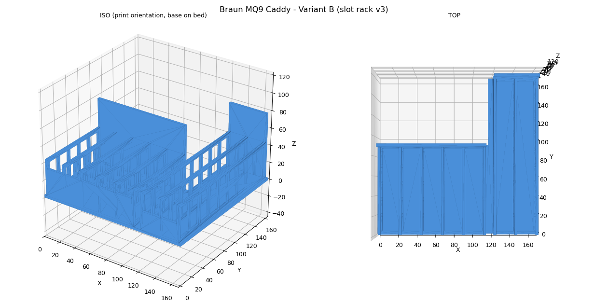

# Braun MQ9 Food-Processor Accessory Caddy

The [Braun MultiQuick 9](https://www.amazon.com/s?k=Braun+MultiQuick+9) food-processor kit ships a pile of loose blades, discs, and inserts with no storage (the OEM stand only exists in some non-US kits). One 900-line build123d script emits four caddy variants: an integrated single print, plus a two-part set (disc slot rack + peg/cup block) and an aux bin that fills the leftover L-notch behind the rack.

**The defining constraint: no part dimensions are published anywhere.** Braun, eReplacementParts, and Amazon spare listings carry electrical specs only (verified before giving up). So every dimension is an estimate scaled from the known 2 L bowl, clearances are deliberately generous (+3 mm slot gaps, +4 mm bores), the docstring shouts `!!! DIMENSIONS ARE ESTIMATES !!!`, and the workflow plans for a v1 test-fit followed by caliper-tightened constants. Designing for revision beats pretending to precision you do not have.

**Design decisions worth stealing:**
- **Vertical edge-slots like a dish rack** for flat parts; **pegs and ring cups** for bulky ones; the S-blade gets a **shrouded well plus center post** so fingers cannot meet edges while rummaging
- **A shelf-packing helper** lays out the round pockets automatically from a `(id, diameter)` list
- **Lightening with intent:** blade-adjacent fins get a fine mesh (a big window would let a loose blade shift into it); disc dividers get tall ~70% -open windows whose top borders stay under a 15 mm bridge span; back walls stay solid because they are the backstop
- An in-code **containment truth table** (`checks` lists of point, expected, label) validates every zone before export

**Files:** `braun_mq9_caddy.py`, `braun_mq9_caddy_B_slotrack.png`. Running the script regenerates all four STL/3MF sets and viewers.

**What went wrong (honestly):** the v2 insert grid was simply too small when the real parts arrived; v3 replaced it with the two-group disc rack (5 x 90 mm-deep slots plus 2 x 160 mm-deep slots so a 156 mm disc's whole footprint lands on the base). Estimation error is the expected failure mode here, which is why the base plan is test-fit-then-tighten.

**AI-assisted build notes:** Claude generated and re-generated this large script fluently, and the packing helper plus truth-table pattern are ideas it carried in from earlier projects on its own. What it could not do is know how big a dicer disc is; both rounds of correction came from physical parts in hand. Estimates-first was the right call, but only because the script made re-emitting all four variants a one-command operation.
