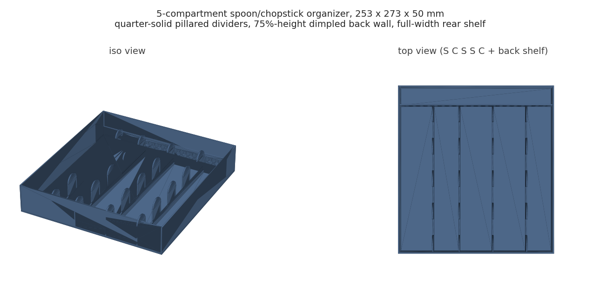
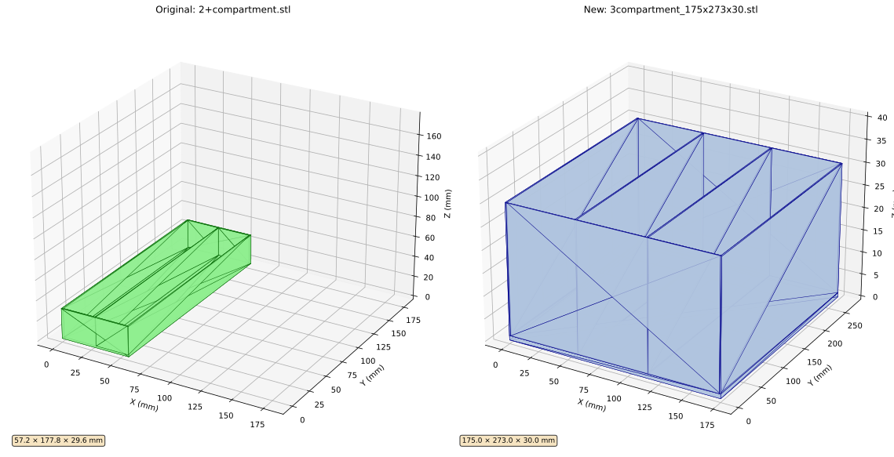

# Kitchen Drawer Organizers (and the non-manifold lessons)

Custom drawer dividers cut to my drawers' measured interiors: a 3-compartment tray, a diagonal 2-compartment tray, and a 5-compartment spoon/chopstick organizer (S-C-S-S-C layout with a full-width rear shelf). Plus `render_stl_svg.py`, which renders any STL to documentation SVGs so the repo can show geometry without shipping meshes.

**Why these scripts document their own failure mode:** the early organizers built triangle meshes by hand with numpy-stl. That works until two boxes share a face: an edge shared by more than 2 triangles (T-junction) or by only 1 (open edge) makes the mesh non-manifold, and slicers reject or mis-repair it. The 5-compartment script's docstring records the exact failure taxonomy and the resolution: build CSG with manifold3d, which guarantees watertight output from boolean unions, and stop hand-assembling triangles for anything with internal walls. I kept the notes in the code on purpose; they are the most useful part.

**Fit details that made these keepers:** scalloped inner walls (pillar cutouts that keep the bottom quarter solid) save filament without losing rigidity; the rear shelf's divider runs at 75% height so long utensils can overhang it (the "lattice" in that wall turned out to be its own story, below); compartment widths are derived from a layout list, so re-planning a drawer is editing `LAYOUT = [True, False, ...]`.

**The 5-compartment variant, decoded:** the letter strings in the mesh names are the drawer plan read left to right - S is a spoon bay, C is a chopstick bay. The first build was SSCSC at 245 mm wide (51/40 mm bays, not shipped here); the layout that lives in the drawer is SCSSC at 253 x 273 x 50 mm (53/41 mm bays), which re-orders the plan and adds the rear shelf: a 31.75 mm bay across the full width, behind that 75%-height divider. The recorded design walk on the vertical dividers is a negotiation over how much wall to delete: solid walls first, then full-height scalloped pillars with finger gaps, then a retreat to bottom-half solid for stiffness, and the shipped variant settles at a bottom quarter (`SOLID_WALL_RATIO = 0.25`). It stayed a single constant precisely because the filament/stiffness/finger-access tradeoff kept moving. The scallop itself is the post-manifold3d technique: a 2D semicircle profile, extruded and rotated into place, instead of hand-wound triangle approximations of a curve.

**The lattice that is not there (found while making the render above):** the rear divider was designed as a ventilation lattice, and the script still announces "8.0mm diameter, 12.0mm spacing (~60 holes)" when it runs. Regenerating the mesh for this page, the script's own validator flagged an Euler characteristic of -10 where it expects 2, and probing the geometry showed something better than a topology quibble: none of the 60 holes goes through. `Manifold.cylinder` grows from its base plane, `rotate([90, 0, 0])` maps that growth from +Z to -Y, and the translate then parks the base on the wall's centerline - so each 2.2 mm drill hangs 1.2 mm in the air and penetrates only 1.0 mm of the 2 mm wall. The part in the drawer got 60 shallow dimples where the design doc promises windows, and every validation gate passed, because a dimpled watertight solid is perfectly manifold. The archived STL from print day probes identically, so this is not a regeneration artifact, and nothing in the project log ever flagged it. Two lessons worth the price: mesh validation confirms the part is printable, not that it matches intent; and an LLM will confidently narrate the feature it failed to build - the console line describing the hole pattern was written by the same model that pointed the drill backward.

**Files:** three generators, the SVG renderer, three rendered SVGs (`comparison.svg` shows old vs new 3-compartment layouts), and two PNG renders (`overview.png`, `5compartment_horizontal_shelf.png`). STLs regenerate by running the scripts.

**Honest note:** the diagonal 2-compartment divider exists because the first straight version wasted the corner a soup ladle needs; measured-object-first beats symmetric-grid-first for drawers. Also, these print near-full-bed and the first one warped until I stopped ignoring draft placement.

**AI-assisted build notes:** Claude wrote all four scripts. Its hand-built meshes produced the non-manifold geometry in the first place, and it also correctly diagnosed the cause and proposed the manifold3d migration once shown the slicer errors. Net: the AI both dug and filled this hole; the durable value is that the lesson got written down where the next script generation reads it. The rear-shelf wall's missing lattice (above) is the sharper half of the same lesson: the checks an AI writes for its own output verify printability, not intent.
