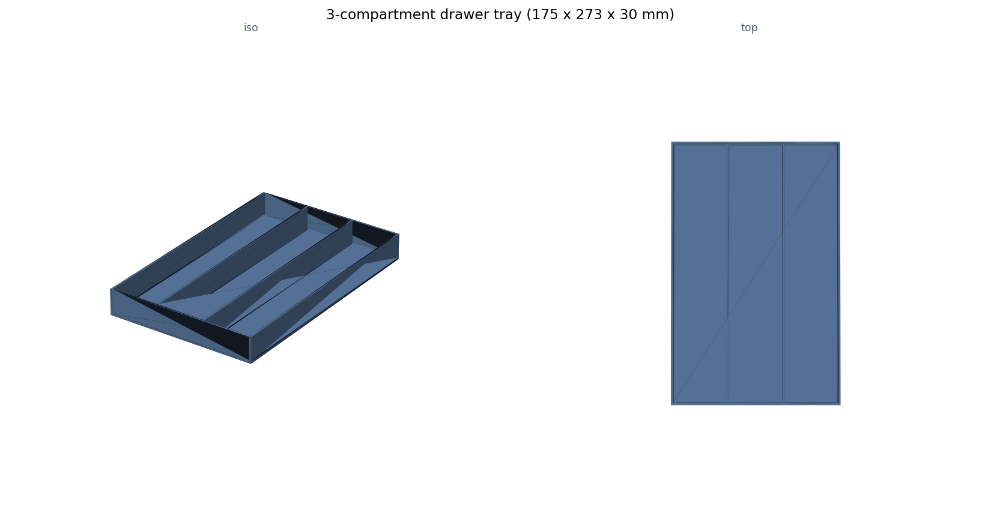

# Kitchen Drawer Organizers (and the non-manifold lessons)

Custom drawer dividers cut to my drawers' measured interiors: a 3-compartment tray, a diagonal 2-compartment tray, and a 5-compartment spoon/chopstick organizer (S-C-S-S-C layout with a lattice-vented horizontal wall). Plus `render_stl_svg.py`, which renders any STL to documentation SVGs so the repo can show geometry without shipping meshes.

**Why these scripts document their own failure mode:** the early organizers built triangle meshes by hand with numpy-stl. That works until two boxes share a face: an edge shared by more than 2 triangles (T-junction) or by only 1 (open edge) makes the mesh non-manifold, and slicers reject or mis-repair it. The 5-compartment script's docstring records the exact failure taxonomy and the resolution: build CSG with manifold3d, which guarantees watertight output from boolean unions, and stop hand-assembling triangles for anything with internal walls. I kept the notes in the code on purpose; they are the most useful part.

**Fit details that made these keepers:** scalloped inner walls (pillar cutouts that keep the bottom quarter solid) save filament without losing rigidity; the horizontal divider runs at 75% height with an 8 mm circular hole lattice so long utensils can overhang it; compartment widths are derived from a layout list, so re-planning a drawer is editing `LAYOUT = [True, False, ...]`.

**Files:** three generators, the SVG renderer, and three rendered SVGs (`comparison.svg` shows old vs new 3-compartment layouts). STLs regenerate by running the scripts.

**Honest note:** the diagonal 2-compartment divider exists because the first straight version wasted the corner a soup ladle needs; measured-object-first beats symmetric-grid-first for drawers. Also, these print near-full-bed and the first one warped until I stopped ignoring draft placement.

**AI-assisted build notes:** Claude wrote all four scripts. Its hand-built meshes produced the non-manifold geometry in the first place, and it also correctly diagnosed the cause and proposed the manifold3d migration once shown the slicer errors. Net: the AI both dug and filled this hole; the durable value is that the lesson got written down where the next script generation reads it.
