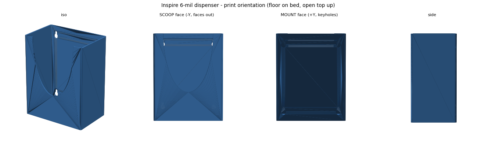

# Glove Box Dispenser (the design-DNA origin)

A wall-mounted sleeve for a Korean disposable-glove box (실속크린장갑, 190 x 155 x 40 mm): open top, elliptical U-cutout in the front face for pulling gloves, and four keyhole slots so the sleeve lifts off its screws without touching a screwdriver.

**Why it matters beyond gloves:** this was the first holder in the family, and three of its patterns became the house style that later projects (coffee scale garages, dispenser towers) inherited directly:
- **Named clearances** (`+2 mm` footprint, box depth as the single swap variable `INNER_D`)
- **The elliptical scoop** as the one-handed grab feature
- **Gravity retention plus keyhole mounting**: all four keyhole slots point the same direction, so one downward slide locks every screw head at once, and an inside counterbore channel lets the heads travel behind the wall

**How it works:** CadQuery. Solid block, fillet the vertical edges first (filleting before cavity cuts is deliberate; it fails far less often), hollow from the top, cut the ellipse through the front, then punch the keyholes: through-hole entry circle, narrow slot, rounded end cap, and the counterbore recess on the inside face. Decorative fillets are wrapped in try/except so an OCCT edge case degrades to a sharp edge instead of crashing the build.

**Files:** `glove_dispenser.py`. Running it exports the STL, validates watertightness, estimates weight in PLA/PETG, and writes an HTML viewer.

**Honest note:** the keyhole dimensions are sized to #8 pan-head screws from published head diameters, not measured hardware, and the 0.83 mm shank clearance is generous on purpose. The part has survived daily use; the tolerance stack was never tightened because it never needed to be.

**AI-assisted build notes:** this is early, mostly clean AI-generated CAD, and it shows both sides: the geometry worked first print, but the code validates less than the later projects (no containment truth table yet, just a watertight check). Comparing this script to the nursery vent validators is a fair before/after of what the AI-assisted workflow learned in a year.
