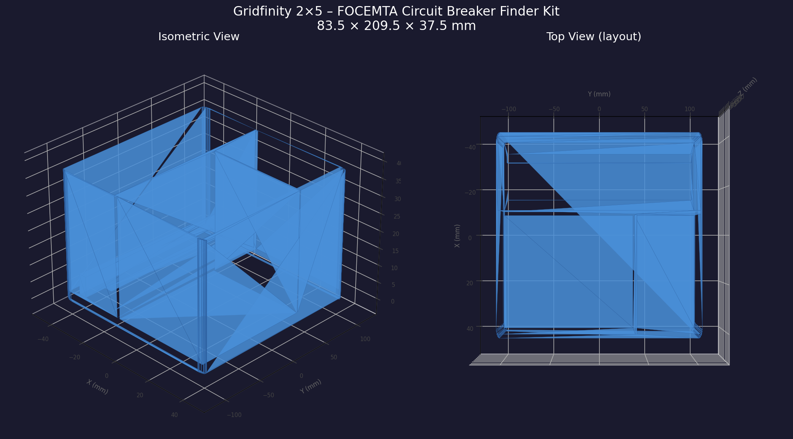

# Gridfinity Tool Bins (custom-fit, 42 mm standard)

Three bins on the Gridfinity 42 mm / 7 mm-unit standard, each custom-fit to a specific tool instead of being a generic tray:

- `gridfinity_kaiweets_ht100.py` - 4x1 bin for a KAIWEETS HT100 pen-style voltage tester (158 x 23 x 20 mm) with a finger scoop
- `gridfinity_focemta_2x5.py` - 2x5 bin for a FOCEMTA circuit-breaker-finder kit, with an internal layout diagram in the docstring
- `generate_gridfinity_5x5_box.py` - plain 5x5 box (210 x 210 x 50.8 mm) built with numpy-stl rather than a CAD kernel

**Why custom-fit:** a generic bin holds a tool the way a drawer does, loosely. Cutting the pocket to the tool's measured envelope plus 1 mm per side means the tool has one home, drops in one way, and the bin label is the tool. The Gridfinity constants (`GRID = 42.0`, `GAP = 0.5`, `CORNER_R = 3.75`, 7 mm height units) live at the top of each script, so a bin resizes by editing `UNITS_X` / `UNITS_Y` / `HEIGHT_UNITS`.

**Two build styles on purpose:** the tool bins use CadQuery; the 5x5 box builds its triangle mesh directly with numpy-stl. The direct-mesh approach is educational and fast for boxes, but it is also exactly the style that caused non-manifold failures on more complex parts elsewhere in this repo (see drawer-organizers), which is why only the simplest part still uses it.

**Files:** three generator scripts plus `gridfinity_focemta_preview.png`. STLs regenerate by running the scripts.

**Honest note:** these bins assume standard Gridfinity baseplates and do not implement the magnet bores or stacking lip of the full spec; they are flat-bottom bins sized to the grid. That covers my drawers. If you need the full profile, use gridfinity-rebuilt-openscad and treat these as pocket references.

**AI-assisted build notes:** Claude generated all three from tool measurements and the Gridfinity constants without issues; simple prismatic bins are squarely inside what AI CAD generation does well. The only human work was measuring the tools and deciding the scoop position, and the honest observation is that for this class of part the AI is simply faster than opening a GUI CAD tool.
