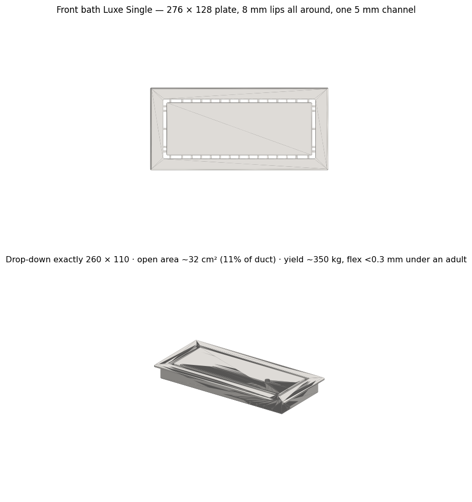
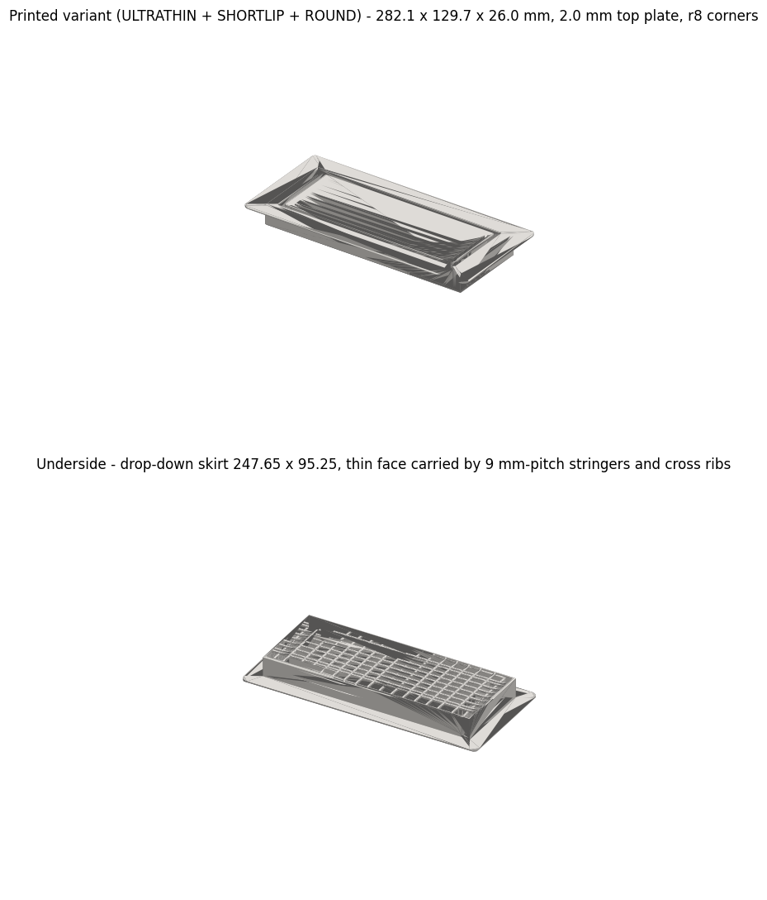

# Hall Bath Flush Vent (10 x 4 in, the nursery vent re-parametrized)

The variant that got printed, regenerated from the shipped script:

The hall bathroom's floor duct is a nominal 10 x 4 in opening - about a third the area of the [nursery vent's](../nursery-flush-vent/). This is that project's spin-off: the same "Luxe Single" frameless style (one floating panel, one 5 mm perimeter channel, all structure hidden below the sightline) refitted to the small duct. Same design DNA, different constraints: a wet room, a duct too narrow for the 3-channel style, and - because the part shrank - top-plate thickness became the variable that mattered. Six design iterations over three days, eight exported meshes.

**Zero new CAD lines.** There is no bath fork of the generator. Every variant is a `-D` override set on the already-published `nursery_flush_vent.scad`; `regen_bath_variants.sh` holds all eight sets. The two changes the bath forced on the shared source are both visible in that file: the panel-width assert now fires only for the 3-channel `luxe` mode (10 x 4 is valid for `luxe1` but too narrow for three channels - the comment names this vent as the reason), and a brand-new width assert exists because of the bug below.

**v1/v2 - fit the measured hole (days 1-2):** plate 276 x 128 x 28.5 mm, 8 mm lips, drop-down exactly 260 x 110 (then 260 x 103 after the opening width was re-measured, one override changed). The render caption carries the honest numbers: open area ~32 cm2, 11% of the duct - `luxe1` is the most restrictive style in the family, the exact tradeoff the nursery project got burned by. This time the fraction was computed before printing, not after the heater ran. Yield ~350 kg, flex < 0.3 mm under an adult.

**The RMG pivot (day 2):** instead of hugging the measured hole, clone the footprint of a commercial RMG flush register - faceplate 292.1 x 139.7 mm (11.5 x 5.5 in), drop-down 247.65 x 95.25 mm (9.75 x 3.75 in). That widens the lips from 8 to 22.2 mm per side, and the wide lip exposed a real bug: plate *length* was assert-checked, plate *width* never was, and a lip wider than `luxe_side_border` pushes the side channels off the drop-down skirt - they would vent into the shallow floor gap under the lip instead of into the duct. The fix, `assert(luxe_FW <= skirt_W - 2*skirt_wall - 1, "luxe opening exceeds skirt interior (W)")`, landed in the shared scad the same hour the RMG export was cut, with a comment telling the story; the same check was copied into an unpublished sibling vent generator that day.

**The thickness ladder (day 3):** four top-plate thicknesses at identical RMG footprint - 4.5 mm (original), 2.8 THIN, 2.0 ULTRATHIN, 1.6 (1P6). Thin skin is bought with a denser under-spine grid, pitch scaling roughly with t squared: 28 / 14 / 9 / 6 mm. Total heights 28.5 / 26.8 / 26.0 / 25.6 mm; worst-case single-hard-point capacity ~73 / 57 / 45 / 43 kg (definition: full body weight through a shoe heel landing mid-span - a bare foot spreads over many cells and is trivial for all four); solid material ~400 / 345 / 335 / 365 g (1.6 needs more grid than it saves in skin); magnet pockets deleted below 2.8 mm, edge chamfers scaled down to keep a 0.8 mm rim land. Verdict: **2.0 mm ULTRATHIN** - visually indistinguishable from 1.6 at the floor line, ~55% more puncture margin. The study ships as [bath_thickness_comparison.html](bath_thickness_comparison.html) (self-contained, true-scale cross-sections, spec table). 2.8 exists only in the study; it was never exported as a mesh.

**Two cosmetic passes, then print:** SHORTLIP trims the faceplate 5 mm per side (292.1 x 139.7 to 282.1 x 129.7 - the channel layout is anchored to the duct, so it does not move), and ROUND takes the plate corners from r1.5 to r8 at unchanged bounding box. The printed part is ULTRATHIN + SHORTLIP + ROUND: 282.1 x 129.7 x 26.0 mm, PETG, top face down on textured PEI. Every opening is <= 5 mm (a toddler finger is ~8-10 mm), enforced by the same `luxe_gap <= 5.01` child-safety assert as the nursery part.

**Files:** `regen_bath_variants.sh` (all eight variants as override sets against `../nursery-flush-vent/nursery_flush_vent.scad`; needs OpenSCAD), `make_previews.py` (matplotlib STL renders, writes `final_part.png`), `bath_thickness_comparison.html`, plus the two renders above. No meshes are checked in - the script regenerates them.

**The override sets are reconstructed, not remembered.** The original exports were command-line runs whose flags were never written down. For this export they were reverse-engineered from the shipped meshes - skirt vertex positions pin the clearances, stringer wall pairs pin the grid pitch, a least-squares arc fit pins the corner radius at exactly 8.0 - then re-rendered and diffed against the originals. Six of eight regenerate bit-equivalent (same triangle count, volume matching to 1 mm3). The two ROUND parts differ in one known place: a one-off script had continued the edge chamfer around the four r8 corner arcs, and that script was not retained (648-656 extra corner-facet triangles in the originals, 21 mm3 of 255,626 on the printed part).

**What went wrong (honestly):** the lip bug is the one that mattered - a cosmetic-looking change (wider lips to match a commercial faceplate) silently redirected the side channels into the under-lip floor gap, because no assert covered plate width. It was caught before printing and the fix is a permanent assert, not a note. The other two failures are process failures this folder had to dig out of: the exact export flags of six iterations lived only in shell history, and the corner-chamfer post-process died with its scratch session - the single geometric feature of the printed part that cannot be regenerated from retained source.

**AI-assisted build notes:** Claude ran the whole variant loop - re-parametrizing the shared scad by overrides instead of forking, retuning the spine grid per thickness, and assembling the four-way comparison as a self-contained HTML study - six iterations in three days. Its documented failure is the RMG lip: it widened the plate to the commercial footprint without noticing the side channels slid off the skirt, an error no existing assert covered; the width assert exists because that near-miss was caught in review, and the relaxed luxe assert next to it shows the same tool being loosened deliberately rather than silently. The reconstruction work in this export is the flip side of fast AI iteration: winning command lines nobody saved, recovered only by mesh forensics.
