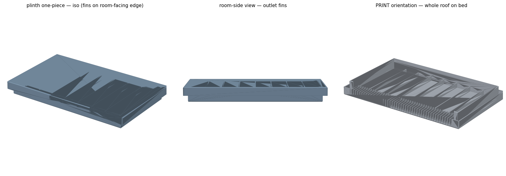
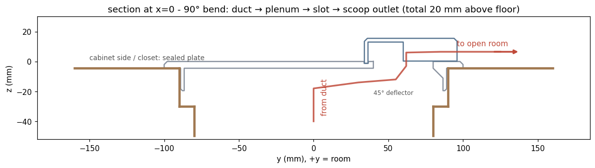
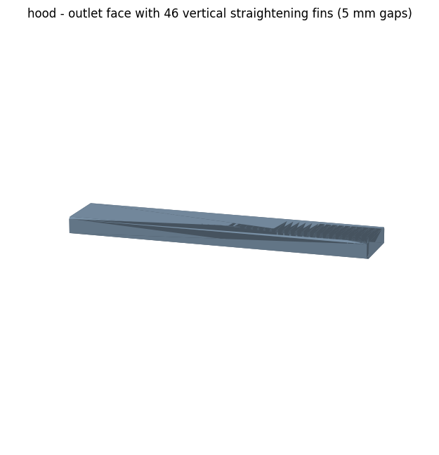
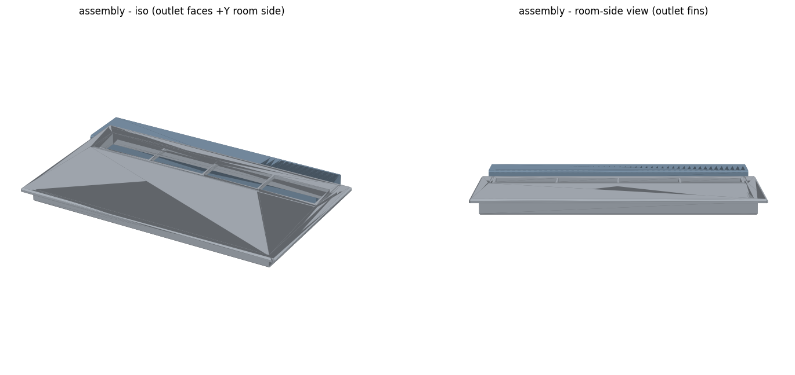
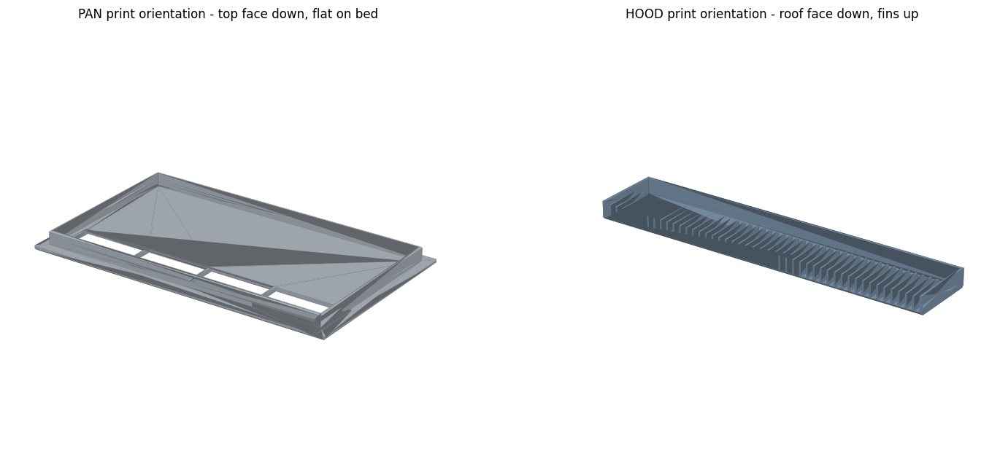
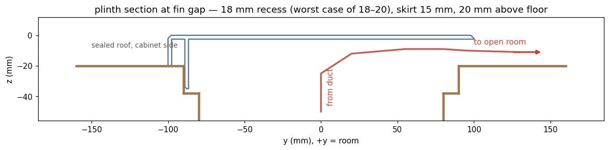

# Hallway Louver Vent (90-degree diverter for a cabinet-blocked register)



A hallway floor register sits fully under a cabinet: supply air dead-ends against the cabinet bottom and escapes only through ~20 cm gaps at the four corners. This cover seals the top and bends the flow 90 degrees about the long (300 mm) axis, exiting horizontally through a low finned outlet along the room-facing edge - air is thrown along the floor toward the open room, away from the closet side. One OpenSCAD source (`RENDER_PART` = `pan` / `hood` / `assembly` / `plinth`) holds two architectures: a two-piece flush pan + glued scoop hood, and the version that got printed, a one-piece 20 mm plinth with zero supports and zero glue. PETG on a 350 x 320 mm bed.



## Louvers are an airflow problem, then a printing problem

Vent covers are where grille aesthetics, airflow, and FDM print physics all pull on the same three or four millimeters. This project did the arithmetic before printing, and every number below is geometric free-area math from the .scad's own `echo` and the validators - no CFD, no flow simulation, and no claim of one.

**1. Projected free area is the budget.** A louver field's open fraction per pitch is `gap / (gap + t)`: here 5.0 mm gaps (a hard child-safety rule, enforced by `assert(fin_gap <= 5.01)`) and 1.6 mm fins (exactly 2 perimeters at a 0.4 nozzle) give 5.0 / 6.6 = 76% of the field width. If the blades are also raked at angle theta, the *projected* open area shrinks by cos(theta) before blade thickness is even counted - classic 45-degree louvers hand back 29% off the top. Then the fin height multiplies it all. The ledger for this design:

| Station | Free area | % of duct |
|---|---|---|
| Duct (300 x 160) | 480 cm2 | 100% |
| Pan slot, 300 x 40 minus 3 ribs (two-piece) | ~117 cm2 | 24% |
| Hood outlet, 46 fins x 13 mm tall (two-piece bottleneck) | ~30.5 cm2 | ~6% |
| Plinth outlet, 45 fins x 17.5 mm tall (one-piece, printed) | ~39.9 cm2 | ~8.3% |



6% of duct is starvation territory. The lesson was already paid for on [nursery-flush-vent](../nursery-flush-vent/), where a beautiful frameless register shipped at ~9% free area and choked the room the first time the heater ran; a grille that drops free area does not look like a mistake until the thermostat says so. Here the low ratio was accepted eyes-open: the starting condition is a *fully blocked* register, and the cabinet's corner gaps are a second restriction in series anyway. The one-piece plinth was chosen partly because it buys +30% outlet area for free - deleting the flush plate lets the outlet grow from 13 mm to 17.5 mm tall inside the same 20 mm height cap.

**2. Velocity intuition and the whistle ladder.** By continuity, the same airflow through ~6% of the area means roughly 16x the duct velocity at the outlet - the regime where registers become audible. Rather than pretending to simulate that, the design records an escalation ladder with each lever's cost computed from the same formulas as the geometry: (1) shift the fin field toward the plate edge - lower loss, no area change; (2) raise `scoop_cap` above 20 mm - each +1 mm buys ~2.3 cm2 of outlet; (3) widen `fin_gap` past 5 mm only when the child-safety rule no longer applies; (4) add outlets on the end faces (parameterizable, but they would blow along the wall). The levers are in the source as named parameters, so any of them is a one-line change and a re-render.

**3. The 45-degree rule couples three constraints - and print orientation dissolves it.** Classic louvers sit at 45 degrees because one angle serves three masters: it self-supports on an FDM printer, it blocks the vertical sightline into the duct, and it still passes air (at the cos-45 = 71% projection tax, which is why angled-blade grilles are hungry for depth). This design pays none of that tax, because both architectures print face-down: the fins grow as plain vertical walls off the bed - 0-degree rake, no overhang anywhere, full projected area. Sightline blocking comes free too, since the outlet faces sideways 20 mm off the floor and nobody looks down it. The 45-degree angle still appears exactly twice, both times for printability rather than airflow: the deflector wedge that fills the dead-end corner of the plenum (a corner fillet, not a turning vane - it stops the flow recirculating in the pocket and curves it up into the slot, and its 45-degree face prints support-free top-face-down) and the 2.0 mm roof-edge chamfers that flare from the bed. When a louver design gets to choose its print orientation, blade angle stops being a three-way compromise and becomes a free parameter.

**4. Print physics picked the architecture.** Every one-piece flush-plate-plus-raised-hood variant fails the same way: in any orientation, some ~15 mm of plate starts mid-air (the playbook rule: re-check every feature in *print* orientation, not design orientation). So v1 split at the plate plane into two flat, zero-support parts whose show faces both land on textured PEI: the PAN prints top-face-down dead flat, the HOOD prints roof-down as a tray with walls and 46 fins growing up, and they join with a 1.2 mm locating groove plus CA glue. v2 answered "can it be one piece with no glue?" by removing the flush plate entirely - the whole cover becomes a 20 mm box whose roof is layer 1 on the bed, with 45 fins in the room-facing edge, 7 internal ribs parallel to the flow, and a 3-sided skirt plus two 8 mm registration stubs. One print, zero supports, zero bridges, nothing to assemble - at the cost of standing 20 mm proud across the whole 340 x 200 footprint instead of sitting flush.







## Validation is a program, not a review

- **10 asserts in the .scad** fail the render on a bad edit: bed fit (350 x 320), child-safe fin gap, skirt-vs-ledge clearance, groove-vs-slot interference (back groove clear of the slot; end grooves pass 1.4 mm from the slot ends), hood-vs-plate envelope, and the 20 mm height cap.
- **`validate_and_export.py`** (two-piece): watertight + extents checks on both parts, then a 23-point containment truth table whose probe coordinates are *derived from the same formulas as the geometry* (`rib_x(i)`, `fin_xc(k)`, `gap_xc(k)` - never eyeballed), then flips and re-zeros the meshes, exports the `*_PRINT` STL/3MF, and verifies which vertices actually touch z=0.
- **`validate_plinth.py`** (one-piece): watertight + envelope plus an 18-probe truth table including the stub assert (`skirt_L/2 - skirt_wall - p_stub_len >= p_fins_span/2`), computes the outlet free area, and exports the pre-rotated print files with a bed-contact span check.

## What went wrong (honestly)

- **The registration stubs almost strangled the outlet.** First sized at 30 mm, they reached x = 127-159 and would have dead-walled ~7 fin channels - a part that printed perfectly and quietly moved less air. Caught in design review, and the constraint is now an assert, not a memory.
- **Two truth-table "failures" were probe bugs, not geometry.** Rib 4 sits exactly at x=0 and fin 22 straddles x=0, so probes placed on the centerline hit solid where the table expected air. The fix was moving probes to derived gap coordinates (`gap_xc(k)`, mid-rib) - the same never-eyeball-a-probe rule the file already preached.
- **The hood was filenamed 308 from a stale comment.** Its real length is derived: `slot_L + 2*(hood_wall + hood_margin_x)` = 312.8 mm. The extents check caught the mismatch and the file was renamed 313 - names come from measured extents, not intentions.
- **"About an inch" was not an inch.** The recess measured 18-20 mm, not ~25.4; the correction rippled through as a two-line parametric change (`ledge_depth` 25.4 to 18, `skirt_depth` 20 to 15) followed by a full re-render and re-validation. Verbal depth estimates get replaced by measurements before printing.

## Files

| File | What |
|---|---|
| `hallway_vent_90.scad` | Parametric source of truth; `RENDER_PART` selects `pan` / `hood` / `assembly` / `plinth`; 10 asserts + free-area echoes |
| `validate_and_export.py` | Two-piece: watertight/envelope checks, 23-point truth table, pre-rotated print export + bed-contact check |
| `validate_plinth.py` | One-piece: 18-probe truth table incl. the stub assert, outlet free-area math, pre-rotated print export |
| `make_previews.py` | matplotlib renders: assembly views, section with airflow path, print orientations, fin closeup (covers the two-piece set; the plinth previews came from a variant of the same script) |
| `overview.png`, `preview_*.png` | The renders embedded above |

No STL/3MF ships here. Regenerate the design meshes with OpenSCAD, then run the validators next to them:

```bash
openscad -o pan_design.stl    -D 'RENDER_PART="pan"'    hallway_vent_90.scad
openscad -o hood_design.stl   -D 'RENDER_PART="hood"'   hallway_vent_90.scad
openscad -o plinth_design.stl -D 'RENDER_PART="plinth"' hallway_vent_90.scad
python3 validate_and_export.py && python3 validate_plinth.py
```

Printed in PETG (0.2 mm layers, 4 walls, 25-30% gyroid, zero supports) with the `*_PRINT` exports as-is: already flipped, z=0 at the bed.

## AI-assisted build notes

Claude wrote the OpenSCAD, both validators, and all the free-area arithmetic, and the assert-driven loop made the two-architecture pivot cheap - v2 reuses the pan's parameter block, and the "~1 inch" measurement correction was absorbed as a two-line change. It also made both catchable mistakes in this project: it placed truth-table probes on centerline geometry twice (its own tests then reported failures against correct geometry), and it named an export from a stale 308 mm comment instead of the derived 312.8 mm extents. Both were caught by the validation habits themselves - derived probe coordinates and the extents check - plus a human asking why a "failing" part looked fine in the render. The human also supplied the two decisions the math could not: re-measuring the recess instead of trusting a verbal estimate, and asking for one piece with no glue, which is the version on the floor now.
