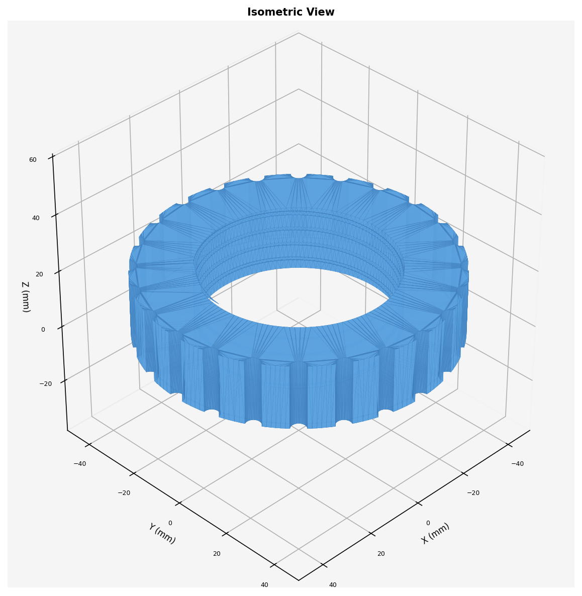

# Honeywell Tower Fan Replacement Locking Nut

The plastic locking nut that holds a [Honeywell QuietSet tower fan](https://www.honeywellstore.com/store/products/honeywell-quietset-whole-room-tower-fan-black-hyf290b.htm) (HYF260/HYF290) together cracked, and Honeywell does not sell it. This is a parametric build123d replacement: a 100 mm knurled ring with internal multi-start threads swept from a `Helix`, with a selectable thread profile (triangle / square / buttress).

**Why it is interesting:** the mating thread is inside the fan housing where calipers barely reach. My measured pitch (2.84 mm from crest 1.61 + gap 1.23) produced a nut that fit but would not catch. Instead of guessing again, I bracketed the unknowns empirically: an overnight plate of 8 test rings (5 mm tall, ~15 minutes each) varying pitch (2.5 / 3.0 / 3.5), profile (triangle / square), depth (0.30 / 0.50 x pitch), and start count (2 vs 3). A second round varied bore diameter and ring height after two rings engaged but bound. Cheap prints turned an unmeasurable geometry problem into a lookup.

**A constraint I did not expect:** the female thread's axial width must be less than the male thread's measured 1.23 mm gap or the crests physically cannot pass, so the profile is capped at 0.35 x pitch with ~0.2 mm FDM tolerance. That single line is why v5 failed and v6 engaged.

**Files:** `locking_nut.py` (all parameters at the top; the docstring records the caliper measurements verbatim so future sessions do not re-measure), `locking_nut_isometric.png`. STL/3MF regenerate by running the script.

**What went wrong (honestly):** multi-start swept-union threads produced non-manifold edges in OCCT at the trim boundary; the script switched to a subtract-grooves strategy (start from a tight bore, cut helical grooves) which stays watertight. Two of the early test rings still carry ~15-23 tiny boundary edges and need the slicer's auto-repair; documented rather than hidden.

**AI-assisted build notes:** Claude generated the Helix sweep code and the test-ring matrix quickly, and correctly diagnosed "measured pitch is the weakest number" after the first failure. It initially produced the non-manifold multi-start unions and needed a strategy change, not a parameter tweak, to fix them. The hypothesis bracketing was a joint effort: the AI proposed the axes, I ranked which ring to try first based on how the failed print felt.
