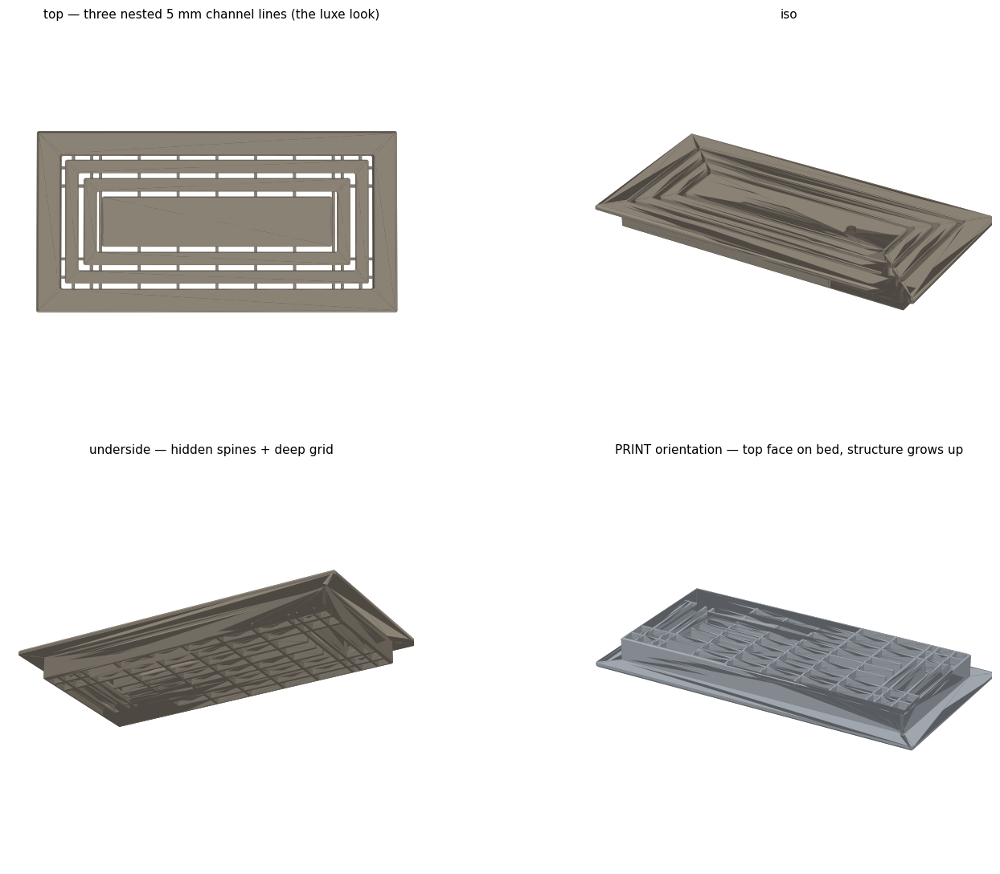
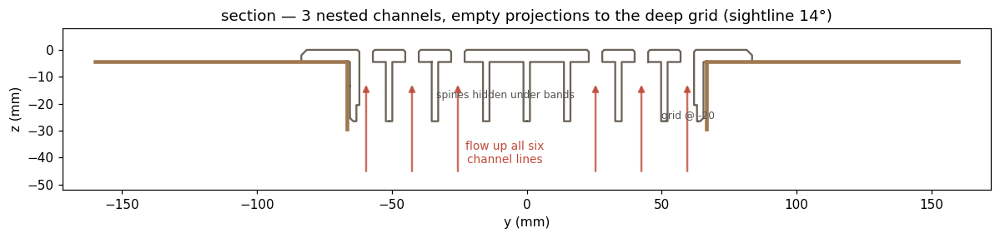

# Kitchen Luxe Flush Vent (frameless language at maximum airflow)

Annotated cross-section - six channel lines, spines hidden under their own bands, grid at -20 mm:

A flush drop-in floor register for a 300 x 133 mm kitchen floor opening, in the same frameless visual language as the [nursery-flush-vent](../nursery-flush-vent/) but pushed to maximum airflow: three nested 5.0 mm channels instead of a single floating panel. One printed piece, no assembly, no visible structure, removed by hidden magnet pockets. Four principles carried over intact from that lineage: child-safe openings, maximum airflow, no visible understructure line, mechanical sturdiness.

**The pivot: flow versus the single-panel look.** The single floating panel (the "bath look", the style of the [hall-bath-vent](../hall-bath-vent/)) is the most restrictive member of the family, and the portfolio already contains the lesson of a beautiful frameless vent that starved a room at 9% free area. "Maximum flow" and "luxe single" pull in opposite directions, so this design switched to the three-channel member of the same language:

| Style | Free area | % of the 379 cm2 duct |
|---|---|---|
| Luxe single (bath look) | ~40 cm2 | ~11% |
| **Luxe 3-channel (this)** | **~101 cm2** | **~27%** |

2.5x the flow, same frameless read. Channel stack across the 124 mm field: frame, ch 5, ring 12, ch 5, ring 12, ch 5, panel 46 - six channel lines in section, panel width 46 mm over the 40 mm structural minimum (asserted).

**Site constraints shaped everything.** The duct drops to 285 x 133 mm at 25 mm depth, so ledges exist only at the two ends (7.5 mm each) and the sides drop sheer. One long edge sits near a wall capping the lip at 17 mm, giving a uniform 17 mm lip and a 334 x 167 mm plate. A quiet win over the 350 mm nursery predecessor: at 334 mm this vent gets a full one-piece perimeter lip AND lies flat on the 350 mm bed - the original had to choose (its flange is asymmetric for exactly that reason).

**The "no visible line" trick, adapted to a 25 mm recess.** Every channel's vertical projection is empty from the surface down to a deep grid whose top is 20 mm down, so the sightline into a 5 mm channel cuts off at `atan(5/20) = 14 degrees` (the predecessor's v3 had 24 mm of depth to work with, 12 degrees; the difference is imperceptible). Islands hang from 2.4 mm spine walls hidden under their own solid faces; loads land on a bidirectional grid at z -20 to -26.5: 7 main cross members, 4 extra ribs placed by formula (`(r_o + r_i)/4`, under the ring end-band centerlines), and stringers arranged so no print bridge exceeds ~20 mm. Kitchen floors get stepped on; the grid is the sturdiness item. A 22 mm skirt clears the end ledges by 3 mm, and the outer channel's downstand wall deliberately fuses into it as a doubled wall. Removal: Ø8.4 mm blind magnet pockets at x = +/-60 mm with ceilings 1.2 mm below the surface - glue in 8x3 mm discs, lift with a magnet on a stick, invisible from above. Every opening is exactly 5.0 mm (child-safety assert), and all six channel edge loops get 0.7 mm chamfers.

**Validation is a program.** Seven asserts in the .scad (bed fit, child-safety gap, panel width, ledge clearance, luxe opening vs skirt interior in both axes, grid height). `validate_kitchen.py` mirrors the .scad formulas independently, checks watertightness and the envelope, then runs the signature containment sweep: 1,296 points (3 channels x 108 points x 4 depths at z -1.5/-6/-12/-19.5) through the channel projections, required to hit zero obstructions - the sweep IS the checkable "no visible line" spec. Then an 18-probe truth table (spines, grid members and open cells, downstand, skirt wall, magnet boss vs pocket, chamfers), then export of the pre-rotated top-face-down print files with a bed-contact check. All checks PASS.

**Files:** `kitchen_luxe_vent.scad` (parametric source of truth), `validate_kitchen.py` (sweep + truth table + print export), `overview.png` / `section.png` (renders). STL/3MF are regenerated, not stored: `openscad -o kitchen_design.stl kitchen_luxe_vent.scad`, then `python validate_kitchen.py` emits the pre-rotated `*_PRINT.stl/.3mf`. Printed in PETG on textured PEI, top face down, zero supports, 0.2 mm layers, 4 walls, 25-30% gyroid; the grid bridges only in the final ~6.5 mm of the print, on faces nobody sees.

**Vent family:** [nursery-flush-vent](../nursery-flush-vent/) (origin of the luxe language and the sweep-as-spec doctrine), [hall-bath-vent](../hall-bath-vent/) (the single-channel luxe member), [hallway-louver-vent](../hallway-louver-vent/), [toekick-vent-slider](../toekick-vent-slider/), [kumiko-vent-covers](../kumiko-vent-covers/).

**AI-assisted build notes:** Claude wrote the OpenSCAD, the validator, and the sightline/free-area arithmetic, and because the conventions were already established by the predecessor (formulas-never-numbers, the containment sweep as spec), this went from site measurements to all-PASS print files in one session with no printed-part surprises. The catches here were inherited, which is the point: the human call was refusing the single-panel reading of "match the bath vent" because AI had once shipped a 9%-free-area vent without anyone asking the flow question, and the width assert on the luxe opening exists because an earlier bath variant left width unchecked and its side channels would have vented into the under-lip floor gap instead of the duct. The failure modes live on as asserts, so this build did not get to repeat them.
