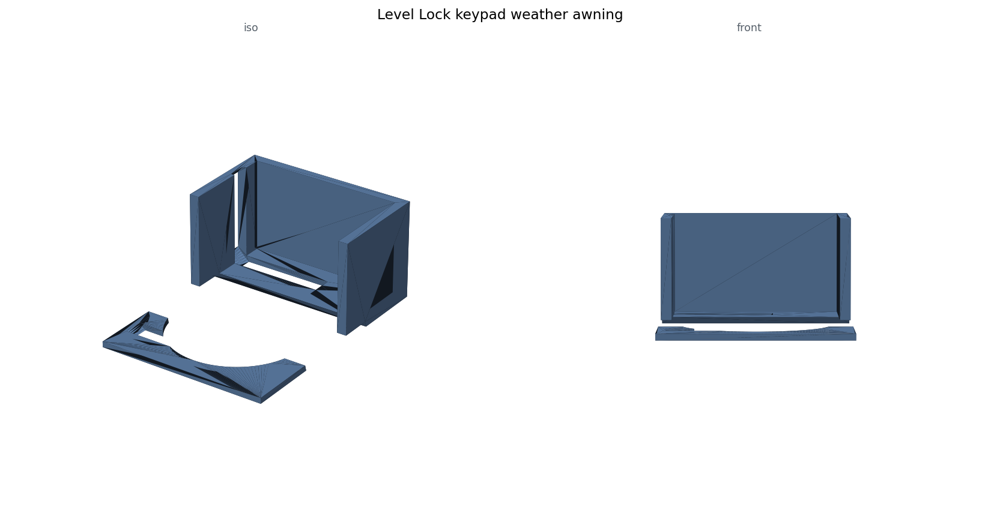
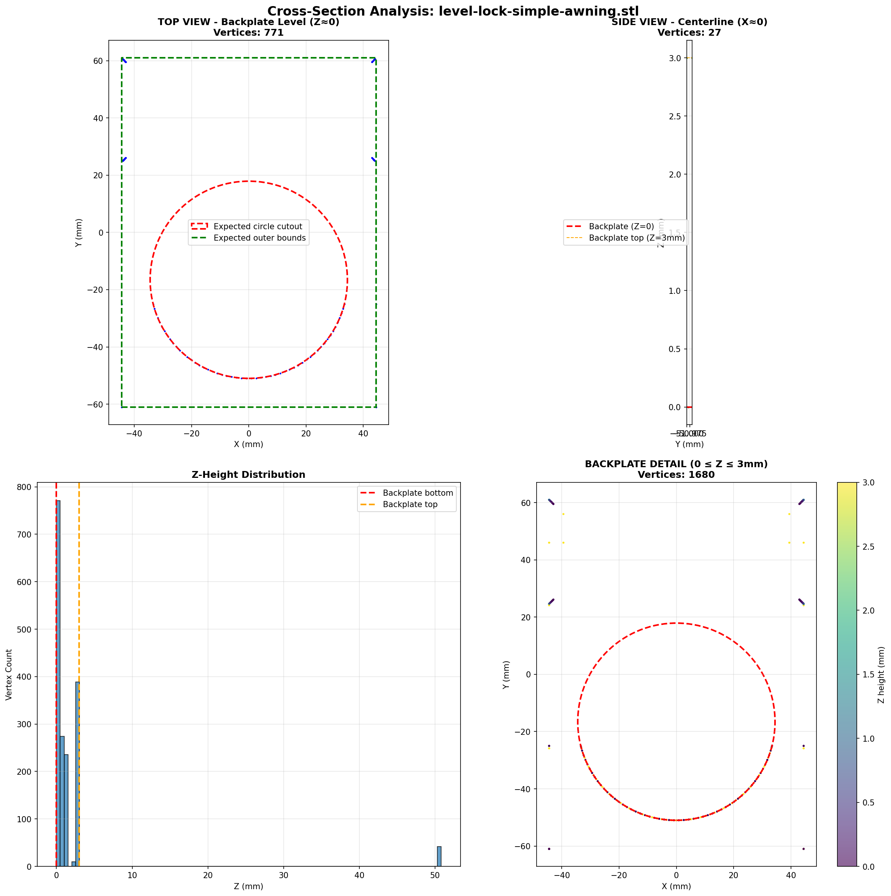

# Level Lock Keypad Weather Cover

A smart-lock keypad on an exterior door sits in the rain. Commercial spring-loaded keypad covers (clear polycarbonate, stainless torsion spring) run about $30-50, and none of the printable alternatives surveyed replicate the spring mechanism - so this design trades auto-close for zero moving parts: a fixed rain awning sized to fit a [Level Lock](https://www.amazon.com/s?k=Level+Lock+keypad) keypad (brand named for compatibility only; all geometry here is authored from scratch). The 88.9 x 122.0 mm footprint is the measured bounding box of a commercial-size keypad cover - only that envelope number was reused.

**Dimensions derive, they are not drawn:** the lock opening is `plate width - 2 x 10 mm side clearance = 68.9 mm`, because v1's hand-picked centered 70 mm circle left only 9.45 mm against the 10 mm clearance target. It took four architectures to get here: a flat 3 mm plate (wrong - it discarded the protective frame entirely), a hollowed box (wrong again), a full U-frame with 5 mm walls (worked, but ~122 g of PLA and over-engineered), and finally a 15-degree angled awning with short sidewalls and an open bottom for hand access - ~74 g, 40% lighter, and the slope sheds rain. Every export ends with a trimesh watertight check plus a weight estimate (volume x 1.24 g/cm^3 for PLA).

**The backplate scare:** the build123d STL looked like it was missing its back plate in the 3D viewer. Instead of trusting one tool, the diagnosis triangulated three independent ways: stepwise volume printouts after every boolean (still visible in `level_lock_simple_awning.py`), an OpenSCAD reimplementation of the same geometry (`level_lock_awning.scad`), and `compare_stl_files.py`, which counts vertices near Z=0 and bottom-facing normals to detect a missing bottom face. `visualize_cross_sections.py` settled it with a 4-panel matplotlib figure (`cross-section-analysis.png`): 771 vertices at Z~0 proved the plate was there all along - a viewer illusion, not a geometry bug. Fittingly, the flat-shaded overview above plays the same trick: the thin strips beside the opening hide at that angle, but the plate is continuous around the hole and the mesh is watertight.

**Files:** `level_lock_awning_cover.py` (shipped awning architecture), `level_lock_simple_awning.py` (minimal corner-tab variant), `level_lock_awning.scad` (cross-check twin), `compare_stl_files.py`, `visualize_cross_sections.py`, `cross-section-analysis.png`, `overview.png`. STLs and the three.js HTML viewers (STL base64-embedded; three.js itself loads from a CDN, so viewing needs internet) all regenerate by running the scripts.

**What went wrong (honestly):** a 0.5 mm chamfer failed outright on a 3 mm plate edge in build123d during the earlier keypad-adapter iterations that are not shipped here; the artifact of that lesson in the shipped code is the simple awning's conservative 1.5 mm fillet, wrapped in try/except because edge selection can still fail on thin geometry. And the honest caveat: the project log still lists test print and fit verification as pending. Print plan from the log: back plate flat on the bed, no supports, PETG over PLA for outdoor UV, mounted with outdoor VHB tape on the border.

**AI-assisted build notes:** Claude wrote all four architectures and the whole verification toolchain quickly, and cross-checking one CAD kernel against an independent OpenSCAD implementation plus mesh forensics was the right instinct. But the first two architectures were confidently the wrong part - the actual requirement only landed after a human annotated a sketch - and the backplate hunt burned a session proving a bug that never existed, ended by a picture rather than a test. Geometry and forensics were the AI's job; requirements and looking at the part were the human's.
