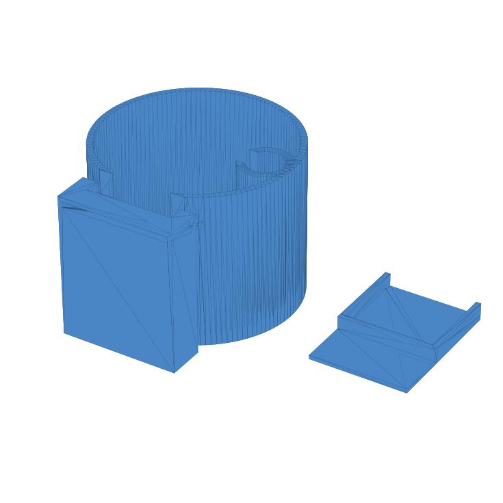

# LG WashTower Pump-Drain Catch Cup

Draining the pump filter on an [LG WashTower](https://www.amazon.com/s?k=LG+WashTower) dumps water from a round filter cap ~110 mm off the floor, and the gap under it fits no container I own. This is a two-part catch system: a cylindrical cup with an angled socket, and a thin spout tongue that slips into the gap under the filter opening and guides water into the cup. The pattern follows the proven "drain bowl" class of models for round LG filter caps (cf. Printables model 1536585); the geometry here is original.

**How it works:** trimesh + manifold3d boolean CSG, no BREP kernel. The cup is a difference of cylinders; a full-height buttress boss carries a socket slot that is cut at a 13-degree downward tilt (rotated about the wall entry point, so the spout tip rides just under the cap while its root drains into the cup). A C-clip column inside the cup snaps the machine's emergency drain hose (15 mm OD kept by a 9 mm mouth) so it drains into the same cup. Both parts print flat with zero supports; the spout root slides into the socket as a snug 0.25 mm-clearance fit.

**Fit-critical parameters are labeled `[F]` in the script** (cap diameter, cap center height, tongue thickness, hose OD) because those four numbers are the ones a different LG unit would change. The script prints a fit report at build time: cap bottom height, cup rim height, and the fitted spout tip height, so a mismatch is visible before slicing.

**Files:** `lg_washtower_drain_bucket.py`, `preview.png`. Running the script exports cup, spout, and a combined print plate as STL/3MF.

**What went wrong (honestly):** v1 was a rectangular tray under the filter, designed from a photo. The user feedback ("the filter cap is round, and there is a known-good design shape for this") plus twenty minutes of reference research produced v2, a complete rework. Checking whether a proven design pattern already exists is cheaper than inventing; I now do that first.

**AI-assisted build notes:** Claude wrote the CSG cleanly, including the tilted-socket transform math that I would have fumbled in a GUI. Its v1 shape was wrong because it designed from my bad description instead of asking for the reference class; the fix came from human feedback and prior art, not more code.
