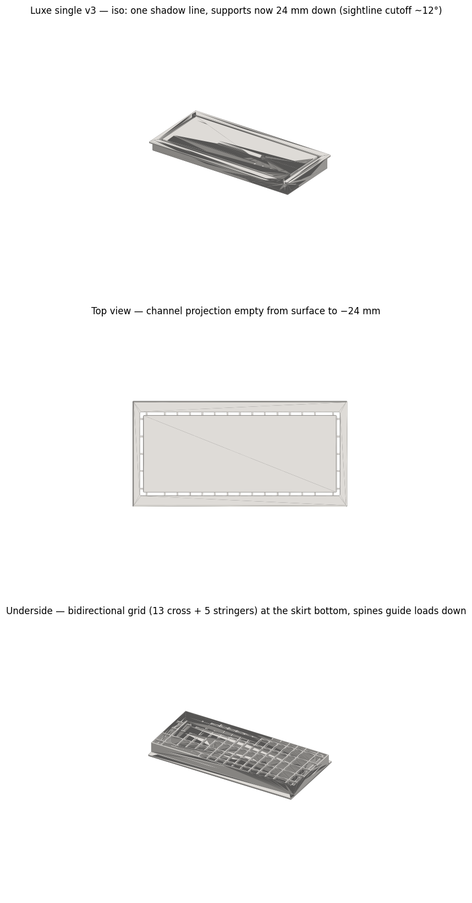
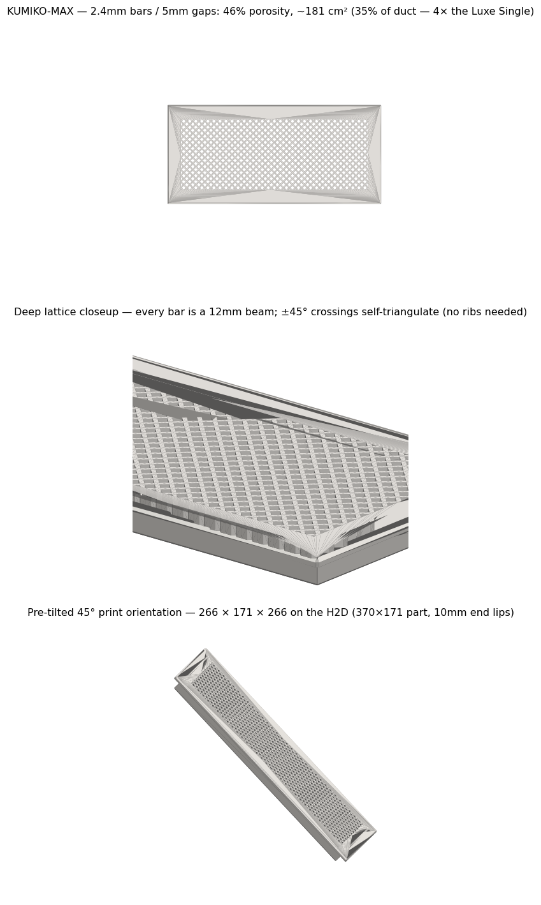
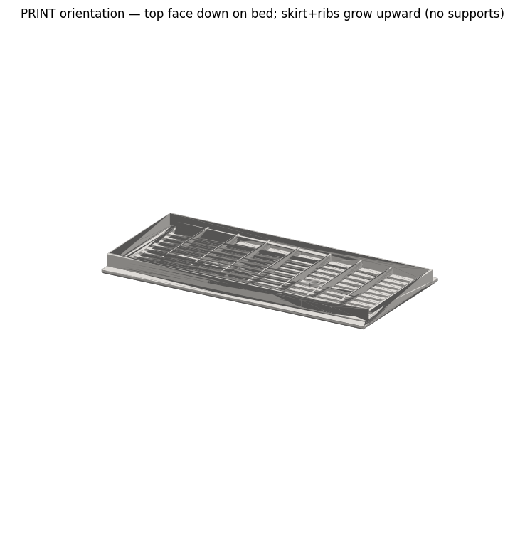

# Nursery Flush Floor Vent (child-safe, one-piece on a 350 mm bed)

Two more of the generated styles and the print-orientation check:

 

A flush, minimalist drop-in floor register for a 350 x 147 mm duct opening in a nursery, replacing a stamped register whose openings were a finger-entrapment risk for small children. One OpenSCAD source generates four visual styles from a shared body: lengthwise slots, a 45-degree kumiko diamond lattice, and two "frameless" nested-channel looks.

**The two constraints that drove everything:**
- **Child safety: every opening <= 5 mm** (a toddler finger is ~8-10 mm), enforced by an `assert()` in the .scad so a future parameter tweak fails at render time, not at install time.
- **Bed size:** a flange on all four sides needs 374 mm on a 350 mm bed. The fix is an asymmetric flange (12 mm on the two long edges only, ends flush inside the opening), landing a 348.5 mm one-piece part on the bed with 0.75 mm margin per end. I also proved to myself that diagonal placement cannot save a wide part: rotated bounding width `L*cos(t) + W*sin(t)` is minimal at zero rotation.

**Favorite detail:** the "Luxe" style hides all structure. The zone under every visible channel is kept empty down to 24 mm, so the sightline into a 5 mm channel cuts off at `atan(5/24) ~ 12 degrees` and channels read as pure shadow. "Invisible" is an assertable spec: `validate_luxe.py` swept 1,476 points through the channel projections at the printed v2's 14.5 mm depth and required zero hits; the deeper 24 mm v3 grid re-verified with a 528-point sweep (projections empty to -23.5 mm). The KUMIKO-MAX variant goes the other way: 2.4 mm bars, 20 mm deep (S ~ h^2, I ~ h^3), self-braced by the crossing lattice, 4x the airflow of the first frameless attempt.

**Files:** `nursery_flush_vent.scad` (source of truth, ~520 lines, `RENDER_PART` selects style), `validate_*.py` (trimesh truth tables + print-orientation export), `make_previews.py` / `make_viewer.py` (matplotlib renders, gzip-payload three.js viewer), `DESIGN-NOTES.md` and `KUMIKO-MAX-DESIGN-LOG.md` (the full engineering log, including 14 documented mistakes), plus preview renders. STL/3MF are regenerated by running OpenSCAD + the validate scripts.

**What went wrong (honestly):** the first frameless version printed and installed fine but choked airflow in service (~9% of duct free area); the deep-kumiko redesign exists because of that mistake. Two validation "failures" were probe bugs, not geometry. And hardcoded support positions rotted the moment a dimension became mode-dependent; every derived feature now gets a formula, never a number.

**AI-assisted build notes:** Claude wrote the OpenSCAD, the validators, and most of the sightline/section-modulus math, and the assert-driven loop (render, validate, fix) ran mostly unattended. It needed human correction on physical judgment: the airflow-starved first frameless version shipped because nobody asked "what is the free area as a fraction of duct?" until the heater ran, and print-orientation overhang logic for top-face-down parts had to be re-taught (a "trip-safe 18-degree ramp" that becomes a 72-degree overhang upside down).
