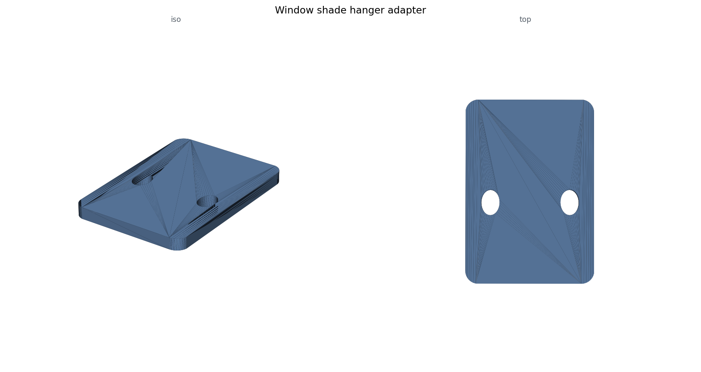

# Window Shade Hanger Adapter

A small adapter plate for window-shade hanger hardware: a flat bracket with two oval mounting holes at a spacing nothing on hand matched. The entire design is caliper readings transcribed into code: a 30 x 45 x 4 mm rounded-rectangle plate (3 mm corner radius) with two 4.33 x 6.0 mm oval holes whose left edges sit 3.64 mm and 22.14 mm from the origin, hole centerline 18.98 mm from the top edge. The script does the conversion calipers force on you - edge-referenced measurements in, center coordinates out (x = 5.805 and 24.305 mm).

**Deliberately minimal stack:** no build123d, no OpenSCAD - just trimesh. A hand-sampled rounded-rectangle polygon is extruded with `extrude_polygon`, the oval holes are 32-segment cylinders scaled into ellipses and boolean-subtracted, and the export is followed by a watertight check and a dimension printback for verification. For a flat bracket, mesh CSG is the whole job.

**Fit revision:** `shade_adapter_43mm.py` is the version that survived test-fitting: plate height trimmed 45 -> 43 mm and thickness 4 -> 3 mm, geometry otherwise identical. Sliced for a Bambu Lab H2D with a 0.4 mm nozzle.

**Files:** `shade_adapter.py` (v1), `shade_adapter_43mm.py` (fit fix), `overview.png`. The STL and a three.js HTML viewer (STL base64-embedded; three.js loads from a CDN) regenerate by running either script.

**What went wrong (honestly):** the raw measurement note records the hole X dimension as both 4.3 and 4.33 mm - transcribing calipers to paper is its own error source; the code standardizes on 4.33. And v1's 45 mm height came straight off the calipers yet still needed a 2 mm trim: measuring a space and fitting a part into it remain different problems.

**AI-assisted build notes:** Claude turned a terse caliper note into a watertight, validated mesh in one pass, including the left-edge-to-center hole math. What it could not know is whether the part fit: the ambiguous 4.3-vs-4.33 entry needed a human call, and the 43 mm revision came from holding a print against the real hardware, not from anything in the code.
