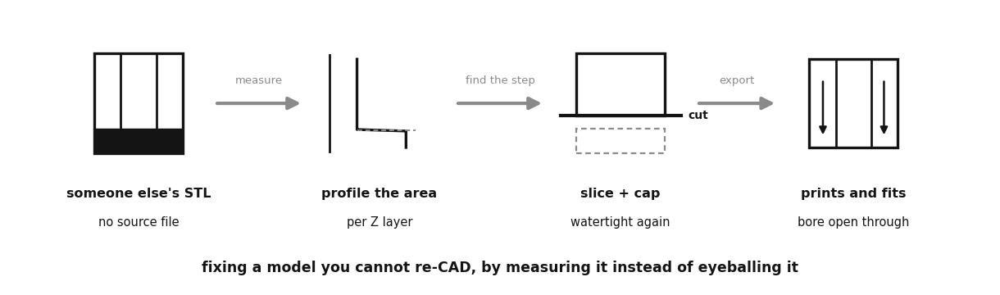
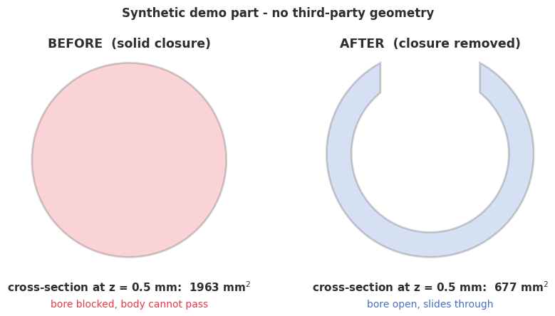

# STL surgery: fixing a model you cannot re-CAD

Most of this section is parts I designed, where a change means editing a Python
script. This is the other case: you download a model, print it, and only then find
out it solves a slightly different problem than yours. There is no source file, so
the fix has to happen on the mesh itself.

The specific failure that prompted this: a cradle designed for **horizontal**
mounting has a solid closure across the bottom. Mount it **vertically** and the
body it holds cannot slide down through it. The part is 95% right and 5% unusable.


The interesting part is panel **b**. The instinct is to open the model in a slicer
and eyeball where to cut. Measuring is better: walk the Z axis computing
cross-sectional area at every layer, and the unwanted solid announces itself as a
step well above the section's own baseline. That gives a cut height derived from
the geometry instead of from squinting.



## Run it

No mesh files are committed (the repo ignores `*.stl` everywhere, the same
code-over-artifacts rule the rest of this section follows), so step one generates
the demo part. It is synthetic, which is also why **no third-party geometry is
redistributed here**:

```bash
pip install -r requirements.txt
python make_broken_part.py            # generate the synthetic flawed holder
python stl_surgery.py --plot examples/area_profile.png
```

On the bundled part that reports:

```
[IN]   examples/broken_holder.stl
       986 faces, watertight=True, bbox [50. 50. 100.] mm
[SCAN] baseline 677 mm2, peak 1963 mm2 (2.9x)
[CUT]  detected cut height z = 5.2 mm
[OUT]  examples/broken_holder_open.stl
       1,268 faces, watertight=True, bbox [50. 46.93 94.75] mm
```

Use `--z` to override the detected height, `--ratio` to tune what counts as
anomalous, and `--dry-run` to measure without writing anything.



That is the check that matters: the cross-section at the very bottom goes from a
filled disc to the same open C-profile the rest of the part has, and the mesh is
still watertight afterwards.

## Gotchas worth the writeup

1. **`cap=True` is not optional.** `slice_plane` without it leaves the cut walls
   open, so the result is a shell rather than a solid. It often still *looks* fine
   in a viewer and then slices into nonsense (panel **c**).
2. **`plane_normal` picks the side you keep, not the side you remove.**
   `[0, 0, 1]` keeps geometry above the plane; `[0, 0, -1]` keeps what is below.
   Getting it backwards silently hands you the exact piece you were deleting.
3. **Slicing does not move the part.** The result keeps its original coordinates,
   so it hovers at the cut height above the bed. Subtract the cut height from the
   Z column afterwards (panel **d**).
4. **Cut where the area returns to baseline, not where you think the flaw ends.**
   Cutting a millimetre or two low leaves a lip of the closure behind, which is
   just enough to still block the fit.
5. **Never union a patch onto a part when you can subtract instead.** Building the
   demo part by unioning a disc onto the cradle left two solids sharing a
   coincident face, and that seam survived export as four unpaired edges, i.e. a
   non-watertight mesh. Cutting the bore and slot out of one solid gave identical
   geometry with a clean Euler number of 2. This was a bug in this repo's own demo
   generator, caught by checking watertightness *after* the STL round-trip rather
   than before it.
6. **`to_planar` is deprecated in favour of `to_2D`.** Current trimesh warns and
   schedules removal, so the area helper here accepts either.

## Honest limits

- It looks for a closure **at the bottom** of the part along **Z**. An internal
  blockage, or one on another axis, needs the part reoriented first.
- The detected cut lands on the sampling grid, so with `--dz 0.5` it can cut up to
  half a millimetre more than strictly needed. Tighten `--dz` or pass `--z`.
- A single area threshold cannot tell a design flaw from a deliberate solid base.
  It reports what it measured; deciding that the material is unwanted is still
  your call, which is why `--dry-run` exists.
- Nothing here repairs a mesh that arrives already broken. It checks
  watertightness and tells you, rather than pretending the output is printable.

## AI-assisted build notes

Claude wrote the area-profile sweep and the argparse shell quickly, and the
`to_2D` deprecation surfaced immediately on the first run. What needed a human:
the first version of the demo generator unioned a closure disc onto the cradle,
which reported `watertight=True` in memory and `False` after export. The model had
no reason to suspect the union seam, and the fix (subtract from one solid instead)
came from reading the Euler number rather than trusting the in-memory flag. Gotcha
5 exists because the tooling produced it.
