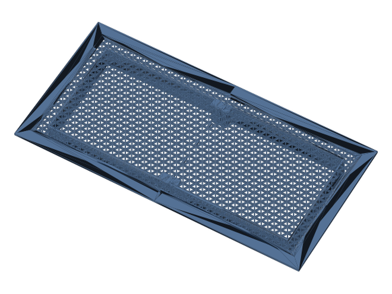
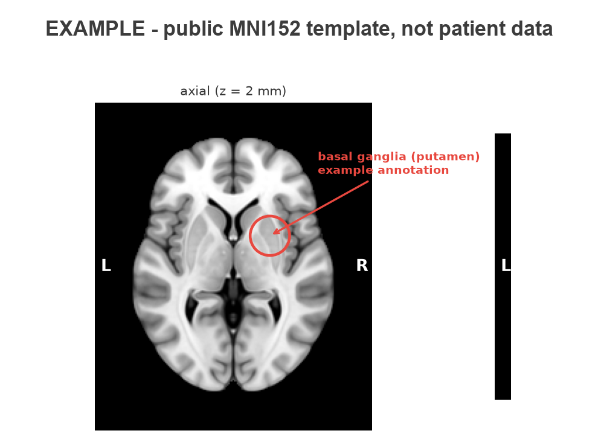
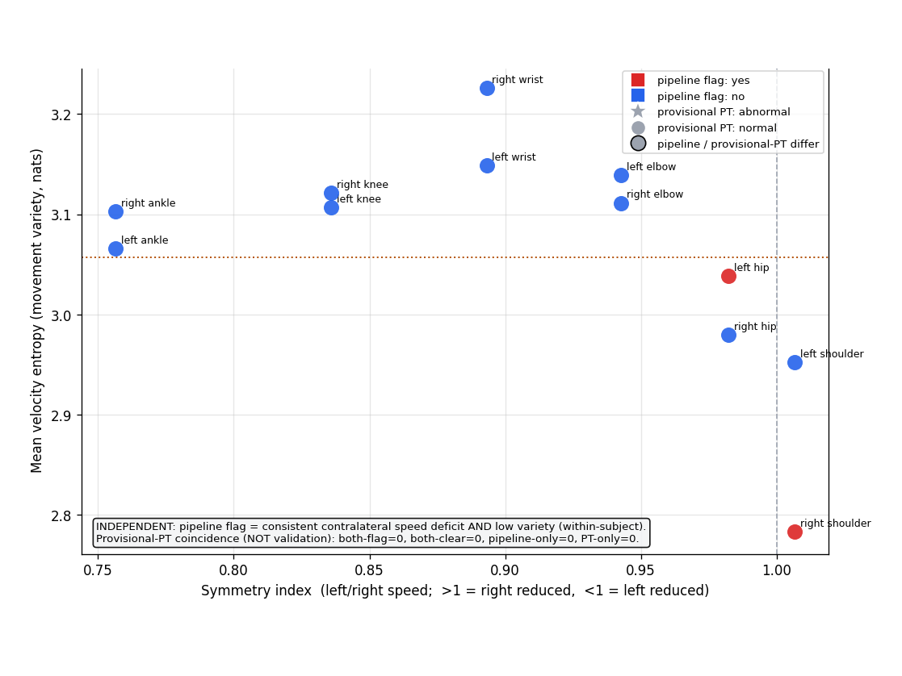
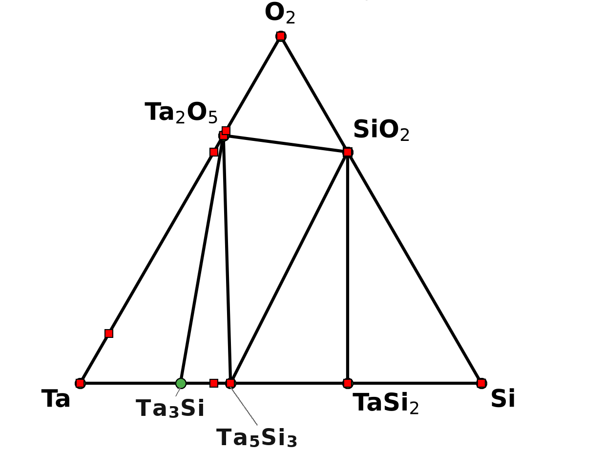

# Side Quests

Things I build outside work. By day I am a semiconductor process and materials engineer; evenings and weekends produce what's in this repo: thermodynamic screening on open materials data, local-first AI tooling, parametric CAD written as Python, medical-imaging pipelines, and an espresso machine that files telemetry reports.

**In a hurry?** Three artifacts carry the flavor: the [caught-and-fixed API data bug](computational-materials/mp-interface-reactions/README.md) in the materials screening, the NIIMBOT driver's [GOTCHAS.md](hardware-tools/niimbot-labelmaker/GOTCHAS.md) (identical printers, different firmware dialects), and the GMA pipeline's [honest scorer](medical-imaging/gma-video-pipeline/src/gma_pipeline/mos_r.py) that declares three subscales NOT_COMPUTABLE rather than guessing.

Everything here shares three habits:

1. **Code over artifacts.** Parts, pipelines, and reports are all regenerable from scripts. No orphaned binaries; no personal data ships with this repo, ever.
2. **Validation as a first-class step.** Watertight checks and containment truth tables for printed parts, synthetic-data test suites for pipelines, adversarial review passes for research documents.
3. **Calibrated AI-assist notes.** All of this was built with Claude in the loop. Each project documents concretely what AI acceleration bought and where it confidently failed, because both halves are the interesting part.

> I'm a process and materials engineer by day, but everything in this repository is a personal, nights-and-weekends project. The materials-science, chemistry, and physics explorations here are pursued purely out of curiosity, on my own time. They use only publicly available data and open source codes, produce only self-generated results, and are kept deliberately separate from my professional work and completely unrelated to my current daily activities - no employer data, no proprietary systems, no affiliation. The views, and the mistakes, are my own.

## Map

| Section | What's inside |
|---|---|
| [computational-materials/](computational-materials/) | Materials Project interface-reaction screening: gate-dielectric stability, an 18-gas etch-chemistry study at 0 K vs 300 K, and a caught-and-fixed API data bug |
| [ai-tooling/](ai-tooling/) | Two local-first tools over your own paper library: a Zotero 7 plugin doing on-device retrieval (BM25 + ONNX embeddings) with only the most relevant passages sent to Claude, and a fully offline [Ollama](https://ollama.com/) batch summarizer that turned ~3,900 PDFs into a searchable Obsidian idea bank |
| [claude-skills/](claude-skills/) | Nine working Claude Code skills: parametric CAD, academic figures, arXiv PDFs, hybrid retrieval, research orchestration, transcript tooling |
| [3d-printing/](3d-printing/) | Seventeen parametric builds plus two design playbooks; every part is a Python or OpenSCAD program |
| [hardware-tools/](hardware-tools/) | Batch label printing for a phone-app-only NIIMBOT printer: reverse-engineered BLE protocol, firmware-dialect detection, dry-run byte tracing |
| [medical-imaging/](medical-imaging/) | An infant-movement video pipeline (SAM 3 on Apple Silicon) and a DICOM MRI toolkit, both de-identified and code-only, with caveats and shortcomings documented |
| [espresso-gaggiuino/](espresso-gaggiuino/) | An open-source machine mod run as a data project: 639-shot telemetry corpus, drift detection, troubleshooting as differential diagnosis |
| [audio/](audio/) | A construction-noise monitor born of a napping baby vs. the jackhammers next door: camera clips to a fully local dBFS timeline, noise-event detection, and an hour-bucketed report of loud minutes outside permitted hours (levels only, no speech, ever) |

## Highlights

<table>
<tr>
<td align="center" valign="middle" width="25%"></td>
<td align="center" valign="middle" width="25%"></td>
<td align="center" valign="middle" width="25%"></td>
<td align="center" valign="middle" width="25%"></td>
</tr>
<tr>
<td align="center" valign="top"><b>Kumiko lattice vent cover</b> parametric asanoha pattern bed-split with real joinery</td>
<td align="center" valign="top"><b>DICOM MRI toolkit</b> annotating anatomy in code runs on .dcm series shown: public MNI152 template</td>
<td align="center" valign="top"><b>GMA video pipeline</b> per-keypoint symmetry screen in-norm limbs blue, flagged red</td>
<td align="center" valign="top"><b>Gate-dielectric screening</b> the O-Si-Ta convex hull: Ta2O5 + Si -> silicides + SiO2</td>
</tr>
</table>

## The projects

### [Computational Materials](computational-materials/)

A [Materials Project interface-reaction tool](computational-materials/mp-interface-reactions/) that walks pseudo-binary mixing lines for reaction-energy kinks, MP-website style. The demo reproduces the classic gate-dielectric screening from open data: Ta2O5 decomposes against silicon into silicides + SiO2 (why it lost the high-k race) while HfO2 and Si3N4 sit at exactly 0.00 eV/atom (why they get to touch silicon). The companion study runs silicon against 18 fab gases - Bosch etch, chamber cleans, MEMS release - at 0 K and at 300 K via a SISSO-Gibbs mode, measuring exactly when the 0 K ranking stops being trustworthy and flagging where the 300 K mode itself deserves skepticism. Also documents a silently changed API default (mixed GGA/R2SCAN hull) that was corrupting results until a literature cross-check caught it.

### [AI Tooling](ai-tooling/)

A [Zotero 7 plugin](ai-tooling/zotero-claude-assistant/) that answers questions about your own paper library from inside [Zotero](https://www.zotero.org/): a section-aware BM25 index and a quantized ONNX embedding model (bge-small-en-v1.5, running in a ChromeWorker via Transformers.js) retrieve on-device, Reciprocal Rank Fusion merges the rankings, and only the most relevant passages go to the Claude API. Papers never leave the machine at index time; the network surface is one hostname. TypeScript, esbuild, CI that deliberately builds without the model weights to keep the degraded path tested. Has an [ARCHITECTURE.md](ai-tooling/zotero-claude-assistant/ARCHITECTURE.md) with dataflow diagrams.

The offline sibling in this section, an [Ollama paper summarizer](ai-tooling/ollama-paper-summarizer/), takes the opposite tradeoff: it batch-summarizes a whole PDF library into structured Markdown with a local [Ollama](https://ollama.com/) model - nothing sent anywhere, no API key - so the summaries become a greppable idea bank an Obsidian similarity plugin surfaces while you write. It has summarized about 3,900 papers entirely offline; a carefully constrained prompt keeps every note the same shape instead of a random abstract.

### [Claude Code Skills](claude-skills/)

Nine of the skills that automate the rest of this repo, published as adaptable public copies: the parametric-CAD skill that built the 3d-printing section, hybrid Zotero retrieval, deep-research orchestration into Obsidian, YouTube transcript tooling, arXiv-style PDF generation, and a coupon tester whose guardrails (never purchase, never touch payment fields) are the interesting part. Skills with private local dependencies declare them honestly in marked adaptation notes.

### [3D Printing as Code](3d-printing/)

Every part is a Python or OpenSCAD program; every STL is reproducible by running a script. Seventeen curated builds from a workshop of about 30, printed on a [Bambu Lab H2D](https://bambulab.com/en/h2d): a six-version rice-bowl gravity dispenser, a child-safe nursery floor register whose safety constraint is an `assert` (and its wet-room and maximum-airflow descendants), a print-in-place sliding-damper register whose slider is collision-swept across its full travel, a 90-degree louver diverter designed by free-area arithmetic, a kumiko-lattice vent cover split for the bed with real joinery, and a multi-start replacement thread nut bracketed by an overnight eight-ring test matrix. Start with the [parametric design gotchas playbook](3d-printing/playbooks/parametric-design-gotchas.md): cross-project design rules, each traceable to a printed mistake.

### [Hardware Tools](hardware-tools/)

[Batch label printing](hardware-tools/niimbot-labelmaker/) for the [NIIMBOT D110](https://www.niimbot.com/us/hardware/detail?productCode=HPC250801095736000004), which ships with no computer software at all - phone app only, one label at a time. I liked the printer itself, but tapping labels out one at a time on a phone was never going to knock out the good-husband weekend chores: a week of baby-food containers, a whole-pantry reorganization. This CLI takes a text file and prints the entire stack over one BLE connection. Under it sits a reverse-engineered protocol driver whose best story is in its GOTCHAS file: visually identical printers ship with different firmware dialects, and the `_M` variant returns byte-perfect success traces while printing blanks. Folder-licensed GPL-3.0 because one upstream protocol source is GPL - the one non-MIT corner of the repo, labeled as such.

### [Medical Imaging](medical-imaging/)

Two side quests built to understand clinical imaging from first principles instead of passively receiving it. Neither ships any real imaging or reports (each carries one explicitly labeled synthetic or public-template example), and neither is remotely a medical device.

- **[GMA video pipeline](medical-imaging/gma-video-pipeline/)**: turns consumer phone video of an infant into segmentation masks (SAM 3 run deliberately on the Apple Silicon GPU through PyTorch's Metal/MPS backend, via a five-patch compatibility shim), pose keypoints, kinematic features from the published GMA computer-vision literature, and a deliberately honest proxy score that reports what it cannot see as NOT_COMPUTABLE rather than guessing.
- **[DICOM MRI toolkit](medical-imaging/dicom-mri-toolkit/)**: from a hospital CD to an interactive 3D reconstruction: series matching by pulse parameters, longitudinal difference maps, spline-curvature candidate detection on ventricle walls, five-sequence cross-validation, and a self-contained clickable HTML report.

Each has an `ARCHITECTURE.md` with system diagrams.

### [Espresso: Gaggiuino Build Research](espresso-gaggiuino/)

Replaced the controls of a [Gaggia Classic Evo Pro](https://www.gaggia-na.com/products/gaggia-classic-pro) with the open-source [Gaggiuino](https://gaggiuino.github.io/) controller (STM32 + ESP32, pressure/flow profiling, PID), then treated eight months of daily use as a data project: a 639-shot telemetry corpus pulled from the machine's HTTP API, a machine-drift analysis that isolated OPV spring fatigue from grinder and coffee variables, and troubleshooting docs structured as differential diagnoses with explicit priors. Safety claims were checked against the firmware source, not forum consensus.

### [Audio: Construction-Noise Monitor](audio/)

Prolonged construction next door and a napping infant raised one question that opinions could not settle: how loud, how often, and inside or outside working hours? A [noise monitor](audio/) answers it with data. It extracts the audio track from home-camera clips (ffmpeg), builds a windowed dBFS level timeline, detects noise events against a rolling-median baseline with hysteresis, renders spectrograms, and produces an hour-bucketed report flagging loud minutes outside a permitted-hours window. It is fully local (numpy, no cloud, no API keys) and processes **no speech at all** - noise levels and timing only, deliberately nowhere near what anyone said. Levels are honest relative dBFS from an uncalibrated camera microphone, not dB(A). Ships with a seeded synthetic demo so it runs without any recording.

## How this was built

Nearly everything here was pair-built with Claude Code. The per-project "AI-assisted build notes" sections are deliberately specific: the MPS shim and validation harnesses that AI made fast, and also the silently wrong jerk normalization, the alignment approach that was confidently wrong twice, the fillet that no-opped five versions, and the ten citation errors an adversarial review pass caught. The stable division of labor across every section: AI writes geometry, plumbing, and checks; the human owns physical judgment, spatial semantics, and looking at the picture.

## License

MIT for all code (see [LICENSE](LICENSE)), with one labeled exception: [hardware-tools/niimbot-labelmaker/](hardware-tools/niimbot-labelmaker/) is GPL-3.0 because part of its protocol knowledge derives from a GPL-3.0 upstream. Documentation and research notes may be quoted with attribution. One 3D printing project adapts a community concept and credits it in its README.
