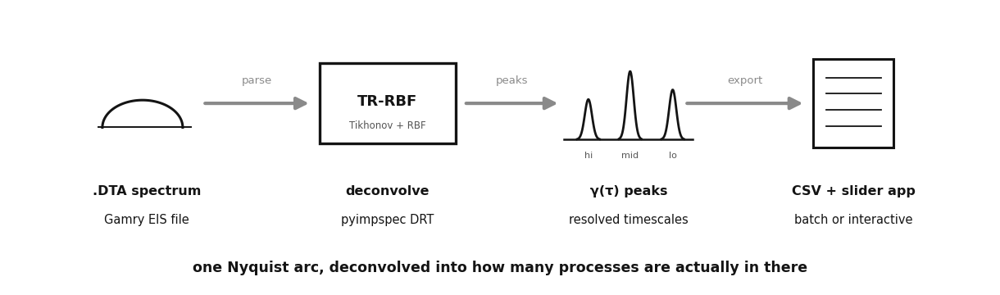
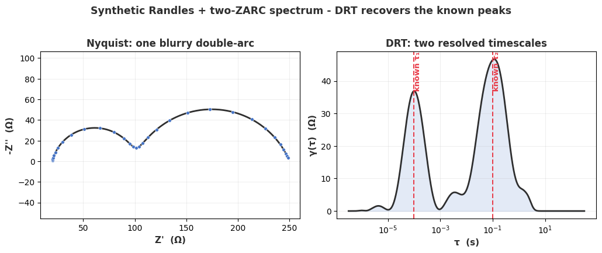

# EIS / DRT toolkit: turn one blurry Nyquist arc into resolvable timescales

A Nyquist semicircle usually hides several overlapping processes at once. The
Distribution of Relaxation Times (DRT) deconvolves an impedance spectrum into
peaks along a relaxation-time (tau) axis, so instead of guessing how many
processes are inside one arc you can actually count them and read off their
characteristic timescales.





## Pipeline

```
.DTA spectrum  ->  pyimpspec.parse_data  ->  calculate_drt_tr_rbf (TR-RBF)  ->  gamma(tau) peaks  ->  CSV + plots
      |                                                                                   |
 synthetic Randles+ZARC generator                            Streamlit slider app: RC/ZARC -> DRT + Nyquist live
```

## Two entry points

- **`drt_batch.py`** - headless TR-RBF DRT over a single `.DTA` or a whole folder
  tree of them, one gamma(tau) CSV per spectrum. Defaults to the bundled
  synthetic spectrum, so it runs with no real data:
  ```bash
  pip install -r requirements.txt
  python make_synthetic_dta.py                 # (re)build the demo spectrum
  python drt_batch.py                          # DRT on the synthetic spectrum
  python drt_batch.py --data-dir my_eis/ --out drt_out
  ```
- **`drt_equivalent_circuit.py`** - a Streamlit + Plotly explorer. Drag three
  RC/ZARC sliders and watch the DRT peaks and the Nyquist curve update together,
  a fast way to build intuition for which feature moves which arc:
  ```bash
  streamlit run drt_equivalent_circuit.py
  ```

## Method note (the honest knob)

TR-RBF is Tikhonov regularization plus radial basis functions. The regularization
strength is the honest knob: under-regularize and the DRT sprouts spurious peaks,
over-regularize and two real peaks merge into one. There is no free lunch and the
tool does not pretend otherwise, so a peak is a hypothesis to check, not a fact.

## Validation as a first-class step

The demo does not just assert an answer. `make_synthetic_dta.py` builds the
spectrum from a Randles + two-ZARC model with two known time constants
(tau1 = 1e-4 s, tau2 = 1e-1 s) and prints them, so the recovered DRT can be
checked against ground truth. It lands both peaks within a few percent, and the
faint third bump between them is exactly the kind of regularization artifact the
method note warns about, left in rather than hidden.

## The bug I shipped

The original batch script called `tqdm(...)` and `time.time()` while neither
`tqdm` nor `time` was ever imported, so it would crash on the first spectrum. The
imports are added here, and the employer-specific hardcoded batch paths in the
old `__main__` block were replaced with a proper `--input` / `--data-dir` CLI.

## AI-assisted build notes

Built with Claude in the loop. Wins: it wrote the Gamry `.DTA` writer straight
from pyimpspec's column contract and did the argparse/CLI refactor in minutes.
Failures worth naming: the original script called `tqdm`/`time` with no imports
(would crash on first run), and every prototype hardcoded an absolute data path,
exactly the pattern a human has to catch before anything ships. Judgment that
stays manual: choosing the regularization level and deciding that a peak is a
real physical process rather than a fitting artifact.
