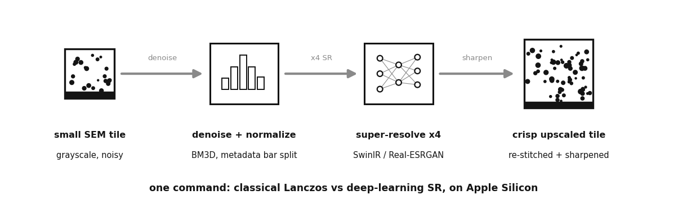
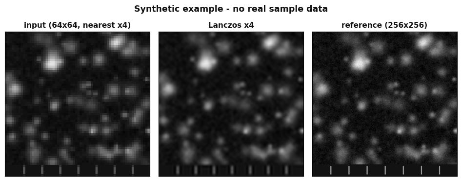

# SEM super-resolution: batch-upscale grayscale micrographs on Apple Silicon

Benchtop SEM micrographs come off the instrument small and noisy. I wanted one
command to batch-upscale a folder of them on a Mac GPU, and an honest way to see
whether a deep-learning super-resolution network actually beats plain Lanczos
interpolation, or just costs 100x more compute to look the same. This does both,
while preserving the instrument's burnt-in metadata bar.





## Pipeline

```
SEM TIFF -> split metadata bar -> [optional BM3D denoise] -> normalize
        -> upscale x2/x4  { Lanczos | SwinIR | Real-ESRGAN | Swin2SR | HAT }
        -> [optional sharpen] -> re-stitch metadata bar -> PNG + side-by-side compare
```

## What ships

- **`sem_sr.py`** - single-image CLI with a five-model zoo (Real-ESRGAN, BSRGAN,
  SwinIR, Swin2SR, HAT). Auto-selects MPS (Apple GPU), CUDA, or CPU. Weights are
  downloaded to a temp dir at runtime; none are committed.
- **`SEM_Upscaling.ipynb`** - batch a whole folder, with a classical
  BM3D-denoise then Lanczos baseline for the honest comparison.
- **`make_synthetic_sem.py`** - regenerates the bundled demo image so the input
  is transparent and reproducible, not an opaque blob.

Everything runs end-to-end on the bundled synthetic `examples/dummy_sem_image.tif`.

```bash
pip install -r requirements.txt
python make_synthetic_sem.py                       # (re)build the demo image
python sem_sr.py examples/dummy_sem_image.tif --model realesrgan --out sr.png
```

`INPUT_DIR` in the notebook accepts any folder of grayscale SEM TIFFs. For real
micrographs to try it on, a public option is the NFFA-EUROPE SEM dataset; nothing
real is included here.

## Honest engineering notes

- **The deep nets are RGB-trained.** Grayscale is triplicated to three channels,
  super-resolved, then re-grayed, which is a small but real quality tax the code
  is upfront about.
- **Apple Silicon runs fp32.** The nets run with `half=False` on the MPS backend
  with a CPU fallback; half-precision is not reliable there.
- **Lanczos is ~100x faster and often visually competitive.** That is the actual
  calibration lesson of this project: on clean-ish micrographs a classical
  interpolation is frequently good enough, and the transformer only earns its
  keep on genuinely detail-starved inputs. The tool ships both so you can decide
  per image rather than assume.

## The bug I shipped

`read_sem()` called `tifffile.imread` while `tifffile` was never imported, so the
tool would `NameError` on the very first TIFF it touched. It is fixed here
(`tifffile` is now in the import line); it is called out rather than quietly
patched because that is the point of these notes.

## AI-assisted build notes

Built with Claude in the loop. The wins: the multi-model loader scaffolding, the
argparse boilerplate, and the weight-download URLs came together fast. The
failures worth naming: the model dropped the `tifffile` import (silent until
runtime), and a sibling notebook draft hardcoded a local absolute input path
roughly twenty-five times, a concrete reminder that AI happily bakes your
environment into "reusable" code. Judgment that stayed manual: deciding when the
extra super-resolution compute is actually buying resolvable detail versus just
hallucinating plausible texture.
