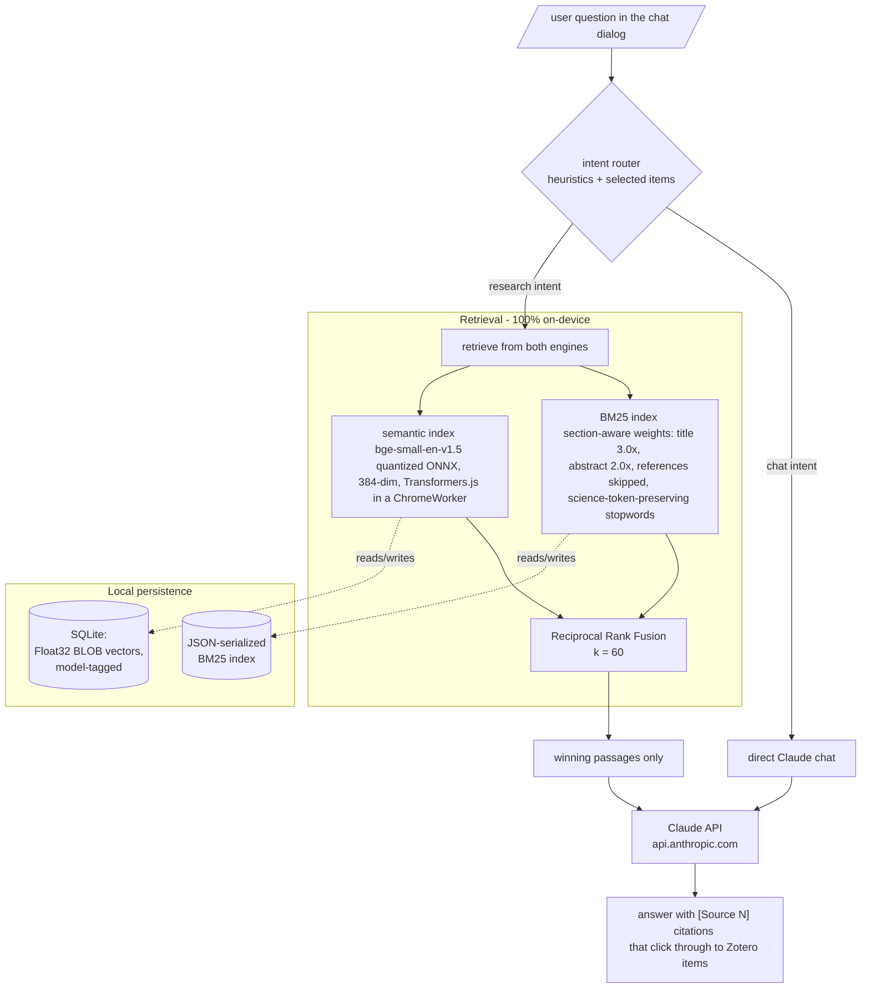
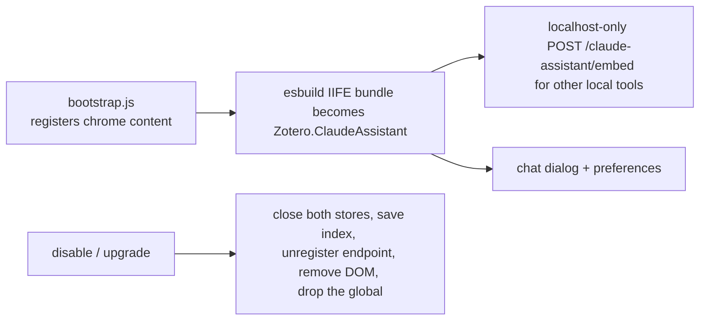

# Architecture

Structural map of the plugin. See the [section README](../README.md) for the showcase framing and the [plugin README](README.md) for install and usage.

## Query dataflow

## Plugin lifecycle

## Design decisions worth naming

- **Two engines, one fusion.** BM25 catches exact-term science queries (element symbols, units); the embedding index catches paraphrase. RRF merges them without score calibration, and if the ONNX model is unavailable everything degrades to BM25-only instead of failing.
- **Model-tagged vectors.** The embedding store records which model produced its vectors and wipes them if the configured model changes; a stale 384-dim vector can never be compared against a different model's space.
- **ESM in a ChromeWorker, by force.** `importScripts()` cannot load the ESM Transformers.js bundle, so the worker fetches the bundle text, strips the export block, rewrites `import.meta.url`, and indirect-evals it into scope. Documented ugliness beats undocumented magic.
- **Network surface is one hostname.** Paper text leaves the machine only as the retrieved snippets attached to a query, only to `api.anthropic.com`. Indexing and embedding never touch the network (weights are fetched at build time; Zotero's updater polls the update manifest).
- **Privacy claims are code-checked.** The section README's guarantees were audited against the source before publishing; the one latent contradiction found (a dead API-side `generateEmbedding` method with no call sites) is disclosed there and slated for deletion.
