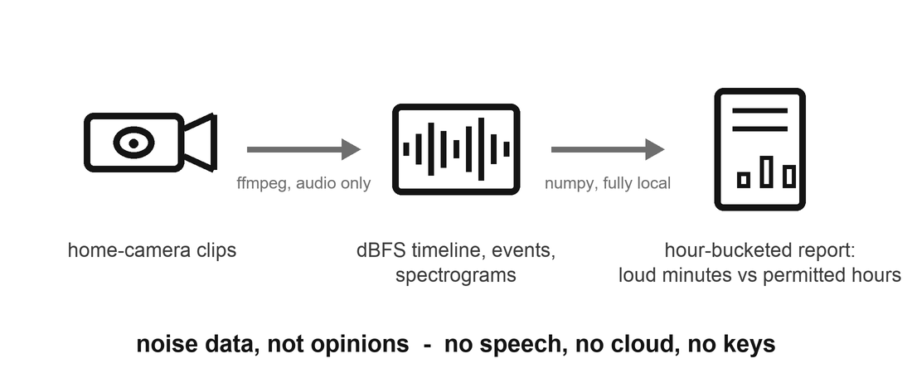
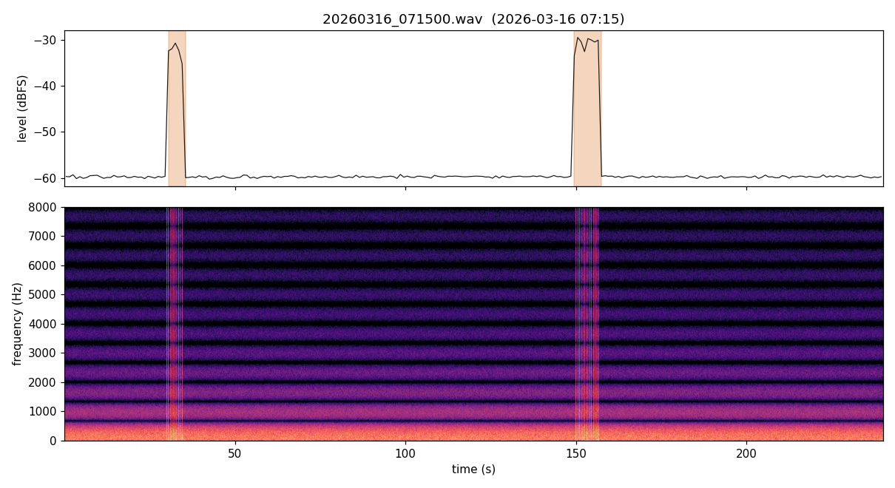

# Construction-Noise Monitor

Months of construction next door, a napping infant, and one recurring
question: how loud, how often, and inside or outside working hours? Opinions
were plentiful; data was not. This tool turns home-camera clips into a noise
report: level timelines, detected noise events, spectrograms, and an
hour-bucketed summary that flags loud minutes outside a permitted-hours
window.



## Pipeline

```
camera clips (.mp4/.mov/.wav)
  -> ffmpeg           audio track only, mono 16 kHz (local subprocess)
  -> numpy            windowed RMS -> dBFS timeline
                      adaptive event detection (rolling-median baseline,
                      hysteresis, min duration, gap merging)
                      STFT spectrogram (band character: impacts vs saw roar)
  -> report.md        per-clip table + per-hour table with an
                      outside-permitted-hours column
  -> plots/*.png      level timeline with shaded events over a spectrogram
```

Run:

```bash
python3 noise_monitor.py --input ./clips --out ./report \
    --permitted 08:00-18:00 --weekdays-only
```

Try it without any recordings. The demo generates seeded synthetic clips
(background noise, hammer-impact trains, a saw-band segment) and runs the
full pipeline on them:

```bash
python3 make_synthetic_demo.py
python3 noise_monitor.py --input examples/demo-clips --out examples/report --weekdays-only
```

The [example report](examples/report/report.md) and its plots come from that
synthetic run. The 07:15 clip's hammering lands in the "outside permitted"
column; the 13:00 clip is background only and produces zero events:



## Privacy and safety by design

- **No speech processing, deliberately.** No transcription, no speech-to-text,
  no voice content is extracted, analyzed, or stored. The tool measures noise
  levels and timing; what anyone says is out of scope on purpose. (California
  is a two-party-consent state for confidential communications; a noise
  monitor has no business anywhere near that line.)
- **Fully local.** numpy + matplotlib + an ffmpeg subprocess. Zero network
  calls, zero cloud services, zero API keys - there is nothing to configure or
  hardwire.
- **No hardcoded paths or identifying details.** Input and output are CLI
  arguments; the permitted-hours window is a parameter, not a named
  ordinance; nothing in code or output references a place or a person.
- Raw clips stay wherever you keep them; the tool reads them and writes only
  derived plots and a markdown table. Nothing is uploaded anywhere.

## Calibration honesty

A camera microphone is uncalibrated, has automatic gain control, and sits
wherever the camera happens to sit. Every level in the report is **relative
dBFS** (decibels below the recording's own full scale), not sound-pressure
dB(A). The report is evidence of *patterns and timing* - "loud events at
07:15, before the permitted window" - not a legal noise measurement. Getting
real dB(A) would take a calibrated meter; this tool does not pretend
otherwise.

## AI-assisted build notes

Claude wrote most of the DSP plumbing (the windowed-RMS timeline, the STFT
spectrogram, the report tables) quickly and correctly. Two things needed a
human: the event detector's first version used a fixed dBFS threshold, which
fired constantly on a clip with a high noise floor and never on a quiet one -
the rolling-median baseline plus hysteresis was the fix. And the framing
discipline - measure noise, never speech - was a design constraint set up
front, not something the model volunteered.
