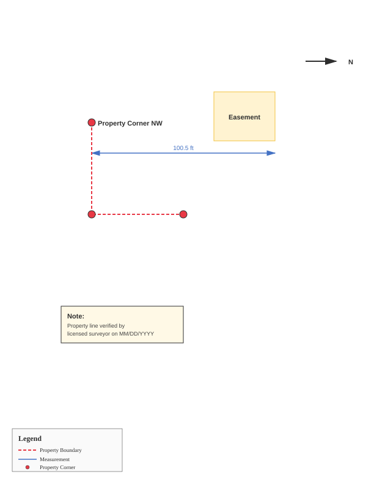

# Assets Directory



This directory contains template files and examples for PDF to SVG conversion workflows.

## Contents

### svg_annotation_template.svg

A template SVG file showing how to structure annotations on top of a converted PDF base layer. Use this as a starting point for annotating land surveying documents or technical drawings.

**Usage:**
1. Convert your PDF using the hybrid method
2. Copy this template
3. Update the `href` attribute to point to your embedded PNG
4. Add your custom annotations in the `<g id="annotations">` section

## Example Workflow

```bash
# 1. Convert PDF to hybrid SVG
python ../scripts/pdf_to_svg.py survey.pdf --method hybrid --page 1 --dpi 300

# 2. Copy the generated SVG or use the template
# 3. Edit in vector graphics software or manually
# 4. Add property markers, measurements, labels, etc.
```

## Integration with Academic SVG

The template follows the same structure used by the academic-svg skill, making it easy to:
- Add professional annotations
- Use consistent styling
- Maintain reference to the original document
- Create publication-quality figures
