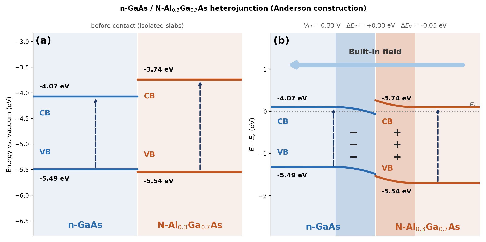
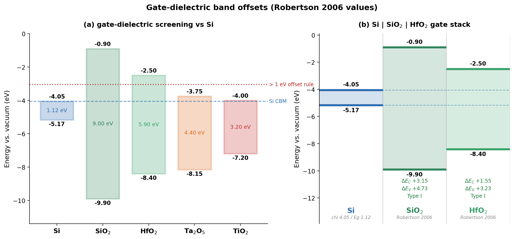
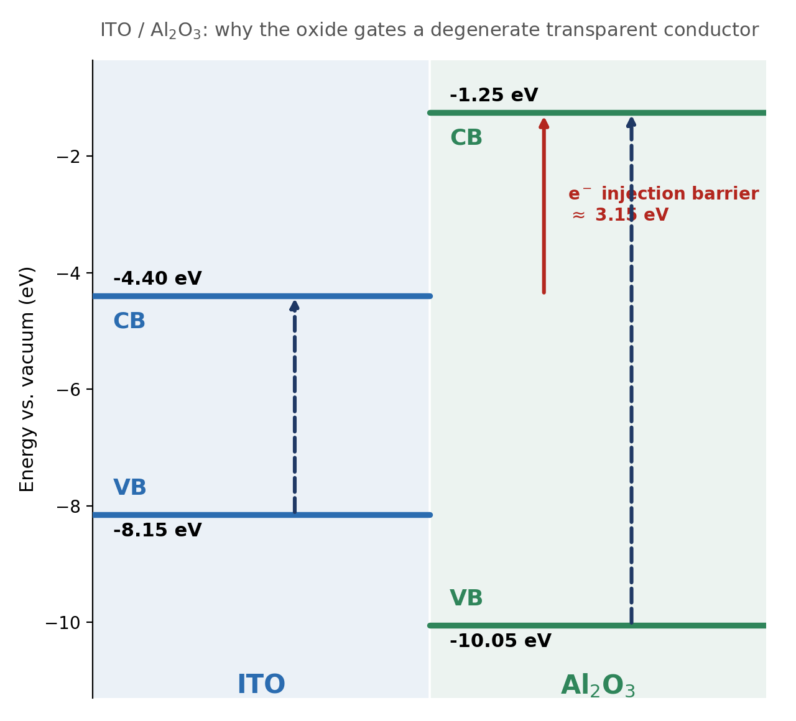
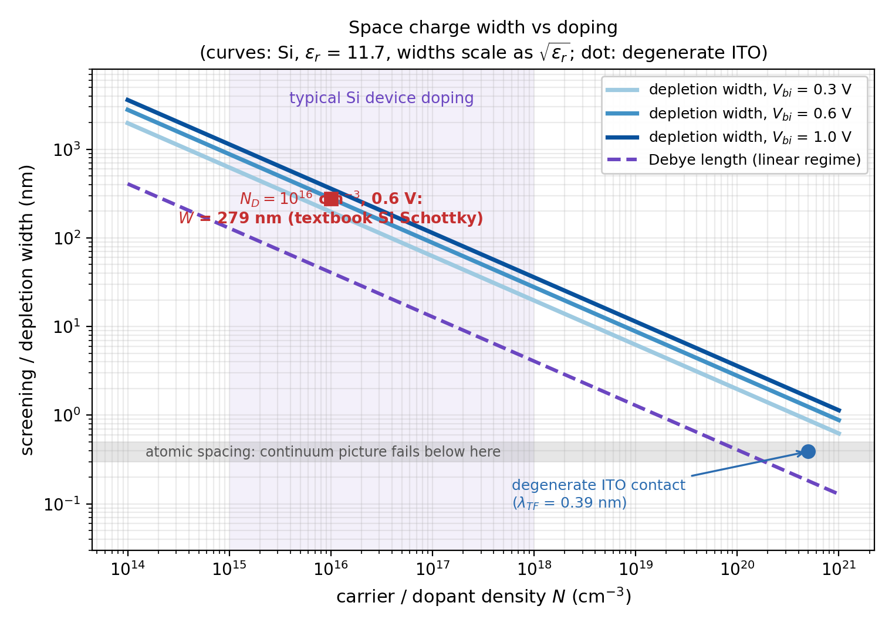

# Band Diagram Kit



The bent-band heterojunction figure is probably the most-drawn diagram in semiconductor interface work, and as far as I can tell nobody ships a tool for it. `bapt` draws flat alignment bars, `macrodensity` extracts band edges from DFT output, `devsim` and `solcore` solve full drift-diffusion if you can feed them doping and mobilities, and `energydiagram` draws reaction coordinates. The junction schematic in between - the one on every interface paper's Figure 1 - gets drawn by hand in a vector editor, every time. (Extra trap: the PyPI package named `sesame` is a config-encryption tool; the NIST semiconductor solver of that name is source-install only.)

Hand drawing is not just slow, it fails silently. The most common error: draw both materials at their isolated vacuum-referenced positions, then bend the bands by the full built-in potential. That double-counts the band offset and roughly doubles the interface discontinuity, and the figure still looks plausible. This kit makes that mistake structurally impossible.

## The whole construction is three lines

Given electron affinity chi, gap, and Fermi depth d = E_c - E_F per side:

```
W_i    = chi_i + d_i                          work function
V_bi   = W_left - W_right                     built-in potential
phi_i  = V_bi * w_i / (w_1 + w_2)             charge-neutral split of the drop
E(x)   = E_bulk +/- phi_i * ((w-|x|)/w)^2     parabolic bending, flat outside
```

The invariant that keeps it honest: with both bulks drawn at their own d_i above a common flat Fermi level, the conduction-band discontinuity that falls out at the interface is

```
dEc = (d_r + phi_r) - (d_l - phi_l) = chi_left - chi_right
```

the Anderson offset, independent of doping. The demo prints this check on every run. If you instead pin the bulks to their isolated vacuum positions and also apply the bending, the check fails by exactly the double-counted offset - which is how this kit caught the error in its own first draft.

## What makes this different from hand-drawing

- **Polarity is derived, not chosen.** Which side goes positive falls out of the work functions; the artist cannot accidentally flip the space charge. (Hand-drawn junctions get this wrong more often than you would hope, and the figure looks fine either way.)
- **The invariant is enforced, not assumed.** Every equilibrium render checks that the interface discontinuity equals chi_left - chi_right, independent of doping. That is precisely the check that catches the double-counting error above - and it caught this kit's own first draft.
- **Provenance sits on the figure face.** Each material's `source=` tag prints under its bar or slab, so a figure is auditable without opening the script.
- **Disputed values are drawn, not resolved.** `e_cb_alt=(lo, hi)` renders a hatched uncertainty band instead of silently picking a side of a literature disagreement.
- **Everything regenerates from numbers.** Change one electron affinity and every figure, offset annotation, and printed verdict re-renders consistently. A vector editor gives you none of that; it gives you a drawing.

## What it draws

| Function | View | Question it answers |
|:---|:---|:---|
| `stack_alignment(materials)` | flat bars vs vacuum | which candidates clear an offset rule? |
| `stack_profile(layers)` | flat multilayer stack | how big are the barriers in this specific stack? |
| `heterojunction(a, b)` | bent-band junction | what does equilibrium contact actually look like? |
| `screening.py` | length scales | how wide is the space charge region? |

Each `Material` is four numbers plus a provenance tag (`source=`) that gets printed under its bar, so a reader can audit the figure without opening the script. A disputed literature value can be drawn as a hatched uncertainty band (`e_cb_alt=(lo, hi)`) instead of silently picking a side.

## Demos (all from published numbers)

**`band_diagram.py`** - the Anderson textbook case, n-GaAs / N-Al0.3Ga0.7As (hero image above). The construction returns V_bi = 0.33 V with the GaAs side negative: the electron spill-over that modulation doping exploits, with dEc = +0.33 eV falling out as chi_GaAs - chi_AlGaAs exactly.

**`gate_stack.py`** - Robertson's gate-dielectric screening, drawn to scale. A dielectric on silicon needs a conduction-band offset over ~1 eV to bound tunneling injection. SiO2 (+3.15 eV) and HfO2 (+1.55 eV) clear it; Ta2O5 (+0.30 eV) and TiO2 (+0.05 eV) fail:



Band offsets and thermodynamics are independent axes, and Ta2O5 fails both: the neighboring [mp-interface-reactions](../mp-interface-reactions/) project reaches the same why-Ta2O5-lost verdict from convex-hull energetics. Two tools, two physics, one conclusion.

**`ito_al2o3.py`** - the transparent-electronics gate stack, ITO on Al2O3. One flatband picture answers why an oxide can gate a degenerate transparent conductor: the electron injection barrier from the ITO Fermi level (pinned at its conduction band edge, `d_fermi=0` - degenerate materials are a supported input, not an edge case) into the Al2O3 conduction band is chi_ITO - chi_Al2O3 = 4.40 - 1.25, roughly **3.15 eV**. The hole barrier is ~1.9 eV crystalline, trimmed to ~1.2 eV for the narrower amorphous ALD gap; the 3 eV electron barrier is what the gate relies on. Values are approximate and tagged as such on the figure - reported ITO affinities scatter by several tenths of an eV with tin content and surface treatment.



**`screening.py`** - the three space-charge length scales (Thomas-Fermi for degenerate contacts, Debye for small bending, Mott-Schottky for full depletion) with their validity boundaries:



The point the figure makes: doping is the only strong knob (W scales as N to the -1/2; permittivity and V_bi both sit under square roots), a 10^16 Si Schottky junction depletes ~280 nm at 0.6 V, and a degenerate ITO contact screens in 0.4 nm - one atomic plane, which is also where the continuum formulas stop meaning anything.

## Run it

```bash
pip install -r requirements.txt   # numpy + matplotlib, nothing else
python3 band_diagram.py           # gaas_algaas_junction.png/svg
python3 gate_stack.py             # gate_stack_alignment.png/svg + verdict table
python3 ito_al2o3.py              # ito_al2o3_alignment.png/svg + barrier numbers
python3 screening.py              # depletion_width_vs_doping.png/svg + table
```

Headless-safe (`matplotlib.use("Agg")`); every script prints its numeric checks to stdout.

## Honest notes

- **This is a schematic construction, not a device solver.** Abrupt box charge, one permittivity per side, no interface states. It gives the right shape, sign, and scale of the bending; converged carrier profiles need `devsim` or `solcore` and real transport inputs.
- **Anderson's rule ignores interface dipoles.** Real offsets deviate by a few tenths of an eV; treat drawn offsets as +/- 0.3 eV at best.
- **Signs are hard, magnitudes are soft.** Measured electron affinities of the transition-metal oxides used in gate stacks and OLED injection layers (MoO3 on ITO being the famous case) shift by more than 1 eV between vacuum-clean and air-exposed surfaces (Meyer et al. 2012). Draw conclusions from the sign of an offset, not its second decimal.
- **Fermi depths are inputs.** Only their ordering is usually measured (photoemission); V_bi scales directly with the difference you choose. An arbitrary guess in an early draft of the junction demo produced a plausible-looking diagram with the space charge on the wrong sides; pinning the ordering to measured work functions is what fixed it.

## AI-assisted build notes

Two concrete catches from review, in the spirit of the rest of this repo. First run crashed: the `Material` dataclass was used as a dict key while still hashable-by-value (`TypeError: unhashable type`), fixed with `@dataclass(eq=False)` for identity hashing. And the first draft of the equilibrium view committed exactly the double-counting error described above - the Anderson invariant check existed because the hand-drawn figures it was replacing get this wrong, and it immediately flagged the kit's own output. The tool caught its own author.

## References

| Reference | What it anchors | DOI |
|:---|:---|:---|
| Anderson 1962, Solid-State Electronics | The heterojunction construction (Ge-GaAs) | [10.1016/0038-1101(62)90115-6](https://doi.org/10.1016/0038-1101(62)90115-6) |
| Robertson 2006, Rep. Prog. Phys. | Gate-oxide band offsets and electron affinities; the > 1 eV rule | [10.1088/0034-4885/69/2/R02](https://doi.org/10.1088/0034-4885/69/2/R02) |
| Meyer et al. 2012, Adv. Mater. | Transition-metal-oxide energetics; surface-condition sensitivity | [10.1002/adma.201201630](https://doi.org/10.1002/adma.201201630) |
