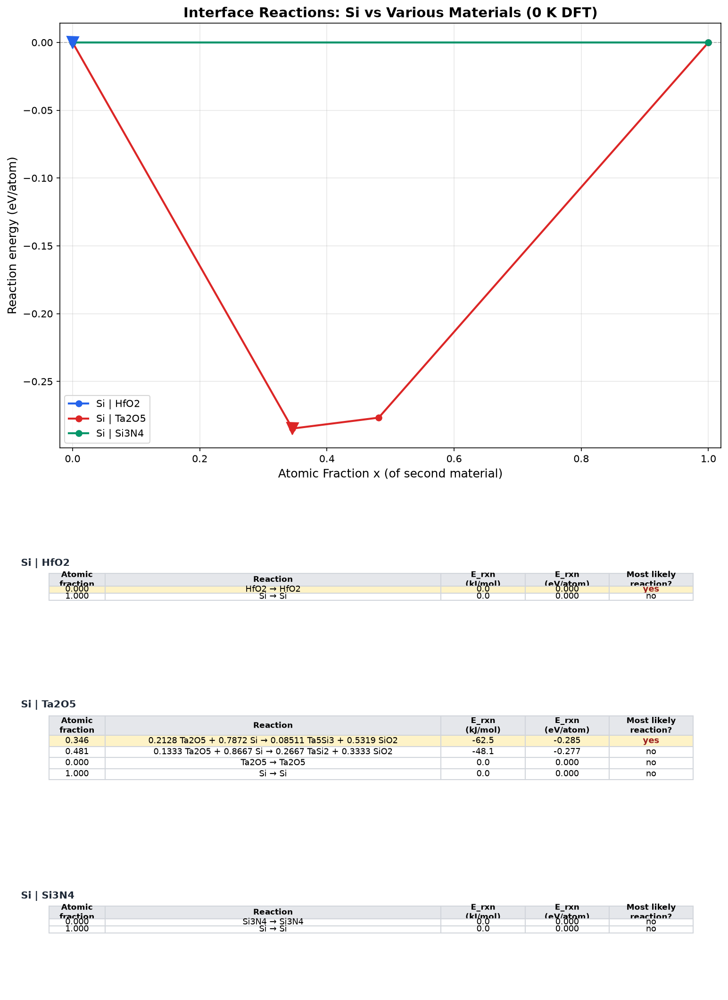

# Interface Reactions from the Materials Project



A command-line tool that answers "what happens, thermodynamically, when material A touches material B?" using the open [Materials Project](https://next-gen.materialsproject.org/) database and pymatgen's `InterfacialReactivity`. Give it a reference material and a list of counterparties and it fetches every entry in each combined chemical system, applies MP2020 compatibility corrections, builds the phase diagram, walks the pseudo-binary mixing line for the reaction-energy kinks, and emits MP-website-style plots, convex hulls, and markdown reports per pair.

By Jay Cho. Bring your own API key: the tool reads `MP_API_KEY` from the environment and refuses to run without it (keys are free).

## The demo: why HfO2 won and Ta2O5 lost

The demo asks a famous semiconductor question (defaults cover Ta2O5 and Si3N4; add HfO2 to the target list to reproduce the full figure): which dielectrics can sit directly on silicon? This is the thermodynamic screening argument of Hubbard and Schlom (J. Mater. Res. 11, 2757, 1996) that shaped the high-k gate-dielectric transition, reproduced from open data (figure above):

- **Si | Ta2O5 reacts.** Deepest kink at `0.213 Ta2O5 + 0.787 Si -> 0.085 Ta5Si3 + 0.532 SiO2` (-0.285 eV/atom), with a TaSi2-forming kink right behind it: the candidate dielectric decomposes against the channel into silicides plus the very SiO2 you were trying to replace. This is the textbook reason Ta2O5 lost.
- **Si | HfO2 does not: 0.000 eV/atom, no interior kinks.** HfO2 is one of the few oxides thermodynamically stable in contact with silicon, which is precisely why it won.
- **Si | Si3N4: 0.000 eV/atom.** Nitride is inert next to silicon, which is why it gets to live in gate sidewalls and liners.

## The etch-gas screening: does temperature change answers?

Materials Project energies are **0 K DFT ground-state formation enthalpies**: no vibrational entropy, no gas-phase entropy, no temperature. The tool makes that asterisk explicit and optional. Default is 0 K; `temperature = 300` swaps entries for `GibbsComputedStructureEntry` (the SISSO-learned Gibbs descriptor of Bartel et al. 2018, Nat. Commun. 9, 4168, with NIST-JANAF experimental data for 9 of the 18 gases), falling back to 0 K loudly if conversion fails.

[etch-gas-screening-0K-vs-300K.md](etch-gas-screening-0K-vs-300K.md) runs silicon against 18 fab gases - Bosch etch and passivation (SF6, C4F8), poly/oxide etch (Cl2, HBr, CF4, CHF3, C2F6, BCl3), chamber cleans (NF3, ClF3, F2), MEMS release (XeF2), WF6, vapor HF, elemental halogens, and the SiF4/SiCl4 byproducts - at both settings ([compare_0K_vs_300K.py](compare_0K_vs_300K.py) builds the comparison):

- The 0 K ranking alone reads like an etch-chemistry cheat sheet: F2 (-3.47 eV/atom) > NF3 > ClF3 at the top, XeF2 at -1.81 (`Si + 2 XeF2 -> 2 Xe + SiF4`, the spontaneous no-plasma etch used in MEMS release), and SiF4/SiCl4 at exactly 0.000: silicon is stable against its own etch byproducts.
- Temperature matters far more here than for condensed-phase screenings: average shift **+0.14 eV/atom** (gas-consuming reactions live or die by entropy), with four materials moving three or more rank positions.
- And the flagged artifact: at 300 K the Gibbs entry set injects a spurious "Si3F" phase that collapses the XeF2 answer from -1.81 to -0.14 eV/atom, an 11-place rank change that is chemistry-free. The study documents it as the "SISSO is approximate for gases" caveat made concrete: the finite-temperature mode deserves the same skepticism it enables.

## What went wrong (honestly): the silent hull swap

The first foundry-chemistry runs of this export produced two anomalies: Si | HfO2 failed with "Missing terminal entries for elements ['Hf']", and Cu | Sn returned an intermetallic formation energy of -1.56 eV/atom, an order of magnitude more negative than the literature. Both traced to one root cause the API mentions only in a warning: **the default entry set changed from the GGA/GGA+U hull to a mixed GGA/R2SCAN hull**, which MP2020Compatibility (GGA-only) cannot process consistently - terminal entries vanish and energies mix functionals. The fix, now in the tool, pins `thermo_types: ["GGA_GGA+U"]` on the 0 K path. Validation: HfO2 went from crashing to the correct flat 0.000, and a Cu | Sn diagnostic run dropped from -1.56 to -0.023 eV/atom forming CuSn, in line with published intermetallic energies (diagnostic runs, described here rather than shipped).

[PYMATGEN-MIGRATION-NOTES.md](PYMATGEN-MIGRATION-NOTES.md) documents the seven earlier breakages from resurrecting the script against current pymatgen, including the instructive one: a fallback function that silently masked every real error with plausible-looking precomputed values. That is why this tool prints errors loudly and never substitutes a canned answer - which is exactly how the hull-swap bug got caught instead of shipping a wrong number.

## What the tool outputs per pair

- Reaction-energy-vs-mixing-fraction plot with every kink annotated and the suggested reaction starred (MP-website style, including the stoichiometric table)
- Convex hull plot of the combined chemical system
- Per-pair markdown with the full kink table in both eV/atom and kJ/mol
- A combined overlay plot and a run-level summary markdown

## AI-assisted build notes

Claude wrote the plotting layer, the markdown generators, and most of the API-migration fixes quickly; the migration notes exist because each pymatgen breakage was diagnosed from a stack trace in minutes. The judgment calls were human: choosing to surface errors instead of falling back silently, knowing the 0 K vs 300 K question needed asking, distrusting a Cu-Sn number that disagreed with literature by an order of magnitude (which is what unearthed the hull swap), and recognizing the XeF2 rank change as an artifact rather than a finding. The tool computes; deciding whether to believe it stays manual.

## Run it

```bash
pip install mp-api pymatgen matplotlib numpy
export MP_API_KEY=your_key_here
python run_interface_reactions.py
# prompts: reference material [Si], target list [Ta2O5, Si3N4], temperature (blank = 0 K, 300 = Gibbs)
```

Not affiliated with the Materials Project; just a grateful user of their open data.
