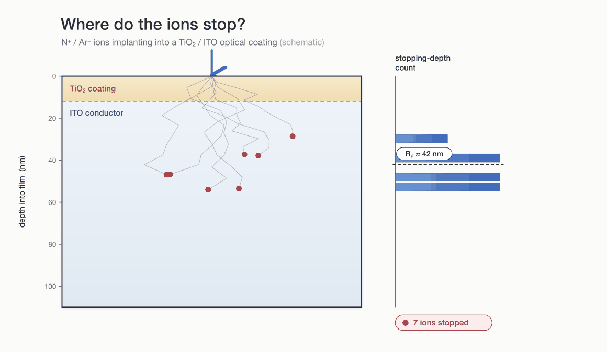
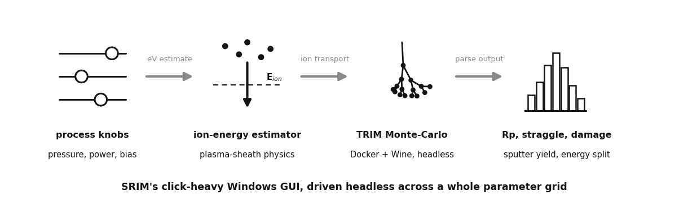

# pySRIM: scriptable sputtering & ion-transport simulation

During reactive RF magnetron sputtering of optical thin films, energetic N+ and
Ar+ ions bombard the target and the growing coating. How deep do they go, and how
much lattice damage do they leave behind? [SRIM/TRIM](http://www.srim.org/)
answers this, but only through a Windows GUI you click hundreds of times. This is
a Python wrapper that asks SRIM the same questions across a whole parameter grid,
headless and reproducibly.



*Schematic of the quantity the pipeline computes: where the ions stop. Depths are
drawn from a projected range and straggle of the order SRIM returns for a light
ion in a low-Z oxide; the real numbers come out of TRIM.*



## What it does

Build `Ion` / `Layer` / `Target` objects, run TRIM headless (Wine + xvfb in Docker,
`--platform linux/amd64` on Apple Silicon), parse the output files, and compute:

- projected range and straggling
- vacancy / damage profiles
- sputter yield
- electronic / nuclear / phonon energy partitioning

with five parameter sweeps (ion energy, ion species, chamber pressure, substrate
bias, and a TiO2-coating-on-ITO penetration study). The materials are an optical
thin-film stack - low-index SiO2 (n ~ 1.46), high-index TiO2 (n ~ 2.4), and the
ITO transparent conductor - with literature densities and SRIM
displacement/binding energies (cited in `config/materials.yaml`).

## Pipeline

```
 process knobs                SRIM/TRIM (Docker + Wine)       analysis
 (pressure, power, bias)  ->  ion-transport Monte Carlo   ->  Rp, straggle,
        |                       per-ion cascades               vacancies,
 ion-energy estimator     ->  RANGE / VACANCY / IONIZ.txt     sputter yield,
 (sheath physics)                                             energy split
                                                                  |
                                                          matplotlib figures
```

## Run it

```bash
# build once (fetches SRIM-2013 from srim.org at build time; no binary is committed)
docker build --platform linux/amd64 -t pysrim .

# the "runs with only pip deps, no Docker" demo - validates materials + prints
# ion-energy estimates, and gracefully skips TRIM if Docker is absent
python examples/01_basic_n_on_sio2.py

# unit tests need no Docker and no external data (fully synthetic fixtures)
pytest tests/ --ignore=tests/test_integration.py
```

Examples 02-05 need a working SRIM, which the Dockerfile fetches at build time.
Their only inputs are the textbook values in `config/materials.yaml`.

## Honest engineering notes

The interesting part was making `pysrim` behave inside a container, and knowing
where to trust SRIM:

- **pysrim crashes at import on modern PyYAML.** `pysrim` v0.5.10 calls
  `yaml.load` the old (unsafe) way, which raises on PyYAML 6+. The fix is to
  monkey-patch `yaml.load` *before* `import srim` - order matters, and it fails
  loudly at import if you get it wrong.
- **Documented output classes that were never shipped.** The `Phonon` output
  class in the docs does not exist in the package, so there is a manual
  `PHONON.txt` fallback; the `Sputter` parser is a non-functional stub, replaced
  by a custom regex parser.
- **SRIM.exe is 32-bit Windows**, so macOS needs Rosetta emulation under the
  linux/amd64 image.
- **Trust range and damage, not absolute sputter yields.** SRIM under- or
  over-estimates low-energy sputter yields by tens of percent for heavy-on-light
  versus light-on-heavy collisions, and gives unphysical angular distributions
  for low-Z targets. This project uses SRIM for projected range and lattice
  damage, and says so rather than quoting sputter yields as ground truth.

## AI-assisted build notes

Claude scaffolded the output-file parsers, the Docker/Wine bridge, and the
parameter-sweep plumbing quickly, and caught the import-time `yaml.load` ordering
trap. Where it needed a human: the pysrim ion-energy unit convention
(`energy = eV * 1e3`) is still flagged as unverified against published SRIM
tables in the code - the model confidently produced plausible-but-unchecked
stopping-unit code that has to be validated by hand, not trusted.
