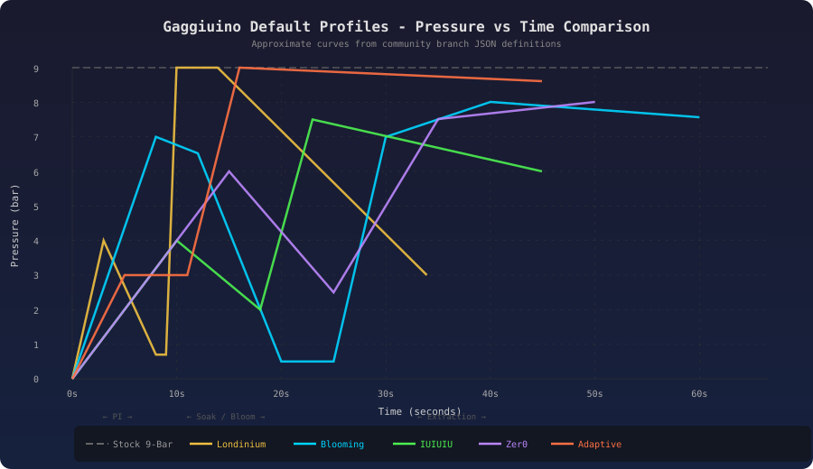
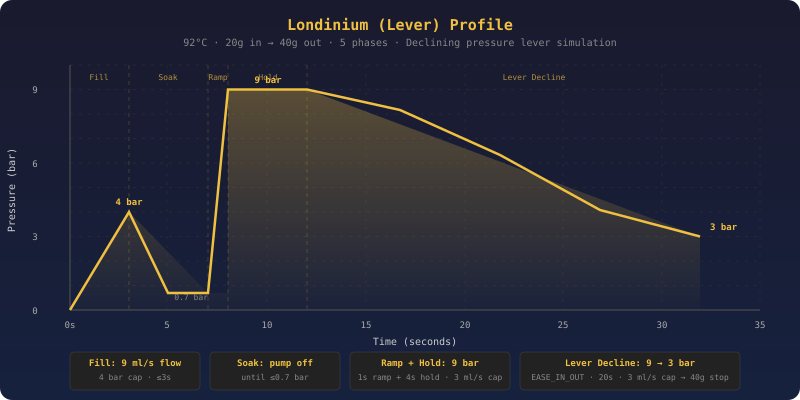
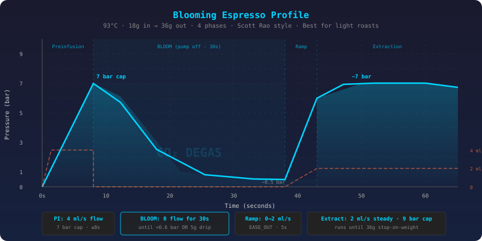
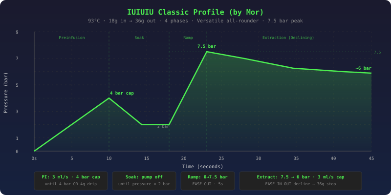
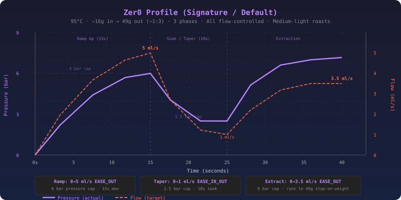
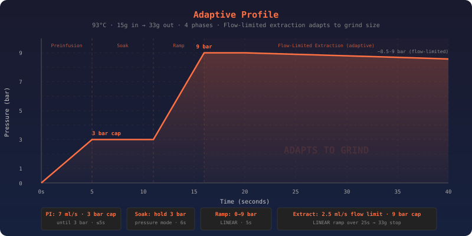

# Gaggiuino Default Profile Curves - Visual Reference

> Personal research notes on the [Gaggiuino](https://gaggiuino.github.io/) espresso machine mod on a Gaggia Classic Evo Pro (RI9380/49), exported from an Obsidian vault (compiled 2026-03-03). Wiki links flattened; sources cited inline.

> Phase-by-phase pressure and flow curves for every default [Gaggiuino](../machine/Gaggiuino-Modification-Overview.md) profile, sourced directly from the [community branch JSON files](https://github.com/Zer0-bit/gaggiuino/tree/community/profiles). Use this as a visual reference when editing profiles on the touchscreen or web UI.

For profile philosophy and when-to-use guidance, see [Gaggiuino-Profile-Comparison-Guide](Gaggiuino-Profile-Comparison-Guide.md).
For importing/editing profiles, see [Gaggiuino-Custom-Profiles-Import-Guide](Gaggiuino-Custom-Profiles-Import-Guide.md).

---

## Combined Pressure Comparison

All profiles overlaid on a single chart - shows how differently each profile manages pressure over time.



**Key takeaways from the overlay:**
- **Stock 9-Bar** is a flat line - no profiling at all
- **Londinium** hits peak pressure fastest, then declines steadily (lever simulation)
- **Blooming** has the longest total time due to the 30s bloom pause in the middle
- **IUIUIU** never exceeds 7.5 bar - deliberately lower peak than traditional
- **Zer0** is entirely flow-controlled - the pressure curve is a *result*, not a target
- **Adaptive** ramps to 9 bar like traditional, but flow-limits the extraction phase

---

## Individual Profile Details

### Londinium (Lever)



| Parameter | Value |
|-----------|-------|
| **Temperature** | 92°C |
| **Recipe** | 20g in → 40g out (1:2) |
| **Total time** | 25–35s |
| **Control mode** | Flow (phases 1-2) → Pressure (phases 3-5) |
| **Peak pressure** | 9 bar |
| **Key feature** | 9→3 bar EASE_IN_OUT decline over 20s |

**5 phases:**

| # | Phase | Type | Target | Restriction | Stop Condition |
|---|-------|------|--------|-------------|----------------|
| 1 | Fill | FLOW | 9 ml/s (instant) | 4 bar | 10s OR pressure ≥ 4 bar OR 65 ml |
| 2 | Soak | FLOW | 0 ml/s (pump off) | - | 10s OR pressure ≤ 0.7 bar |
| 3 | Ramp | PRESSURE | 0→9 bar (EASE_OUT, 1s) | - | 1s |
| 4 | Hold | PRESSURE | 9 bar (instant) | 3 ml/s | 4s |
| 5 | Decline | PRESSURE | 9→3 bar (EASE_IN_OUT, 20s) | 3 ml/s | Weight (40g global) |

**Why it works:** The fast fill (9 ml/s) saturates the puck quickly, then a brief soak lets it settle. The rapid ramp to 9 bar mimics pulling a lever down. The signature 20s decline from 9→3 bar mimics a spring lever naturally losing force - extracting bright acids first (high pressure) and sweetness later (low pressure) without pulling bitter compounds.

---

### Blooming Espresso



| Parameter | Value |
|-----------|-------|
| **Temperature** | 93°C |
| **Recipe** | 18g in → 36g out (1:2) |
| **Total time** | 45–65s |
| **Control mode** | All FLOW |
| **Peak pressure** | ~7 bar (during PI, capped) |
| **Key feature** | 30s pump-off bloom pause for CO₂ degassing |

**4 phases:**

| # | Phase | Type | Target | Restriction | Stop Condition |
|---|-------|------|--------|-------------|----------------|
| 1 | Preinfusion | FLOW | 4 ml/s (instant) | 7 bar | 20s OR ≥ 7 bar OR 65 ml |
| 2 | Bloom | FLOW | 0 ml/s (pump off) | - | 30s OR ≤ 0.6 bar OR 5g drip |
| 3 | Ramp | FLOW | 0→2 ml/s (EASE_OUT, 5s) | - | 5s |
| 4 | Extraction | FLOW | 2 ml/s (instant) | 9 bar | Weight (36g global) |

**Why it works:** The 30s bloom pause lets CO₂ trapped in fresh coffee escape completely. When extraction resumes at 2 ml/s, water contacts the puck uniformly - no channeling through gas pockets. This enables extraction yields of 25–29% (vs 19–21% traditional) with dramatically more sweetness and clarity from light roasts.

> **Warning:** If your bloom shots are running fast and tasting thin/simple, the bloom pause is likely too short or the puck isn't saturating properly. See [Bloom-Profile-Troubleshooting-Fast-Extraction](../troubleshooting/Bloom-Profile-Troubleshooting-Fast-Extraction.md) for phase-by-phase fixes.

---

### IUIUIU Classic (by Mor)



| Parameter | Value |
|-----------|-------|
| **Temperature** | 93°C |
| **Recipe** | 18g in → 36g out (1:2) |
| **Total time** | 25–45s |
| **Control mode** | Flow (phases 1-2) → Pressure (phases 3-4) |
| **Peak pressure** | 7.5 bar (never reaches 9) |
| **Key feature** | Extended PI + moderate peak + gentle decline |

**4 phases:**

| # | Phase | Type | Target | Restriction | Stop Condition |
|---|-------|------|--------|-------------|----------------|
| 1 | Preinfusion | FLOW | 3 ml/s (instant) | 4 bar | 20s OR ≥ 4 bar OR 4g drip OR 60 ml |
| 2 | Soak | FLOW | 0 ml/s (pump off) | - | 30s OR pressure ≤ 2 bar |
| 3 | Ramp | PRESSURE | 0→7.5 bar (EASE_OUT, 5s) | - | 5s |
| 4 | Extraction | PRESSURE | 7.5→6 bar (EASE_IN_OUT, 4s) | 3 ml/s | Weight (36g global) |

**Why 7.5 bar (not 9):** Traditional 9 bar was optimized for dark Italian roasts. Specialty light-to-medium beans extract more cleanly at lower pressure - you get higher extraction yields without pulling bitter/astringent compounds. The 4 bar preinfusion cap ensures thorough puck saturation before main extraction, and the soak (until pressure drops below 2 bar) acts as a mini-bloom.

---

### Zer0 (Signature Default)



| Parameter | Value |
|-----------|-------|
| **Temperature** | 95°C |
| **Recipe** | ~16g in → 49g out (~1:3) |
| **Total time** | 30–40s |
| **Control mode** | All FLOW (pressure is a result, not a target) |
| **Peak pressure** | ~6–8 bar (varies with grind) |
| **Key feature** | Pure flow control - pressure adapts to the puck |

**3 phases:**

| # | Phase | Type | Target | Restriction | Stop Condition |
|---|-------|------|--------|-------------|----------------|
| 1 | Ramp Up | FLOW | 0→5 ml/s (EASE_OUT, 15s) | 6 bar | 15s OR ≥ 6 bar |
| 2 | Soak/Taper | FLOW | 0→1 ml/s (EASE_IN_OUT, 10s) | 2.5 bar | 10s |
| 3 | Extraction | FLOW | 0→3.5 ml/s (EASE_OUT, 10s) | 9 bar | Weight (49g global) |

**Why all flow-controlled:** Instead of targeting a pressure number, the Zer0 profile sets flow rates and lets pressure build naturally against the puck's resistance. This makes it inherently adaptive - the same profile produces different pressure curves depending on grind size, dose, and bean density. The 1:3 ratio and 95°C temperature position it for medium to medium-light specialty roasts.

---

### Adaptive



| Parameter | Value |
|-----------|-------|
| **Temperature** | 93°C |
| **Recipe** | 15g in → 33g out (~1:2.2) |
| **Total time** | 25–45s |
| **Control mode** | Flow (PI) → Pressure (soak, ramp) → Flow (extraction) |
| **Peak pressure** | 9 bar |
| **Key feature** | Flow-limited extraction compensates for grind variation |

**4 phases:**

| # | Phase | Type | Target | Restriction | Stop Condition |
|---|-------|------|--------|-------------|----------------|
| 1 | Preinfusion | FLOW | 7 ml/s (instant) | 3 bar | 20s OR ≥ 3 bar OR 60 ml |
| 2 | Soak | PRESSURE | 3 bar (instant) | - | 6s |
| 3 | Ramp | PRESSURE | 0→9 bar (LINEAR, 5s) | - | 5s |
| 4 | Extraction | FLOW | 0→2.5 ml/s (LINEAR, 25s) | 9 bar | Weight (33g global) |

**Why it's "adaptive":** The extraction phase targets flow rate (2.5 ml/s) rather than pressure. If you grind too fine, pressure rises but flow stays capped - preventing over-extraction. If you grind too coarse, pressure stays lower but flow still reaches target. The profile self-corrects for grind variation, making it forgiving to dial in (from [Coffee Ad Astra](https://coffeeadastra.com/2020/12/31/an-espresso-profile-that-adapts-to-your-grind-size/)).

---

### Stock Profiles (Calibration)

Two flat profiles exist for calibration and baseline testing:

| Profile | Pressure | Temperature | Global Stop | Purpose |
|---------|----------|-------------|-------------|---------|
| **Stock - 9 Bar** | Constant 9 bar | 93°C | None (5 min timeout) | Baseline espresso, equivalent to unmodified machine |
| **Stock - 12 Bar** | Constant 12 bar | 93°C | None (5 min timeout) | OPV calibration / pump testing only |

These are single-phase pressure-hold profiles. No preinfusion, no soak, no profiling. Useful for:
- Comparing profiled shots against a traditional baseline
- [OPV spring calibration](../research-notes/Gaggiuino-OPV-Spring-Research-Community-Findings.md) (12 bar)
- Testing grinder calibration at a known, constant pressure

---

## Profile Selection Cheat Sheet

```
What roast?
│
├── Light / Nordic
│   ├── Max extraction? → BLOOMING (93-96C, 1:2.5-1:3)
│   ├── Forgiving dial-in? → ZER0 (95C, 1:3)
│   └── Quick & clean? → Turbo (not default, import)
│
├── Medium-Light
│   ├── Versatile? → IUIUIU (93C, 1:2)
│   └── Adaptive? → ADAPTIVE (93C, 1:2.2)
│
├── Medium
│   ├── Body + chocolate? → LONDINIUM (92C, 1:2)
│   └── Clarity + fruit? → IUIUIU (93C, 1:2)
│
└── Dark
    ├── Traditional Italian? → STOCK 9-BAR (93C, 1:2)
    └── Refined lever? → LONDINIUM (90-92C, 1:1.5-1:2)
```

---

## Understanding Phase Types

All Gaggiuino profiles use two control types - understanding the difference is critical for editing profiles:

### FLOW mode
- **You set:** target flow rate (ml/s)
- **Machine controls:** pump speed to maintain that flow
- **Pressure becomes:** a *result* - it builds based on puck resistance
- **Restriction field:** maximum pressure cap (bar)
- **Use for:** preinfusion, bloom (0 ml/s = pump off), gentle extraction

### PRESSURE mode
- **You set:** target pressure (bar)
- **Machine controls:** pump power to maintain that pressure
- **Flow becomes:** a *result* - it varies based on puck resistance
- **Restriction field:** maximum flow cap (ml/s)
- **Use for:** main extraction, lever-style declining profiles, holds

### Transition curves

| Curve | Shape | Use Case |
|-------|-------|----------|
| **INSTANT** | Step function (jumps to value) | Immediate changes, holds |
| **LINEAR** | Straight-line ramp | Even, predictable transitions |
| **EASE_OUT** | Fast start, slow finish | Natural ramp-up feel |
| **EASE_IN_OUT** | Slow start, fast middle, slow end | Smooth lever-like decline |

---

## Sources

- [Gaggiuino Community Branch - Profile JSONs](https://github.com/Zer0-bit/gaggiuino/tree/community/profiles) - raw JSON source for all curves
- [GaggiMate Profile Documentation](https://docs.gaggimate.eu/docs/profiles/) - profile format reference
- [Coffee Ad Astra - Adaptive Profile](https://coffeeadastra.com/2020/12/31/an-espresso-profile-that-adapts-to-your-grind-size/) - Jonathan Gagne's adaptive flow concept
- [Scott Rao - Blooming Espresso](https://www.scottrao.com/blog/2021/5/18/best-practice-espresso-profile) - original blooming profile specification
- [Visualizer.coffee - IUIUIU Classic](https://visualizer.coffee/shots/d6c2a292-a45a-48b5-835f-65065260b69f) - Mor's original IUIUIU shot data

---

## Related Notes

- [Gaggiuino-Profile-Comparison-Guide](Gaggiuino-Profile-Comparison-Guide.md) - When to use which profile (decision tree)
- [Gaggiuino-Top-10-Profiles-Community-Ranked](Gaggiuino-Top-10-Profiles-Community-Ranked.md) - Community-ranked top 10 (includes non-default profiles)
- [Gaggiuino-Pressure-Profiling-Extraction-Parameters](Gaggiuino-Pressure-Profiling-Extraction-Parameters.md) - Deep dive: extraction yields, blooming science
- [Bloom-Profile-Troubleshooting-Fast-Extraction](../troubleshooting/Bloom-Profile-Troubleshooting-Fast-Extraction.md) - Fixing fast/thin bloom shots
- [Gaggiuino-Custom-Profiles-Import-Guide](Gaggiuino-Custom-Profiles-Import-Guide.md) - Editing, importing, exporting JSON profiles
- [Gaggiuino-Post-Install-Operation-Guide](../machine/Gaggiuino-Post-Install-Operation-Guide.md) - Day-to-day operation
