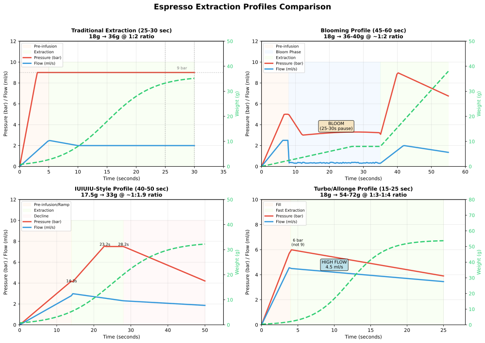
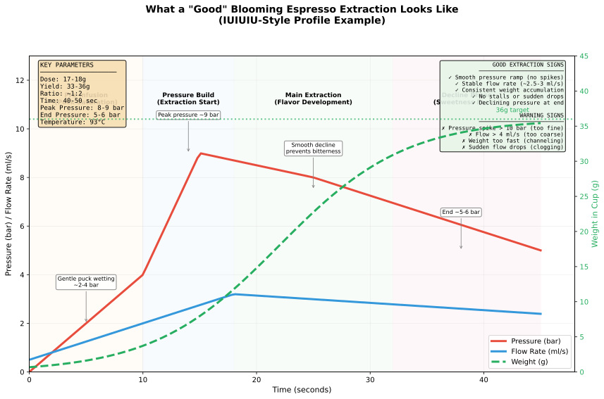

# Gaggiuino Pressure Profiling & Extraction Parameters

> Personal research notes on the [Gaggiuino](https://gaggiuino.github.io/) espresso machine mod on a Gaggia Classic Evo Pro (RI9380/49), exported from an Obsidian vault (compiled 2025-01-28). Wiki links flattened; sources cited inline.

Research on advanced espresso extraction profiles, specifically for [Gaggiuino](../machine/Gaggiuino-Modification-Overview.md) systems. Covers IUIUIU profiles, blooming techniques, and how pressure profiling fundamentally changes traditional extraction rules.

## Key Takeaway: Traditional Rules Are Guidelines, Not Laws

> "1:2 in 30s is not a rule to be strictly adhered to."
> - [Espresso Aficionados Profiling Guide](https://espressoaf.com/guides/profiling.html)

The traditional "25-30 seconds for 36g from 18g dose" was established for **flat 9-bar pressure machines**. With pressure profiling, extraction times commonly extend to **40-60+ seconds** while achieving superior flavor and extraction yields.

---

## Visual Reference: Extraction Profile Comparison

---

## Profile Types Explained

### Traditional Extraction (Baseline)
- **Time**: 25-30 seconds
- **Ratio**: 1:2 (18g in, 36g out)
- **Pressure**: Constant ~9 bar throughout
- **Best for**: Dark roasts, traditional Italian-style espresso

### Blooming Espresso Profile

Developed by **Scott Rao** for Decent Espresso machines, this profile revolutionized light roast extraction.

#### How Blooming Works

The profile consists of three key phases:
1. **Preinfusion** at ~4 ml/s flow rate
2. **Bloom pause** (25-30 seconds) - water flow stops, pressure gradually declines naturally
3. **Extraction** at ~2 ml/s flow rate with declining pressure

**Mechanism**: The bloom pause allows CO2 (trapped in freshly roasted coffee) to escape, improving water-coffee contact and puck saturation. This leads to more even extraction across the entire puck.

#### Parameters

| Parameter | Typical Value |
|-----------|---------------|
| **Preinfusion** | 4 ml/s to 5-7 bar |
| **Bloom Duration** | 25-30 seconds |
| **Extraction Flow** | 2 ml/s |
| **Temperature** | 92-98°C (profile dependent) |
| **Peak Pressure** | 6-9.5 bar |
| **Total Time** | 45-65+ seconds |
| **Ratio** | 1:2 to 1:3 |

#### Extraction Yield Comparison

| Profile Type | Typical Extraction Yield |
|--------------|-------------------------|
| Traditional (9 bar) | 19-21% |
| EK Espresso | 23-24% |
| **Blooming Espresso** | **25-29%** |

Scott Rao reports achieving 27%+ extraction yields consistently, with some shots reaching as high as 29% with light roasts and 1:2.5+ ratios.

#### Best Bean Types for Blooming

- **Ideal**: Light roasts, Nordic-style filter roasts, single origins (Ethiopia, Kenya)
- **Good**: Medium-light roasts
- **Not recommended**: Dark roasts (high extraction makes bitter flavors more prominent)

> "Blooming espresso can lead to an increase in extraction by as much as 1.5%. Additionally, coffee professionals report noticeably improved flavor."
> - [Scott Rao's Best Practice Profile](https://www.scottrao.com/blog/2021/5/18/best-practice-espresso-profile)

#### Blooming on Gaggiuino

Gaggiuino Gen3 includes blooming profile capabilities:
- Pre-programmed blooming profiles available
- Custom profiles can be created with bloom phases
- One user notes: "You are not really Gaggiuino-ing if you are not trying to extract light roasts with bloom profile"
- Available via [GaggiMate](https://docs.gaggimate.eu/docs/profiles/) or Discord community
- **Troubleshooting fast/simple bloom shots:** See [Bloom-Profile-Troubleshooting-Fast-Extraction](../troubleshooting/Bloom-Profile-Troubleshooting-Fast-Extraction.md) for phase-by-phase diagnostic guide

### IUIUIU Profile (Community Profile)

**What does IUIUIU stand for?**

The exact meaning of "IUIUIU" is not definitively documented in public sources. Based on the pattern of alternating letters (I-U-I-U-I-U) and espresso profiling terminology, it likely represents alternating phases in the extraction process - possibly "Infusion-Up-Infusion-Up-Infusion-Up" referring to cycles of low-pressure infusion followed by pressure increases. However, this interpretation cannot be confirmed from official documentation.

The profile was created by a user named **Mor** and is documented on [Visualizer.coffee](https://visualizer.coffee/shots/d6c2a292-a45a-48b5-835f-65065260b69f). It is used on both **Decent Espresso** machines and **Gaggiuino** systems, with branded drip tray covers available on [Printables](https://www.printables.com/model/276407-gaggiuinoiuiuiu-branded-drip-tray-covers).

#### IUIUIU Classic Parameters

Based on documented shots from Visualizer.coffee (multiple data points):

| Parameter | Value (Light Roast) | Value (Medium Roast) |
|-----------|---------------------|----------------------|
| **Dose** | 17.5g | 17.5g |
| **Yield** | 33.6-34.5g | 36g |
| **Ratio** | 1:1.9-1:2.0 | 1:2.1 |
| **Total Time** | 45-116 seconds | 25-45 seconds |
| **Temperature** | 93-94°C | 93°C |
| **Peak Pressure** | 7.5 bar | 7.5 bar |
| **Grinder** | DF54 at 4.5-7 | DF54 at 4.5-7 |

**Three Distinct Phases** (based on SproFiler Gaggiuino data):

1. **Pre-infusion phase** (0-11.2s): Steady 4 bar pressure, puck saturation
2. **Ramp-up phase** (11.2-18s): Gradual pressure increase from 2.3 to 7.5 bar
3. **Plateau/Decline phase** (18-25+s): Stabilizes at ~6 bar, then gradual decline

**Flow characteristics**: Pump flow maintains ~3 ml/s throughout pre-infusion and extraction phases, with deliberate flow reduction during mid-extraction transition.

**Notable characteristics**:
- Never reaches 9 bar - peaks at ~7.5 bar with declining pressure similar to lever machines
- Longer extraction times than traditional (45-116 seconds vs 25-30 seconds)
- Excellent for light and medium roasts
- Requires precise puck preparation (WDT, paper filters recommended)

#### IUIUIU Availability

| Platform | Availability |
|----------|--------------|
| **Gaggiuino Gen3** | Available via SproFiler profile sharing |
| **Decent Espresso DE1** | Available via Visualizer.coffee community |
| **Gaggiuino Discord** | Community-shared profiles |

#### Recommended Equipment Setup (from Mor's documented shots)
- Normcore 18g basket
- 55mm bottom paper filter
- WDT (Weiss Distribution Technique) before tamping
- 58mm top paper filter
- Preheated portafilter
- DF54 or DF64 grinder (burrs realigned)

#### Best Bean Types for IUIUIU Profile

Based on documented shots and profile characteristics:

**Ideal Beans (Documented Success)**:
| Origin | Roast Level | Tasting Notes |
|--------|-------------|---------------|
| Guatemala Huehuetenango | Medium | Milk chocolate, caramel, berry, smooth body |
| Kenya | Light-Medium | Bright acidity, fruit-forward |
| Ethiopia Natural | Light | Wine-like, berry, floral |

**General Guidelines**:
- **Light roasts**: IUIUIU excels - longer extraction at lower pressure prevents sourness
- **Medium roasts**: Sweet spot for the profile - balanced body and clarity
- **Medium-dark roasts**: Acceptable but traditional/lever profiles may be better
- **Dark roasts**: Not recommended - use traditional or Cremina Lever profile

**Bean Characteristics That Work Well**:
- Single origins with complex flavor profiles
- Freshly roasted (7-21 days off roast ideal for blooming phases)
- Higher quality specialty grade beans (extraction highlights both good and bad qualities)

**Bean Characteristics to Avoid**:
- Very dark/oily beans (over-extraction risk)
- Stale beans (>30 days) - less CO2 for bloom phase benefit
- Low-quality commodity beans (defects become more apparent)

### Turbo/Allonge Profile (Fast Extraction)

A modern approach that challenges traditional espresso dogma by using coarser grinds and higher flow rates.

#### Parameters

| Parameter | Allonge | Turbo | Yeet (Extreme) |
|-----------|---------|-------|----------------|
| **Time** | 20-30s | ~20s | 11-15s |
| **Ratio** | 1:3.5+ | 1:3-1:4 | 1:3+ |
| **Pressure** | <6 bar | ~6 bar | 6-9 bar spike |
| **Flow Rate** | 4.5 ml/s | Maintain 6 bar | Full debit |
| **Grind** | Coarser | Coarser | Coarser |

**Key insight**: Shorter contact times increase clarity and fruit-forward notes while sacrificing body/thickness.

> "Shots as short as 11 seconds including nearly 4 seconds of fill" are achievable with turbo profiles.

**Best for**: Ultra-light roasts (Nordic-style), filter-roast beans seeking clarity over body

---

## Extraction Timing: IUIUIU and Blooming vs Traditional 25-30 Second Shots

### Why Traditional Shots Are 25-30 Seconds

The 25-30 second "golden rule" traces back to 1940s Italy, where Achille Gaggia perfected lever machines. Early baristas discovered this timeframe produced the best flavor balance with:
- Constant 9 bar pressure
- Medium-dark roasts (Italian style)
- 1:2 ratio (e.g., 18g in, 36g out)

**The science**: At 9 bar constant pressure, 25-30 seconds provides enough contact time to extract desirable flavors (18-21% extraction yield) without over-extracting bitter compounds.

### How IUIUIU Changes Extraction Timing

IUIUIU profiles extend extraction to **45-116 seconds** by:

1. **Longer preinfusion** (10-15 seconds at low pressure vs 3-5 seconds traditional)
2. **Lower peak pressure** (7.5 bar vs 9 bar) - slower extraction rate
3. **Declining pressure curve** - maintains flow without over-extraction
4. **Staged extraction phases** - three distinct phases instead of single plateau

**Why longer works**: Lower pressure and staged extraction prevent channeling and allow more even extraction across the puck, achieving higher yields (24-26%) without bitterness.

### How Blooming Changes Extraction Timing

Blooming profiles extend extraction to **45-65+ seconds** by adding:

1. **30-second bloom pause** - total stop in water flow
2. **CO2 degassing** - freshly roasted coffee releases gas, improving saturation
3. **Better puck hydration** - more even water distribution before main extraction

**Why longer works**: The bloom pause increases extraction yield by up to 1.5% while improving sweetness and clarity. Contact time increases dramatically, but so does extraction evenness.

### Timing Comparison Table

| Profile | Fill | Preinfusion | Bloom/Pause | Main Extraction | Total |
|---------|------|-------------|-------------|-----------------|-------|
| **Traditional** | 3-5s | 0-5s | None | 20-25s | **25-30s** |
| **IUIUIU Classic** | 3-5s | 10-15s | Phase transition | 25-40s | **45-60s** |
| **Blooming** | 3-5s | 8-12s | 25-30s | 20-30s | **55-75s** |
| **Turbo/Allonge** | 3-4s | 5-8s | None | 8-15s | **15-25s** |

### When to Use Which Timing

| Scenario | Recommended Profile | Expected Time |
|----------|---------------------|---------------|
| Dark roast, traditional taste | Traditional/Lever | 25-35s |
| Medium roast, balanced | IUIUIU-style | 40-50s |
| Light roast, fruity | Blooming | 50-70s |
| Ultra-light, filter-like clarity | Turbo/Allonge | 15-25s |
| Troubleshooting/dialing in | Traditional | 25-30s |

---

## Does Pressure Profiling Change Traditional Extraction Rules?

**Yes, fundamentally.**

### What Stays the Same
- **Ratio** remains important (1:2 is still a good starting point)
- **Weight-based stopping** is still preferred over time-based
- **Grind adjustment** is still your primary dial-in variable

### What Changes
| Traditional Rule | With Pressure Profiling |
|------------------|------------------------|
| 25-30 second extraction | 12-65+ seconds acceptable |
| 9 bar constant pressure | 2-9 bar variable pressure |
| Time as key metric | Weight as primary stop condition |
| One profile fits all | Profile matched to roast level |

### Roast Level Guidelines

| Roast Level | Recommended Profile | Typical Time | Ratio |
|-------------|---------------------|--------------|-------|
| Light | Blooming or Allonge | 45-65s | 1:2.5-1:4 |
| Medium-Light | Blooming | 40-55s | 1:2-1:2.5 |
| Medium | IUIUIU-style | 35-50s | 1:1.9-1:2.2 |
| Medium-Dark | Lever-style declining | 30-45s | 1:1.5-1:2 |
| Dark | Traditional or Lever | 25-35s | 1:1.5-1:2 |

---

## Gaggiuino Pre-loaded Profiles

Based on [GaggiMate documentation](https://docs.gaggimate.eu/docs/profiles/):

### Cremina Lever (by Johnyez)
- **Roast level**: Medium-Dark to Very Dark
- **Duration**: 40-60 seconds
- **Ratio**: 1:1.5 - 1:2.2
- **Temperature**: 78-90°C
- **Character**: "Lots of crema, traditional texture"

### Medium 18g 1:2 (by alexr1525)
- **Design**: Relatively simple with pre-infusion and bloom phases
- **Pressure**: Uses 9 bar with end-stage decline

---

## Weight-Based Stop Conditions in Gaggiuino

Gaggiuino supports **gravimetric (weight-based) shot stopping** when paired with a Bluetooth scale.

### How It Works
- Profile defines `globalStopConditions.weight` in grams (e.g., `"weight": 35.3`)
- Machine monitors scale weight in real-time
- Extraction stops automatically when target weight is reached

### Stop Condition Types
- **Weight above**: Exits when scale weight exceeds set value (most common for shot target)
- **Time**: Maximum duration failsafe
- **Pressure thresholds**: Can trigger phase transitions

### Without a Scale
> "Volumetric targets work best when a Bluetooth scale is used. If not, Gaggimate will estimate the amount of coffee in the cup based on the pressure curve of the brew up to that point."

---

## Bookoo Scale Integration with Gaggiuino

The [Bookoo Themis scale](../machine/Gaggiuino-Bluetooth-Scale-Recommendations.md) integrates with Gaggiuino Gen3 for real-time weight tracking.

### Compatible Features
- **Real-time weight display** during extraction
- **Automatic shot stop** at target weight
- **Flow rate calculation** (0.1 g/s precision)
- **Profile overlay** - set target profile as background graph to replicate

### Setup
1. Power on Bookoo scale via Bluetooth
2. Gaggiuino Gen3 connects automatically
3. Set target weight in profile's `globalStopConditions`
4. Machine stops extraction when weight is reached

### Known Issues
- Some users report Bluetooth disconnection after first shot
- May require power cycling Gaggia to reconnect
- Firmware updates have improved stability

### Compatible Apps
- BOOKOO App
- Beanconqueror App
- GaggiMate (for Gaggiuino integration)

---

## Practical Recommendations

### For Light Roasts
1. **Use blooming profile** with 25-30 second bloom phase
2. **Target ratio**: 1:2.5 or higher
3. **Grind finer** than you would for traditional extraction
4. **Expect**: 45-60+ second total extraction time
5. **Temperature**: 93-96°C

### For Medium Roasts
1. **Use IUIUIU-style profile** with gradual pressure build
2. **Target ratio**: 1:2
3. **Expect**: 40-50 second extraction
4. **Temperature**: 93°C
5. **Peak pressure**: 7-8 bar (not 9)

### For Dark Roasts
1. **Use lever-style declining pressure** or traditional
2. **Target ratio**: 1:1.5 to 1:2
3. **Lower temperature**: 88-92°C
4. **Expect**: 25-40 second extraction

### Using Bookoo Scale for Real-Time Tracking
1. **Set target weight** in Gaggiuino profile (e.g., 36g)
2. **Watch flow rate** - should be 2-3 ml/s for normal extractions
3. **Look for consistency** - smooth weight accumulation without stalls
4. **Troubleshoot via flow**: >4 ml/s = too coarse, <1.5 ml/s = too fine

---

## Signs of Good vs Bad Extraction

### Good Extraction Indicators
- Smooth pressure curve without sudden spikes
- Stable flow rate (2-3 ml/s for normal profiles)
- Consistent weight accumulation
- Declining pressure toward end of shot
- Total time appropriate for profile type

### Warning Signs
| Symptom | Likely Cause | Fix |
|---------|--------------|-----|
| Pressure spike >10 bar | Grind too fine | Coarsen grind |
| Flow >4 ml/s | Grind too coarse | Finer grind |
| Rapid initial weight | Channeling | Better puck prep, WDT |
| Sudden flow drops | Puck clogging | Coarser grind, less dose |
| Shot finishes too fast | Grind too coarse | Finer grind |

---

## About the "Zero" Profile

Research did not find a widely documented profile specifically named "Zero" in the Gaggiuino or Decent espresso communities. The term may refer to:

1. **Zero flow phase** in blooming profiles - the pause where flow rate is 0 ml/s
2. **A community-created profile** shared on Discord or private forums
3. **Zer0-bit** - the creator/maintainer of the Gaggiuino project on GitHub

If you're looking for a specific "Zero" profile, check the [Gaggiuino Discord](https://discord.com/invite/gaggiuino-890339612441063494) community (21,000+ members) where custom profiles are actively shared.

---

## Sources

### Primary Sources
- [Gaggiuino Official Documentation](https://gaggiuino.github.io/)
- [GaggiMate Profiles Documentation](https://docs.gaggimate.eu/docs/profiles/)
- [Espresso Aficionados Profiling Guide](https://espressoaf.com/guides/profiling.html)
- [Scott Rao's Best Practice Espresso Profile](https://www.scottrao.com/blog/2021/5/18/best-practice-espresso-profile)
- [Scott Rao Masterclass on Blooming Espresso](https://decentespresso.com/blog/scott_rao_masterclass_on_blooming_espresso_filter_3_and_what_about_quakers)

### IUIUIU Profile Sources
- [Visualizer.coffee - IUIUIU Classic Shot (Mor)](https://visualizer.coffee/shots/d6c2a292-a45a-48b5-835f-65065260b69f)
- [Visualizer.coffee - IUIUIU Classic (Guatemala)](https://visualizer.coffee/shots/dbf99c62-b074-42af-b0d4-b2ef2ca4e74d)
- [SproFiler - IUIUIU Gaggiuino Profile](https://sprofiler.io/shot/9df583a5-ae90-41d1-9904-02fc185701f3)
- [Printables - IUIUIU Branded Drip Tray Covers](https://www.printables.com/model/276407-gaggiuinoiuiuiu-branded-drip-tray-covers)

### Technical Resources
- [Robert McKeon Aloe - Blooming Espresso Profile Explorations](https://rmckeon.medium.com/blooming-espresso-profile-explorations-7edcbeedc6c5)
- [Coffee Ad Astra - Adaptive Espresso Profile](https://coffeeadastra.com/2020/12/31/an-espresso-profile-that-adapts-to-your-grind-size/)
- [Decent Espresso - 5 Profiles for Medium Roasted Beans](https://decentespresso.com/blog/5_profiles_for_medium_roasted_beans)
- [Decent Espresso - 5 Profiles for Light Roasted Beans](https://decentespresso.com/blog/5_espresso_profiles_for_light_roasted_coffee_beans)
- [BOOKOO Coffee Tools](https://bookoocoffee.com/)
- [Gaggiuino GitHub - Profile Definition Format](https://github.com/Zer0-bit/gaggiuino/discussions/350)
- [Espresso Coffee Shop USA - Extraction Time Science](https://www.espressocoffeeshopusa.com/blog/post/26-espresso-extraction-time-perfect-25-30-second-shot)
- [Nucleus Coffee - What Is Blooming Espresso](https://nucleuscoffee.com/en/blogs/specialty-coffee/blooming-espresso)

---

## Related Notes

- [Gaggiuino-Profile-Selection-by-Bean-Origin-and-Character](Gaggiuino-Profile-Selection-by-Bean-Origin-and-Character.md) - Which profile for which bean origin, processing method, and roast level
- [Gaggiuino-Default-Profile-Curves-Reference](Gaggiuino-Default-Profile-Curves-Reference.md) - Visual pressure/flow curves for all default profiles with exact JSON parameters
- [Gaggiuino-Modification-Overview](../machine/Gaggiuino-Modification-Overview.md)
- [Gaggiuino-Popular-Community-Profiles-Research](../research-notes/Gaggiuino-Popular-Community-Profiles-Research.md) - Best profiles by roast level, community favorites
- [Gaggiuino-Custom-Profiles-Import-Guide](Gaggiuino-Custom-Profiles-Import-Guide.md) - How to import/export JSON profiles
- [Gaggiuino-Bluetooth-Scale-Recommendations](../machine/Gaggiuino-Bluetooth-Scale-Recommendations.md)
- [Gaggiuino-Post-Install-Operation-Guide](../machine/Gaggiuino-Post-Install-Operation-Guide.md)
