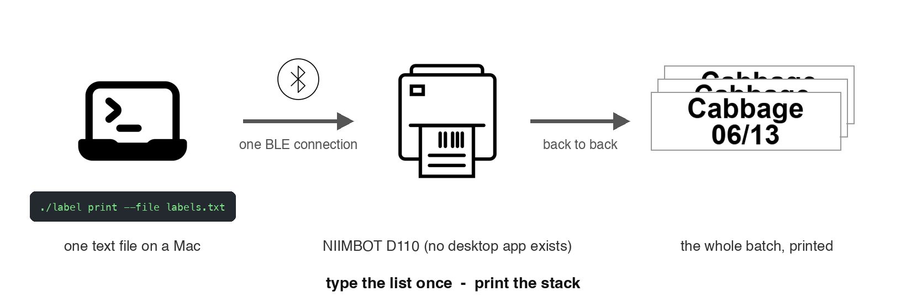

# LabelMaker: batch printing for the NIIMBOT D110 over Bluetooth



NIIMBOT label printers ship with no macOS or PC software at all: the only supported path is the phone app, one label at a time, tapping out text on a phone keyboard. That is fine for one label and miserable for twenty. The itch here was the good-husband weekend chores that come in batches - a week of baby-food containers, a whole-pantry reorganization - where you want to type a list once and have the printer emit the whole stack.

This is a small command-line tool that does exactly that from a Mac: feed it a text file (one label per line, `--5` for five copies), and it renders, previews, and prints the entire batch over a single Bluetooth LE connection.

```bash
./label preview --file labels.txt   # render PNGs, no printer needed
./label print   --file labels.txt   # print the whole batch back to back
./label print "Salt" "Pepper" "Olive Oil"
```

## How it works

A NIIMBOT printer has no "text" command. It accepts a 1-bit bitmap streamed row by row over Bluetooth LE. So this tool:

1. Renders each line of text to a bitmap sized for your label (auto-fit bold font, centered; default 40 x 12 mm).
2. Rotates it so the 12 mm side maps to the 96-dot print head.
3. Streams the rows using the reverse-engineered NIIMBOT protocol, then loops sessions for copies.

`niimbot_d110.py` is the protocol driver (packet framing, GATT service constants, the print sequence, a status poller); `print_labels.py` is the CLI (scan, preview, print, test, dry-run). The only dependencies are `bleak` and `pillow`: no GUI toolkits, no C libraries.

## The part worth reading: [GOTCHAS.md](GOTCHAS.md)

Every dead end hit while making this work, as Symptom / Cause / Fix. The number-one lesson generalizes well beyond label printers: **trust the page counter (did a label physically come out), never the progress counter (did the printer accept the bytes)** - almost every failure was a byte-perfect trace that produced a blank label. The big one: visually identical D110 hardware ships with different firmware dialects, and the `_M` variant silently accepts the standard print sequence while never engaging the head; it needs a different 9-byte start command and 13-byte page setup, now the default here (`--variant std` for a plain D110).

There is also a full `--dry-run` mode that executes the exact command sequence against an in-process fake printer and writes the TX/RX byte trace, so protocol changes are testable without spending labels.

## Setup

```bash
# Python 3.10+ with bleak and pillow (any venv/conda env works)
python -m venv .venv && source .venv/bin/activate
pip install -r requirements.txt

python print_labels.py scan     # find your printer, note its address
python print_labels.py preview --file labels.txt
python print_labels.py print   --file labels.txt
```

macOS notes: grant your terminal Bluetooth permission on first scan (System Settings > Privacy & Security > Bluetooth), and close the NIIMBOT phone app first - BLE allows one connection at a time. The `label` wrapper script runs the CLI via a conda env without activation; edit or ignore it if you use plain venvs.

## License and attribution

The NIIMBOT protocol knowledge here stands on three reverse-engineering projects: [AndBondStyle/niimprint](https://github.com/AndBondStyle/niimprint) (MIT), [labbots/NiimPrintX](https://github.com/labbots/NiimPrintX) (GPL-3.0), and [MultiMote/niimblue](https://github.com/MultiMote/niimblue) (MIT), whose `D110MV4PrintTask` documented the `_M` firmware dialect. Because packet sequences were taken from a GPL-3.0 project, **this folder is licensed GPL-3.0** (see [LICENSE](LICENSE)), unlike the rest of the repository, which is MIT. That is the conservative reading; protocol constants alone are arguably uncopyrightable facts, but conservative is cheap here.

Icon credits (workflow diagram): Prompt by HideMaru, Bluetooth by Viktor Vorobyev, Label Printer by Aidan Stonehouse - all from [Noun Project](https://thenounproject.com/) (CC BY 3.0). Label preview is real output from `./label preview`.
