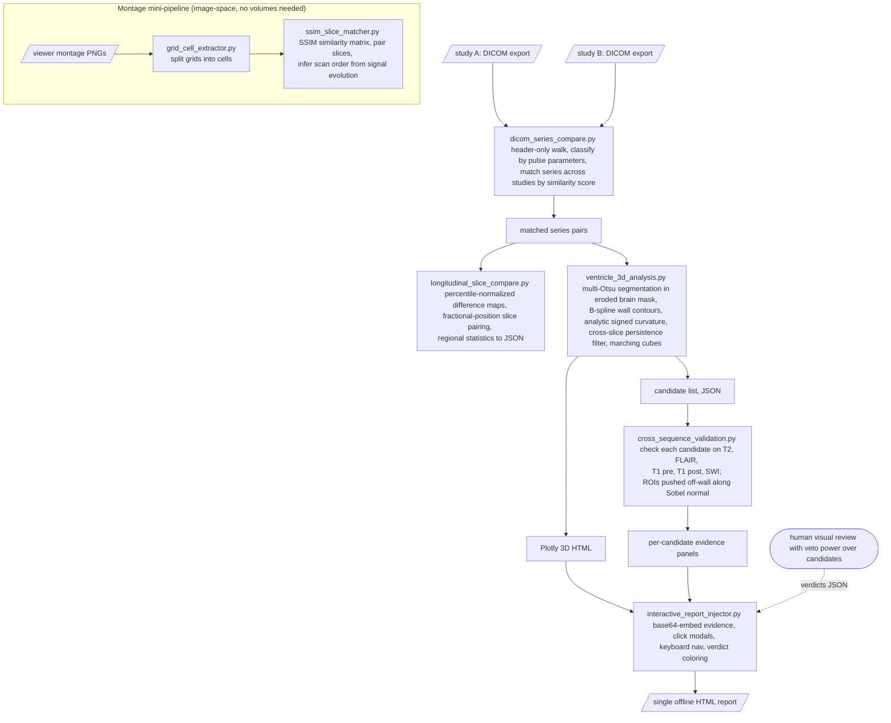
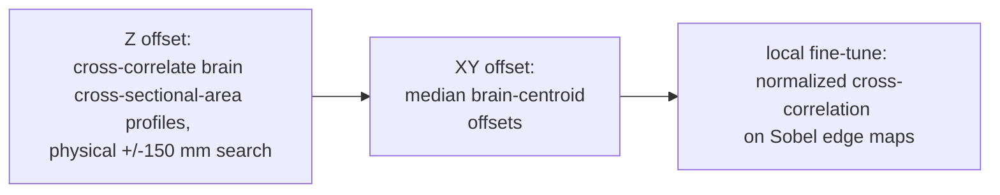

# Architecture

How seven scripts take two hospital DICOM exports to a clickable 3D report. See [README.md](README.md) for the script-by-script narrative and engineering lessons; this is the structural view.

## Main pipeline

## The cross-sequence alignment stack

The hardest problem in the toolkit: after NIfTI conversion, every sequence lives on its own grid (different voxel sizes, FOV, FOV centers, slice counts), so "the same point" must be recovered statistically. The shipped approach is the third full iteration:

Sobel edges are the key trick: edge maps are contrast-invariant, so alignment works between sequences where CSF flips from bright (T2) to dark (FLAIR). The two earlier iterations (fractional brain height; mutual information + edge similarity + Hu-moment shape score) are described in the README's engineering notes; both looked plausible and were wrong in ways only visual inspection caught.

## Design rules that shaped the toolkit

- **Headers before pixels.** Series inventory and matching read DICOM headers only (`stop_before_pixels`), so classification over hundreds of files is fast and never touches image data it does not need.
- **Shape over intensity.** Candidate detection uses wall-contour curvature, not signal ratios, because signal contrast between the tissues of interest was too weak to trust. Geometry survived where intensity failed.
- **Persistence as a filter.** A candidate must appear on adjacent slices to survive. Single-slice blips are treated as noise by construction.
- **Measure off the wall.** Validation ROIs are pushed 4 pixels along the outward mask normal into parenchyma so CSF partial volume at the wall cannot contaminate signal ratios.
- **The human is a pipeline stage.** Output is capped at 10 candidates and routed through visual review; the tooling narrows attention, it does not decide. Verdicts flow back in as JSON and color the final report.
- **One file, no server.** The final report is a single HTML file with all evidence base64-embedded, so it opens on any machine, offline, indefinitely.
