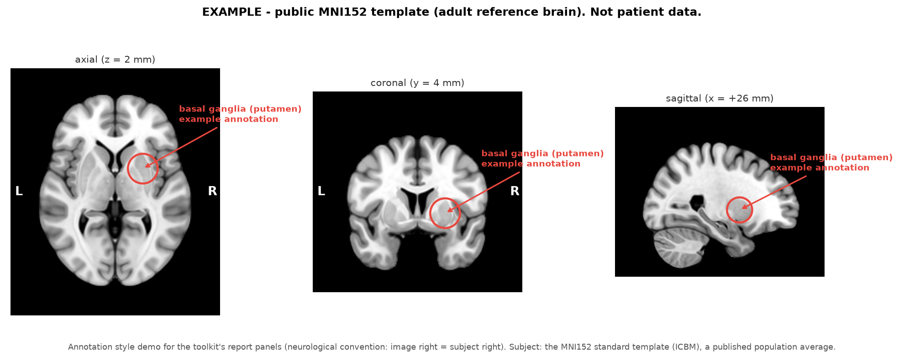

# DICOM MRI Toolkit

A personal toolkit for reading, comparing, and 3D-reconstructing brain MRI studies straight from a hospital imaging CD. Python, built on pydicom, nibabel, NumPy, SciPy, scikit-image, matplotlib, and Plotly.

By Jay Cho. This folder contains no patient imaging, no DICOM files, and no generated reports. The one image here is an [explicitly labeled example](examples/example-annotated-slices.png) rendered on the public MNI152 reference template.

## Why I built this

The starting point was a pair of brain MRI studies on a hospital CD, whose bundled viewer could scroll through slices and not much else. I wanted to genuinely understand what was on that disc: what the sequences were, how the two scans compared, and whether I could reproduce the kind of structured looking a radiologist does. Not to second-guess radiologists, whose reads are the ground truth here, but to be able to ask better questions.

So this became a side quest: start from raw DICOM, end at an interactive 3D reconstruction I could rotate in a browser, with every intermediate step inspectable. The full project grew to about 7,300 lines across 17 scripts over a couple of weeks in early 2026. What is published here is the curated core: 7 scripts covering the whole pipeline, with the dead-end iterations removed (but described below, because they were the most instructive part).

## Example output (public template, not patient data)



The annotation style the interactive reports use, demonstrated on the MNI152 standard template (ICBM population average) with a neutral anatomical landmark. Generated for this repo; no personal imaging was involved.

## The pipeline

```
DICOM CD export
   |
   |  dicom_series_compare.py      inventory + classify + match series
   v
matched series pairs
   |
   |  longitudinal_slice_compare.py    normalized difference maps
   |  ventricle_3d_analysis.py         segmentation + candidate detection + 3D HTML
   v
nodule candidates (JSON)
   |
   |  cross_sequence_validation.py     check candidates on 5 sequences
   |  interactive_report_injector.py   embed evidence into the 3D HTML
   v
self-contained interactive report

(separate mini-pipeline for montage PNGs:
 grid_cell_extractor.py -> ssim_slice_matcher.py)
```

## What each script does

**dicom_series_compare.py** is the entry point. It walks two study exports with pydicom, reads headers only (`stop_before_pixels`), and extracts the acquisition parameters that actually identify a sequence: TR, TE, TI, pixel spacing, slice thickness, scanning sequence, matrix size. Series descriptions from scanners are inconsistent, so classification falls back from description keywords to pulse-parameter heuristics (inversion recovery with TI > 1500ms is FLAIR, spin echo with TE > 80ms is T2, and so on). It then matches series between the two studies with a similarity score over matrix size, slice thickness, TR/TE, and slice count, because the "same" sequence is rarely acquired identically twice.

**longitudinal_slice_compare.py** compares matched series slice by slice. Raw MRI intensities are not comparable across scans, so each slice is normalized by the 5th to 95th percentile of signal inside a morphological brain mask. Slices are paired by fractional position through the stack (the two scans had different slice counts), and each pair renders as a four-panel figure: both slices, an RdBu difference map, and an overlay flagging voxels that changed more than 15%. Regional statistics (quadrants, hemispheres, central region) go to JSON.

**ventricle_3d_analysis.py** is the flagship, about 900 lines. It segments the lateral ventricles by running 4-class multi-Otsu thresholding inside an eroded brain mask (erosion depth computed in millimeters from the voxel size, about 8mm, to exclude surface CSF), restricts to the middle 30 to 75 percent of brain height, scores connected components by size and centrality, and sanity-checks the resulting volume (over 25 mL triggers corrective re-erosion). Then, per slice, it fits B-splines to the ventricular wall contours and computes signed curvature analytically from the spline derivatives: kappa = (x'y'' - y'x'') / (x'^2 + y'^2)^1.5. Curvature peaks are nodule candidates. Candidates that persist across adjacent slices survive; single-slice blips do not. Finally it runs marching cubes on the ventricle mask and a downsampled brain surface, and writes an interactive Plotly HTML with toggleable per-timepoint layers and labeled candidate markers.

**cross_sequence_validation.py** answers the question "is this candidate real tissue, or an artifact of my segmentation?" by checking each candidate on five sequences: T2, FLAIR, T1 pre-contrast, T1 post-contrast, and SWI. The checks are standard tissue-characterization axes: signal ratio against a cortical gray-matter reference, gadolinium enhancement (post/pre ratio), and susceptibility blooming, with the thresholds exposed as constants to adjust for the question at hand. The hard part is spatial alignment, described below. One detail I am proud of: measurement ROIs are pushed 4 pixels along the outward Sobel-gradient normal of the ventricle mask, off the wall and into parenchyma, so CSF partial volume at the wall does not contaminate the signal ratios.

**interactive_report_injector.py** turns the Plotly HTML into a review tool. It base64-embeds each candidate's validation PNG into the file, adds a click-modal (click a 3D marker, see the zoomed MRI evidence), keyboard shortcuts, and verdict-color-coded navigation buttons. The result is a single several-MB HTML file that works offline with no server. Verdicts and notes load from a JSON file.

**grid_cell_extractor.py** and **ssim_slice_matcher.py** are an earlier, image-space mini-pipeline from before I worked with raw volumes. Radiology viewers often export montage PNGs (grids of slices). The extractor splits them into cells; the matcher computes a full SSIM similarity matrix between cells and pairs anatomically matching slices across the two timepoints (threshold 0.80). The cute part: given a config of expected per-sequence signal evolution (textbook example: an acute diffusion-restricting lesion fades bright-to-dark on DWI over time while ADC recovers dark-to-bright), it infers which scan of a matched pair is the earlier one.

## Engineering notes: what was hard, what broke

**MRI spatial geometry is genuinely hard.** This was the single biggest lesson. Every sequence lives on its own grid: different voxel sizes, different FOVs and FOV centers, different slice counts, between sequences and between studies. After NIfTI conversion the scanner coordinate frames were effectively gone, so "the same point" across sequences had to be recovered statistically. The alignment stack went through three full iterations:

1. First attempt mapped slices by fractional brain height. It looked plausible and was quietly wrong; ROIs landed on the wrong anatomy.
2. Second attempt scored candidate slices with mutual information plus Sobel edge similarity plus Hu-moment ventricle shape matching (weighted 0.5/0.3/0.2). Better, still fragile.
3. The version that shipped: cross-correlate the brain cross-sectional-area profile for the Z offset (a physical +/-150mm search), take median brain-centroid offsets for XY, then fine-tune locally with normalized cross-correlation on Sobel edge maps, which are contrast-invariant across sequences. Edges do not care whether CSF is bright (T2) or dark (FLAIR).

**Intensity-based detection failed first.** The original plan scored wall nodules by signal ratio. Signal contrast between the tissues of interest was too weak for that to be reliable, so detection pivoted to shape: curvature only depends on wall geometry. The docstrings record this pivot.

**Averaging positions across slices was a bug.** Persistent candidates were initially summarized by their mean position across slices, which frequently landed the ROI circle off the actual contour. A dedicated correction pass had to project positions back onto the highest-curvature contour point. The lesson: never average coordinates that live on a curved manifold and expect them to stay on it.

**Thresholds needed calibration against my own false positives.** The curvature peak detector started at prominence 0.02 / height 0.05 and flagged normal wall undulations everywhere. The shipped values (0.05 / 0.15, minimum peak distance 10) came from iterating against visual review, and the calibration history is documented in the code.

**Automation was not the last step; review was.** The pipeline caps output at 10 candidates and routes every one through visual review of zoomed panels, which vetoes candidates for reasons an algorithm does not know about: choroid plexus territory, contour fragments, single-slice artifacts, positions inside the ventricle lumen. Only what survives review proceeds to the five-sequence check. I kept this human-in-the-loop step deliberately; the tooling narrows attention, it does not decide.

**Small honest weaknesses that remain:** the segmentation and curvature helpers are duplicated between the 3D script and the validation script instead of living in a shared module, and the original versions had hardcoded absolute paths everywhere (this export replaces them with CLI arguments). The original HTML injector was also not idempotent; re-running it double-injected the modal. The exported version checks for a marker and refuses.

## AI-assisted build notes

I built this with Claude Code, and I want to be precise about what that did and did not buy me.

What it genuinely accelerated: the boilerplate-heavy layers. pydicom header walking, nibabel loading, matplotlib multi-panel layout, Plotly Mesh3d wiring, and the base64/modal/keyboard-shortcut HTML injection were largely right on the first or second pass. Translating "fit a B-spline to this contour and give me signed curvature from the derivatives" into correct scipy.interpolate calls saved me real time.

Where it failed or needed human correction: essentially everything with spatial semantics. The first cross-sequence alignment approach was confidently wrong and the failure only surfaced when I eyeballed the panels; it took two full rewrites to get alignment I trusted. Default detection thresholds were far too permissive and had to be recalibrated against visual review. The ROI-position averaging bug described above shipped in a first version and was caught by looking at pictures, not by the code or the assistant. And no amount of generation replaced the review step where half the automated candidates were rejected by eye. My takeaway: AI assistance moved fastest exactly where correctness was locally checkable, and needed the most supervision where correctness lived in the geometry of the data.

## Privacy and ethics

- All imaging data stayed local at all times. This folder ships code only: no DICOM, no images, no derived masks or meshes, no generated reports.
- The scripts here are sanitized: paths are CLI arguments, and nothing in the code identifies a person, an institution, or a clinical finding.
- This is educational tooling for understanding one's own imaging data. It is not a diagnostic tool. Real decisions belong to radiologists and treating physicians, whose reads are the ground truth any such project must measure itself against.

## Disclaimer

This software is not a medical device. It is a personal educational project and has not been validated for clinical use of any kind. Do not use it to make, support, or delay any medical decision. If you analyze your own or a family member's imaging, treat the output as a way to formulate questions for qualified physicians, never as answers.

## Requirements

```
pip install -r requirements.txt
```

pydicom, nibabel, numpy, scipy, scikit-image, matplotlib, plotly, Pillow. Developed on Python 3.11.

## Usage

```bash
# 1. Inventory and match series between two studies
python dicom_series_compare.py --baseline STUDY_A/dicom --followup STUDY_B/dicom --output out/

# 2. Slice-level difference maps (edit KEY_SERIES to your matched pairs first)
python longitudinal_slice_compare.py --baseline STUDY_A/dicom --followup STUDY_B/dicom --output out/

# 3. 3D ventricle analysis on T2 NIfTI volumes (convert DICOM with dcm2niix)
python ventricle_3d_analysis.py --baseline baseline_T2.nii.gz --followup followup_T2.nii.gz --output-dir out/3d

# 4. Validate candidates across sequences (edit SEQUENCE_FILES to your export)
python cross_sequence_validation.py --data-dir nifti/ --candidates out/3d/candidate_analysis_results.json --output-dir out/validation

# 5. Make the 3D HTML clickable
python interactive_report_injector.py --html out/3d/ventricles_3d.html --candidates verdicts.json --images-dir out/validation

# Montage workflow (if all you have is exported montage PNGs)
python grid_cell_extractor.py --source-dir montages/ --output-dir cells/
python ssim_slice_matcher.py --cells-dir cells/ --output-dir pairs/
```
