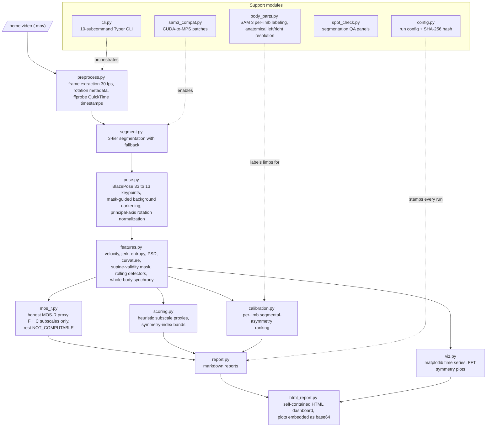
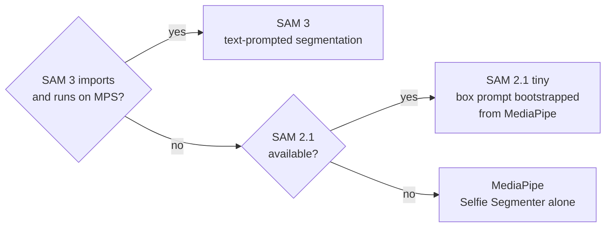

# Architecture

System design of the GMA video pipeline: how a phone video becomes kinematic features and an honest proxy score. See [README.md](README.md) for motivation, science, and limitations; this document is the structural map.

## Dataflow

## The segmentation fallback chain

Segmentation is the most environment-sensitive stage, so it degrades gracefully:

Two deliberate decisions live here:

- **Crop-first inference.** SAM internally resizes to 1024x1024, so the frame is cropped to the subject bounding box (plus 20 percent) before inference and the mask is pasted back afterward. The model spends its resolution on the subject instead of the floor.
- **SAM 2.1 tiny over base_plus.** The larger model "correctly" separates the diaper from skin, which punches a hole in the body mask and breaks pose estimation downstream. The smaller model produces the coherent whole-body mask the pipeline actually needs.

## Why the scoring path is split across three modules

The separation is intentional, not incidental:

- `mos_r.py` owns the claim discipline: which MOS-R subscales a 13-keypoint 2D skeleton can partially address (Fidgety and Movement Character, 16 of 28 points) and which it must report as NOT_COMPUTABLE. Its upper bound imputes missing subscales at ceiling, never at middle values, because middle values would fabricate pathology.
- `scoring.py` holds the heuristic feature-to-band mappings, kept apart so heuristics can be tuned without touching the claim discipline.
- `calibration.py` is an independent within-subject check that ranks paired keypoints by contralateral speed deficit plus low movement variety. It shares no thresholds with the other two, so its output can corroborate or contradict them.

## Validity before kinematics

GMA is only defined for a supine infant, so validity is computed before any feature is trusted. The per-frame supine-validity mask votes on trunk geometry (bi-acromial width collapse, signed shoulder-offset sign flips, trunk tilt), is debounced by a centered majority window, and supports multiple disjoint valid segments. Kinematics are computed over the full series with invalid frames as NaN, so no derivative ever bridges an excluded rolling event. Two independent rolling detectors (velocity-spike and gradual-angle) mark the events themselves.

## Reproducibility spine

Every run writes a `config.yaml` containing the exact configuration and a SHA-256 hash of it; reports embed the hash. The CLI is idempotent per stage (skip-existing), so a crashed run resumes rather than recomputes. Tests are fully synthetic (seeded RNG trajectories, rectangle masks, handcrafted feature objects); no real data exists anywhere in the repo.
