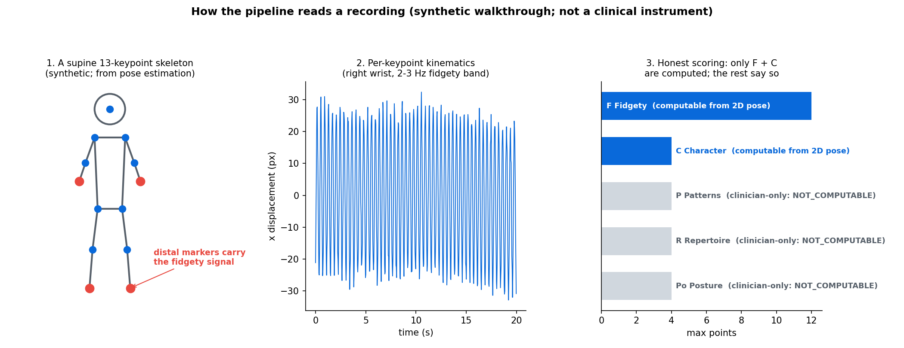
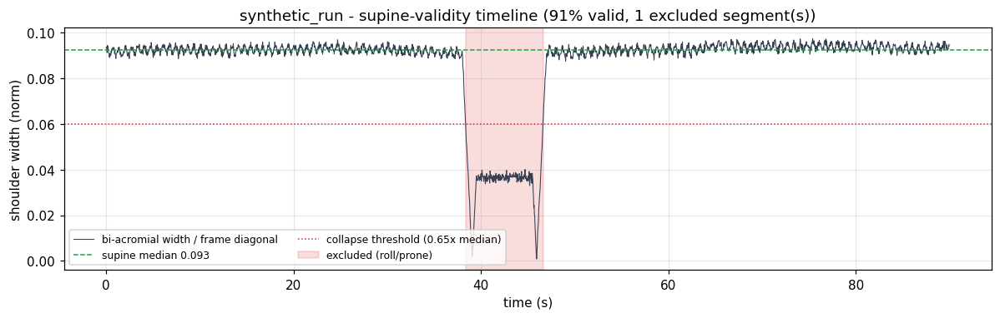
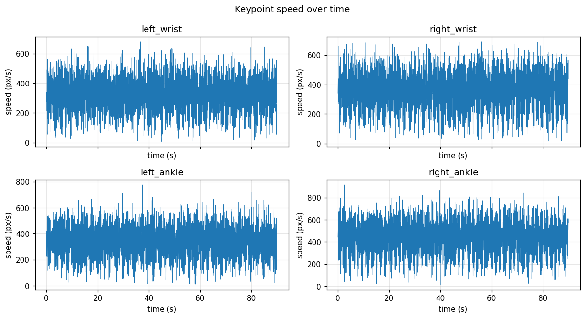
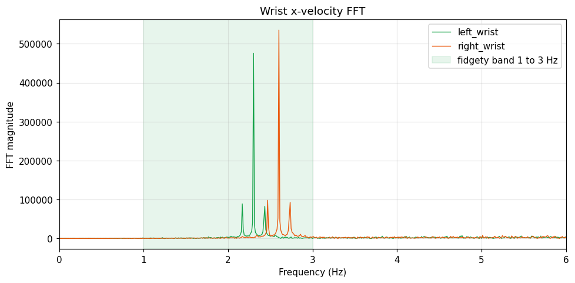
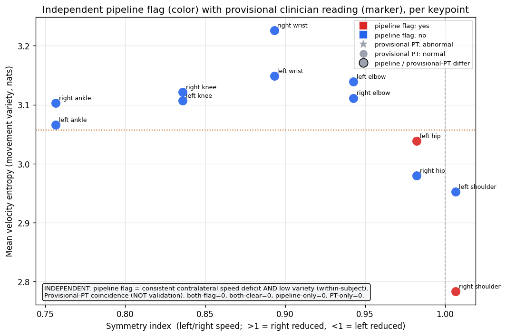
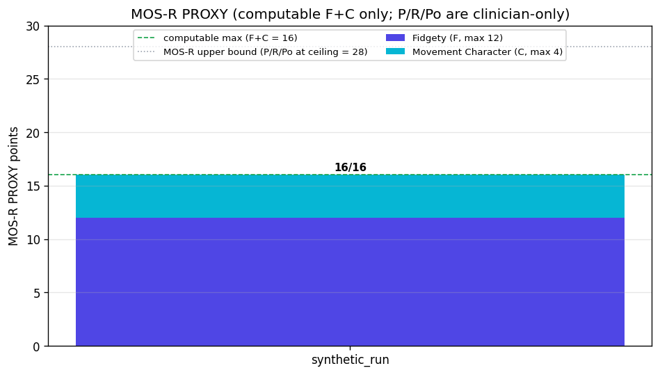

# Infant GMA Video Analysis Pipeline

A personal side quest: replicate the ideas behind a published infant General Movements Assessment (GMA) pipeline on consumer hardware, using nothing but iPhone home video, open models, and a Mac.

**Read [DISCLAIMER.md](DISCLAIMER.md) first. This is not a medical device. Every number it produces is an explicitly labeled proxy, not a clinical score.**

No real videos, frames, pose data, or reports ship with this project; the pipeline expects you to supply your own recordings in `./inputs/`. The [examples folder](examples/) holds one evaluation generated entirely from the synthetic test fixtures, so the output format is visible without any recording.

## Example run (fully synthetic recording)

Everything below comes from one **actual run of the evaluation path on a synthetic recording**: a 90-second seeded pose sequence (13 keypoints, fidgety-band oscillations, plus a scripted roll at 38-47 s) written to parquet and pushed through `extract_features_from_parquet` -> validity mask -> kinematics -> scoring. No recording, no infant, no clinical content exists anywhere in these figures. Full numbers in the [example report](examples/example-mosr-report.md).

**How the pipeline reads a recording** - skeleton, kinematics, and the honest scoring split in one picture:



**The supine-validity mask catching the scripted roll** - bi-acromial width collapses at 38 s, the excluded segment is shaded, and analysis resumes after the return (91% of frames valid across 2 segments):



**Per-keypoint velocity over time** - the raw material every downstream feature is built from:



**Frequency content per keypoint** - fidgety movements live in a characteristic band, so the spectrum is a feature, not a decoration:



**Per-limb monitoring** - each arm and leg tracked through its distal marker and ranked by the independent segmental-asymmetry module:



**The proxy score, saying what it cannot see** - only F and C are computed; the clinician-only subscales report NOT_COMPUTABLE and the upper bound imputes at ceiling:



## Why I built it

General movements assessment is a routine, well-validated infant developmental screen: a trained clinician watches an infant's spontaneous movement and judges its quality. It is also, famously, a visual-Gestalt method. I wanted to understand the science behind it: what part of that Gestalt is quantifiable from a single overhead phone camera, and what part fundamentally is not. It started with wanting to understand home recordings properly, and turned into a deep dive through the GMA literature and a lot of computer-vision plumbing.

The honest answer the project converged on: a 13-keypoint 2D skeleton can partially address 2 of the 5 MOS-R subscales. The pipeline says so, loudly, in its own outputs.

## What it does

Feed it home videos of an infant lying on their back. It produces, per run:

- per-frame segmentation masks and pose keypoints (parquet, with absolute timestamps recovered from QuickTime metadata via ffprobe)
- kinematic features per keypoint: velocity, acceleration, jerk, path-length-normalized jerk index, velocity entropy, Welch PSD, autocorrelation prominence, trajectory curvature, in-band energy fraction
- a per-frame supine-validity mask and rolling-event detection (GMA requires the infant supine; frames where the infant rolls are excluded, not just truncated)
- an honest MOS-R proxy: only the Fidgety (F) and Movement Character (C) subscales are computed (max 16 of 28 points); the other three are reported as NOT_COMPUTABLE, with an explicit upper bound that imputes them at ceiling, never at middle values, because middle values would fabricate pathology
- an independent within-subject segmental-asymmetry ranking: each paired keypoint ranked by the conjunction of contralateral speed deficit and low movement variety
- markdown reports and a fully self-contained HTML dashboard (all plots embedded as base64 data URIs)

Everything is orchestrated by a 10-subcommand Typer CLI (`version`, `doctor`, `preprocess`, `spot-check`, `pose-check`, `overlays`, `body-parts-check`, `pose-extract`, `gma-evaluate`, `run`) with rich progress tables and idempotent skip-existing behavior. Each run writes a reproducibility-stamped `config.yaml` with a SHA-256 config hash.

## Architecture

About 6,200 lines of Python 3.12 across 16 modules, plus about 530 lines of tests. uv-managed, hatchling build, ruff-linted.

```
video (.mov)
  -> preprocess.py      frame extraction (OpenCV, 30 fps), rotation metadata,
                        ffprobe QuickTime creation timestamps
  -> segment.py         3-tier segmentation: SAM 3 (text prompt) ->
                        SAM 2.1 (MediaPipe-bootstrapped box prompt) ->
                        MediaPipe Selfie Segmenter alone
  -> pose.py            MediaPipe BlazePose 33 -> 13 keypoints, mask-guided
                        background darkening, principal-axis rotation
                        normalization with a head-above-hips anatomical prior
  -> features.py        kinematics, supine-validity mask, dual rolling-event
                        detectors, signed zero-lag whole-body synchrony
  -> mos_r.py           honest MOS-R proxy (F + C only, ceiling-imputed bound)
     scoring.py         heuristic subscale proxies + raw symmetry-index bands
     calibration.py     independent per-limb segmental-asymmetry ranking
  -> report.py          markdown reports
     html_report.py     self-contained HTML dashboard
     viz.py             matplotlib plots
```

Supporting modules: `config.py` (run config + hash), `body_parts.py` (SAM 3 per-limb labeling), `spot_check.py` (segmentation QA panels), `sam3_compat.py` (see below), `cli.py`.

## The interesting engineering

### Running CUDA-only SAM 3 on Apple Silicon

Meta's SAM 3 assumes CUDA. `sam3_compat.py` makes it run on MPS with five compounding patches:

1. A meta-path-finder that synthesizes a fake module for any `triton.*` import (triton has no macOS arm64 wheels).
2. A `cv2.distanceTransform` replacement for the triton Euclidean-distance-transform kernel. The SAM 3 codebase documents the two as equivalent.
3. In-place rewriting of hardcoded `device="cuda"` strings in the installed package, with idempotency marker comments so re-running is safe.
4. Stripping `.pin_memory()` / `.cuda()` CUDA-only optimizations.
5. An unfused replacement for a fused BF16 `addmm` + activation op that fails Metal's matmul accumulator dtype check.

Plus `PYTORCH_ENABLE_MPS_FALLBACK=1` and forcing FP32.

### Crop-first inference

SAM resizes its input to 1024x1024 internally. Cropping to the subject's bounding box (plus 20 percent padding) before inference gives the model roughly 1024x1024 of mostly-subject pixels instead of an effective ~500x300. The mask is pasted back into a full-frame canvas afterward.

### Counterintuitive model selection

SAM 2.1 `tiny` (149 MB) beats `base_plus` (305 MB) here. base_plus "correctly" separates the diaper from skin, which punches a hole in the body mask and breaks downstream pose estimation. Tiny produces the coherent whole-body mask the pipeline actually needs. Bigger was not better; this is documented in the code where the default is set.

### SAM 3 does not know anatomical left from right

SAM 3 interprets "baby's left arm" from the observer's perspective, which is inverted for overhead supine video. `body_parts.py` queries category-level prompts ("baby arm" returns two masks) and assigns anatomical left/right by checking which mask contains the MediaPipe `left_wrist` keypoint, with a spatial-midline fallback and a per-prompt response cache.

### Supine-validity as a first-class signal

GMA is only valid with the infant supine. The validity mask votes per frame on trunk geometry: bi-acromial width collapse below 0.65x the recording median (borderline collapse requires bi-iliac corroboration, which rejects arm-over-torso occlusion), a sign flip in the signed shoulder offset as left/right keypoints cross during a roll (the single most specific roll indicator in this data), and trunk tilt over 45 degrees. Votes are debounced with a centered majority window. The mask supports multiple disjoint valid segments, and kinematics are computed over the full series with invalid frames as NaN so derivatives never bridge an excluded roll.

Two complementary rolling detectors run on top: a velocity-spike detector (trunk speed over 10x median) and an angle detector for gradual flips, added after a real slow-tilt flip evaded the spike detector.

## The science

The pipeline implements or cites, among others:

- Novak et al. 2017, JAMA Pediatrics: early, accurate CP detection guideline; the clinical context for why early movement assessment matters.
- Einspieler et al. 2019, J Clin Med 8(10):1616: the MOS-R instrument this proxy is honest about not being.
- Einspieler and Prechtl 2005: the canonical definition of fidgety movements ("small movements of moderate speed with variable acceleration ... in all directions"), which is why a sharp spectral peak is treated as a warning sign, not a reward.
- Ferrari et al. 2016, Early Hum Dev: the fidgety window (optimal 12-16 weeks corrected, valid to ~20).
- Bertoncelli et al. 2024, Children 11(8):940: segmental movement asymmetry present in 91.7 percent of a perinatal-stroke cohort; used as context with its cohort bias documented, not as a threshold.
- Kwong et al. 2022, J Clin Med: MOS-R cutoffs in very preterm infants.
- Guzzetta 2003, Ferrari et al. 1997: additional cohort context for early-asymmetry findings.
- Kanemaru et al. 2019: trajectory curvature as the best single fidgety discriminator, which motivated the curvature feature replacing a conceptually backwards low-jerk reward.
- Groos et al., GigaScience 2024: the open GMA computer-vision pipeline whose feature schema this project adapts. The code documents exactly where it diverges: it adds jerk and frequency features that the original pre-registered pipeline deliberately excluded.
- Ostadabbas SyRIP: infant-specific pose estimation, noted as the planned replacement for the adult-trained BlazePose backend.
- Meta SAM 3 and SAM 2.1; Google MediaPipe (BlazePose, Selfie Segmenter).

## Honest limitations

- 2D pose from a single camera. No depth, no finger detail, and camera obliquity can manufacture left/right speed asymmetries from geometry alone. The code documents this confound where it matters.
- Only F and C subscales are even partially computable; the true MOS-R has 12 clinician-only points this pipeline cannot see. A near-normal proxy total more likely reflects the proxy's blindness than a normal infant, and the code says exactly that in its interpretation strings.
- Thresholds are heuristics from published feature distributions, not calibrated against clinical scoring. Confidence labels are LOW almost everywhere, on purpose; an accuracy review pass downgraded several from HIGH.
- Adult-trained pose models systematically misplace infant keypoints.
- The rule baked into every scoring path: if pipeline output disagrees with clinical scoring, the clinical scoring is correct by definition. The pipeline is the thing being calibrated.

There is a `PT_ASSESSMENT` placeholder in `mos_r.py` where a user can transcribe an external clinician reading for a side-by-side coincidence count. It ships empty. The pipeline's own assessment is independent of it and is never calibrated to it.

## What went wrong (engineering notes)

- **Normalized jerk index blowup.** The textbook Hogan-Sternad dimensionless jerk normalizes by net endpoint displacement. Fidgety-age movement is oscillatory, so net displacement collapses toward zero and values exploded to an unstable ~1e9. Fix: normalize by path length over ~3-second windows. Values dropped to a stable few hundred.
- **A cramped-synchronized metric that could not detect cramped-synchronized.** The first metric used |cross-correlation| at any lag on speed magnitudes. That cannot distinguish in-phase whole-body co-contraction (the pathological pattern) from normal anti-phase reciprocal movement. Replaced with a signed, zero-lag Pearson correlation of speed envelopes across all 28 limb-pair combinations, where a moderate positive baseline is expected and only near-unity synchrony is the signature.
- **Cloud sync ate the git repo.** A file-sync service synced the `.git` directory mid-session and reverted the working tree, staging core modules for deletion. Files were recovered from an earlier commit, in-session copies, and decompiled `__pycache__` bytecode, then verified by re-running the full test suite and reproducing the prior end-to-end result exactly. Git history now lives outside any synced folder. Relatedly: keep the venv outside cloud-synced directories, or several GB of PyTorch will try to sync.
- **Citation errors.** An adversarial accuracy review found 10 errors worth documenting, including a citation attributed to the wrong instrument paper, a nonexistent author on a reference, and a 91.7 percent figure labeled "sensitivity" when it is a prevalence. All corrected.

## Test strategy

No real data appears anywhere in the tests. Everything is synthetic:

- seeded-RNG pose DataFrames with injected velocity spikes and gradual rotations exercise the rolling detectors
- a mid-recording roll-and-return case proves the validity mask can carve two disjoint valid segments, which the earlier truncate-at-first-roll approach structurally could not represent
- rectangle masks validate the principal-axis rotation math
- handcrafted `VideoFeatures` objects drive the MOS-R proxy (F=12/C=4 on clean input, C=1 at synchrony 0.9) and the flag/no-flag discriminator edge cases, including the key false-positive suppression: a consistent speed deficit without a variety loss must not flag

Run with `uv run pytest`.

## Setup

Target hardware: Apple Silicon (developed on M4-class machines). SAM 2.1 per-frame inference runs at roughly 0.5-1 s on MPS. Frames for a 2-minute 1080p30 video occupy 1-2 GB on disk.

```bash
# Python 3.12, uv-managed. Keep the venv OUTSIDE any cloud-synced folder.
uv sync

uv run gma-pipeline doctor          # verify PyTorch/MPS/OpenCV/MediaPipe
# place your own recordings in ./inputs/, then:
uv run gma-pipeline run inputs/IMG_0001.mov
```

Model weights (SAM 2.1 checkpoints, MediaPipe pose and segmentation models) download on demand into `./models/`, which is gitignored along with `inputs/` and `outputs/`.

## AI-assisted build notes

This was built in AI pair-programming sessions (Claude Code), and the record cuts both ways.

What it genuinely accelerated: the MPS compatibility shim would have taken me far longer alone; the triton import-stub and the fused-op unfusing came out of iterating on stack traces in minutes per cycle. Scaffolding the feature extraction, the Typer CLI, and the test suite was similarly fast. The literature synthesis that shaped the honest F+C-only proxy design drew on model knowledge of the GMA papers, which I then verified against the sources.

Where it failed and needed human correction: the first normalized-jerk implementation used the textbook normalization that was mathematically wrong for oscillatory motion and produced values off by seven orders of magnitude. The first cramped-synchronized metric was structurally incapable of detecting the pattern it was named after. Several confidence labels were initially optimistic and had to be downgraded. And a dedicated adversarial review pass found 10 citation and framing errors that the original build sessions introduced, including a misattributed instrument paper and an invented co-author. None of these announced themselves; each was found by reading the output skeptically and checking it against the literature.

The honest summary: the AI made the ambitious version of this project feasible in evenings and weekends, and it also confidently produced subtle errors in exactly the places where being wrong is most costly. Both halves of that sentence are the point.

## License and intent

Personal project by Jay Cho. Shared as a code and methods showcase, not as a tool for assessing infants. If you are worried about an infant's development, talk to a pediatrician, not a GitHub repo.
